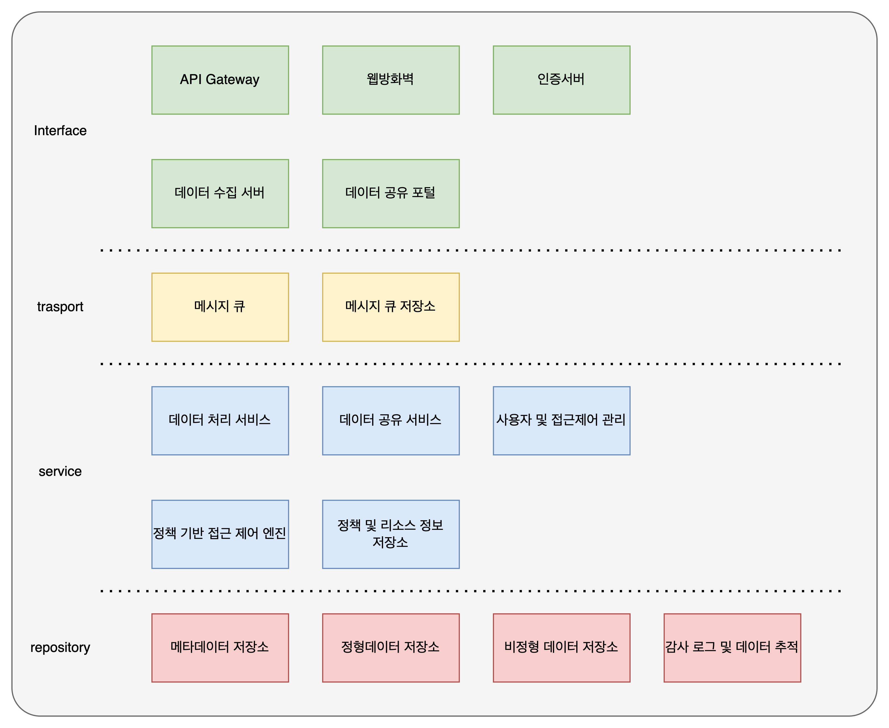
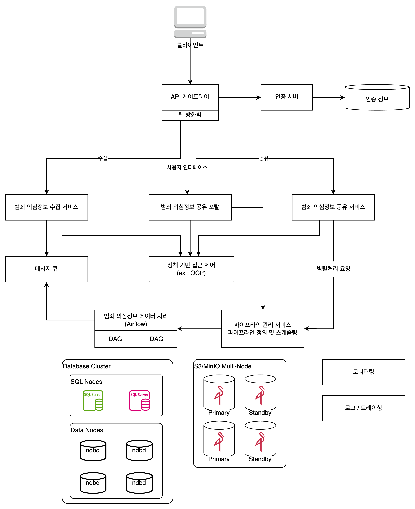
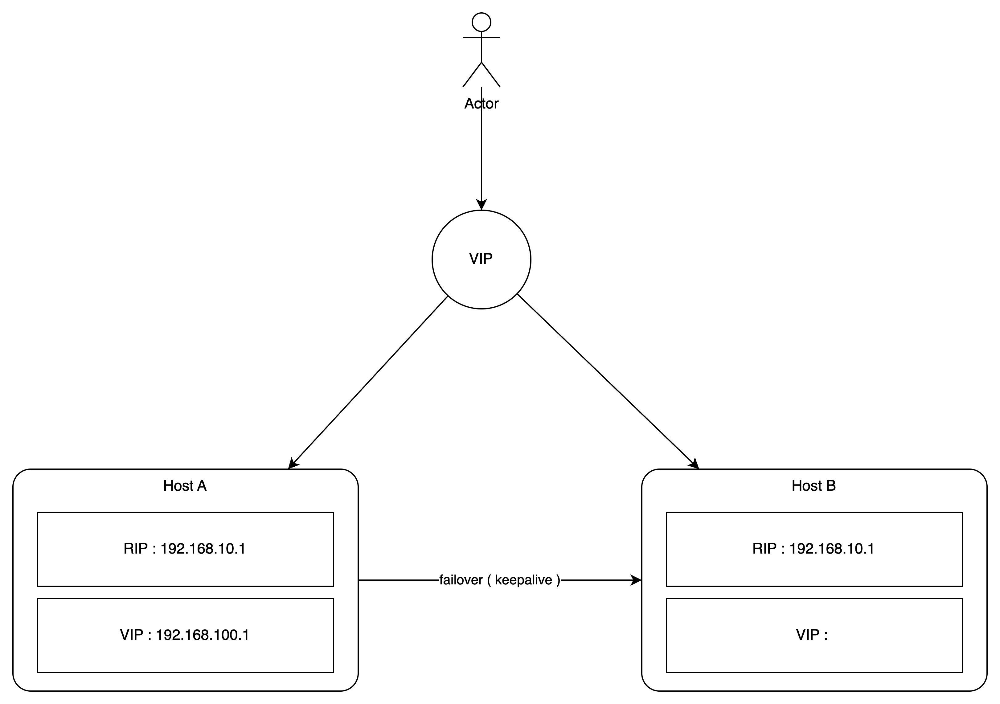

# System Architecture Document

for Voice Phishing Data Collection and Sharing System

## 1. 시스템 개요

본 시스템은 전기통신금융사기(보이스피싱, 스미싱 등) 관련 범죄 의심 정보를 수집, 저장, 분석 및 공유하는 플랫폼으로, 다음과 같은 주요 기능을 포함합니다:

- 다양한 데이터 소스로부터 범죄 의심 정보 수집
- 정형 및 비정형 데이터의 저장 및 관리
- 수집된 정보의 외부 공유를 위한 API 제공
- 역할 기반 및 속성 기반 접근 제어를 통한 보안 강화
- 모의해킹을 통한 보안성 점검 및 강화

## 2. 시스템 아키텍처 정의

시스템은 다음과 같은 주요 구성 요소로 이루어져 있습니다

**시스템 구성 개념도**  



**상세 시스템 구성도**  



2.1. Web Application Firewall (WAF)
    - NGINX 기반 Gateway: 외부 요청을 내부 서비스로 라우팅하며, 로드 밸런싱 및 SSL 종료 기능을 제공합니다.
    - NGINX App Protect WAF: OWASP Top 10 등 웹 공격으로부터 애플리케이션을 보호하며, JSON 기반 정책 설정을 통해 유연한 보안 정책 적용이 가능합니다.

2.2. API gateway
    - Spring Cloud Gateway: 마이크로서비스 아키텍처에서 API 요청을 라우팅하고 필터링하는 역할을 하며, Keycloak과 통합하여 인증 및 권한 관리를 수행합니다.

2.3. 인증 및 권한 관리
    - Keycloak: OpenID Connect 및 OAuth 2.0을 지원하는 오픈소스 IAM 솔루션으로, SSO, 2FA, 역할 기반 접근 제어(RBAC)를 제공합니다.

2.4. 데이터 수집 서비스
    - 수집 API: 스팸, 스미싱, 보이스피싱 등 다양한 소스로부터 데이터를 수집하는 RESTful API를 제공합니다.
    - 실시간 데이터 처리: 스미싱 URL, 악성 앱 배포지 등의 실시간 데이터를 추출하여 메시지 큐에 전달합니다.

2.5 데이터 포털
    - 데이터 정규화 및 메타데이터 관리: 대규모 데이터의 효율적인 관리를 위한 정규화, 인덱싱 및 메타데이터 관리 기능을 제공합니다.
    - 역할 기반 및 속성 기반 접근 제어: 다양한 수요처에 맞는 데이터 조회 권한 관리 기능을 제공합니다.
    - 다중 포맷 지원: 파일 형식 및 데이터 구조 기반의 다양한 포맷을 지원합니다.
    - 로그 관리: 감사 및 데이터 추적을 위한 로그 관리 기능을 제공합니다.

2.6 데이터 공유 서비스
    - 공유 API: 외부 기관에 범죄 의심 정보를 안전하게 공유할 수 있는 RESTful API를 제공합니다.
    - 데이터셋 설정 기능: 공유 API별로 데이터 필터링 및 공유 범위를 지정할 수 있는 기능을 제공합니다.
    - 접근 제어: 사용자 그룹 및 권한 관리 기능을 통해 공유 API의 접근을 통제합니다.

2.7 메시지 큐 및 비동기 처리
    - 메시지 큐 시스템: RabbitMQ 또는 Apache Kafka를 활용하여 데이터 수집 및 처리의 비동기화를 구현합니다.
    - DAG 기반 워크플로우 스케줄링: Apache Airflow 등을 활용하여 작업 스케줄링을 최적화합니다.

2.8 데이터 저장소
    - 정형 데이터 저장소: PostgreSQL 또는 MySQL을 사용하여 구조화된 데이터를 저장합니다.
    - 비정형 데이터 저장소: Elasticsearch 또는 MongoDB를 활용하여 로그, 메타데이터 등의 비정형 데이터를 저장합니다.
    - 분산 스토리지 아키텍처: 확장성과 안정성을 보장하는 수평적 확산 분산 스토리지를 설계합니다.

2.9. 모니터링 및 로깅
    - Jagger: 분산 트레이싱 시스템으로, 마이크로서비스 간의 호출 관계를 추적하고 성능을 모니터링합니다.
    - Prometheus: 오픈소스 모니터링 및 경고 시스템으로, 메트릭 수집 및 시각화를 지원합니다.
    - Grafana: Prometheus와 연동하여 시각화 대시보드를 제공합니다.

## 3. 기술 스택 및 개발 환경

**인프라**  

- OS: Rocky Linux 8
- Container Platform: Docker

**기술 스택**  

- 프로그래밍 언어: Java 21, Python 3.11
- 빌드 도구: Gradle
- 버전 관리: GitLab
- 코드 커버리지 도구: java: JaCoCo, python: coverage
- 코드 품질 분석: SonarQube
- CI/CD 도구: GitLab CI/CD
- 컨테이너화: Docker

## 4. 시스템 확장 및 고도화 계획

- 메시지 큐 기반 비동기 작업 관리: 메시지 큐를 활용하여 작업의 비동기화 및 분산 처리를 구현합니다.
- 사용자 정의 데이터 파이프라인: 사용자가 직접 데이터 파이프라인을 설정하고 관리할 수 있는 기능을 제공합니다.
- 워크플로우 스케줄링 최적화: DAG 기반의 워크플로우 스케줄링을 통해 작업 스케줄링을 최적화합니다.
- 데이터 포털 고도화: 전기통신금융사기 데이터의 통계 생성, 조회 및 시각화 기능을 강화합니다.

## 5. 보안 및 정보 보호 고려

개발 시스템은 외부 공격으로부터 보호하기 위해 방화벽 내 위치시기며, 다음과 같은 보안 조치를 포함합니다:

- 외부 접근 제한 : 방화벽을 통해 외부에서의 직접 접근을 차단합니다.
- 접근 관리 : 개발/테스트 서버의 접근은 허용된 사용자만 가능하다.

## 6. 테스트 및 검증

CI/CD 파이프라인을 통해 코드 변경 시 자동으로 빌드, 테스트,
코드 커버리지 분석 및 배포가 이루어지도록 구성합니다.

- 유닛 테스트: JUnit 5와 Mockito를 활용하여 단위 테스트를 작성하고, 코드 변경 시 자동으로 실행합니다.
- 정적분석: SonarQube를 활용하여 코드 품질을 분석하고, 코드 스멜 및 버그를 사전에 식별합니다.
- 코드 커버리지: JaCoCo, coverage를 활용하여 테스트 커버리지를 측정하고, 최소 커버리지 기준을 설정합니다.

## 7. 고가용성 구성

Docker Swarm 기반의 NGINX + Keepalived 고가용성(HA) 구성은 클러스터 기반 서비스 배포에 VIP를 연동하여 무중단 서비스를 구성하는 방식입니다.
여기서는 Keepalived를 노드 레벨에서 실행하고, 서비스는 Docker Swarm에서 관리하는 Service 단위로 운영하는 시나리오를 예시로 제공합니다.



### 1. 전체 아키텍처 구성 개요

1. 목표
    - Docker Swarm 클러스터 (3노드 이상 권장)
    - NGINX 서비스는 Swarm의 replicated 또는 global 모드로 배포
    - Keepalived는 각 노드에 직접 설치 또는 host 네트워크에서 실행하여 VIP를 유지
    - 클라이언트는 VIP를 통해 접속 → NGINX → 내부 서비스로 요청 전달

2. 구성 요소

| 구성 요소           | 설명                                       |
| ------------------- | ------------------------------------------ |
| Docker Swarm        | HA 클러스터 형성 (Manager 1+, Worker N)    |
| NGINX Service       | Swarm에 의해 관리됨 (e.g. replicas: 3)     |
| Keepalived          | VIP 유지 및 마스터-백업 전환               |
| Application Service | NGINX 뒤에 위치한 실제 애플리케이션 서비스 |

### 2. Swarm 클러스터 구성

1. 노드 예시
    - manager-1 (Swarm Manager)
    - worker-1, worker-2 (Swarm Worker)

    ```sh
    # Swarm 초기화 (manager 노드에서)
    docker swarm init --advertise-addr <MANAGER-IP>

    # Worker 노드에서 Join
    docker swarm join --token <WORKER-TOKEN> <MANAGER-IP>:2377
    ```

2. HA 구성 흐름도

    ```text
    클라이언트 요청
        ↓
        VIP (192.168.0.100)
        ↓
    Keepalived Master 노드
        ↓
        NGINX 서비스 (Swarm)
        ↓
    Backend App 서비스
    ```

3. 실제 구성 시나리오
    1. keepalived.conf 예시 (각 노드 로컬)

        ```conf
        vrrp_instance VI_1 {
            state BACKUP                 # MASTER는 하나만 지정
            interface eth0
            virtual_router_id 51
            priority 100                 # MASTER는 100, BACKUP은 90 등
            advert_int 1
            authentication {
                auth_type PASS
                auth_pass 1111
            }
            virtual_ipaddress {
                192.168.0.100
            }
            track_script {
                chk_docker
            }
        }

        vrrp_script chk_docker {
            script "/etc/keepalived/check_docker_service.sh"
            interval 2
            weight -10
        }
        ```

    2. 헬스 체크 스크립트

        ```bash
        #!/bin/bash
        SERVICE_NAME="nginx_web"
        REPLICAS=$(docker service ls --filter name=$SERVICE_NAME --format "{{.Replicas}}" | cut -d'/' -f1)
        if [ "$REPLICAS" -lt 1 ]; then
            exit 1
        fi
        exit 0
        ```

        Docker Swarm 내 NGINX 서비스가 1개 이상 정상적으로 동작하는지 확인

    3. Swarm에서 NGINX 서비스 배포 예시

        ```sh
        docker service create \
        --name nginx_web \
        --replicas 3 \
        --publish published=80,target=80 \
        --mount type=bind,src=/opt/nginx/nginx.conf,dst=/etc/nginx/nginx.conf \
        nginx:latest
        ```

        - VIP에 바인딩된 NGINX는 어떤 노드의 컨테이너든 라우팅 가능
        - Swarm의 내부 Overlay 네트워크로 백엔드 서비스와 연동 가능

## 8. 변경 사항

NGINX + WAF + AUTH 를 하나로 통합한 시스템 아키텍처를 다음과 같이 변경합니다. ( 25.06.16 )

> NGINX + LUA 를 활용한 기능의 경우 NGINX 에서 공식적으로 지원하지 않음.
> LUA 모듈을 사용하고자 하는 경우 Openresty 에서 제공하는 NGINX를 사용해야 하며,
> Openresty에 OWASP CRS를 적용하고자 하는 경우 소스 빌드가 필요합니다.
> 동작에 문제가 발생할 경우 대처가 어려울 수 있어 구조를 다음과 같이 변경합니다.

```text
[Client]
   ↓
[NGINX + WAF (ModSecurity)]
   ↓
[Spring Cloud Gateway (SCG)]
   ↓
[동적으로 구성된 Backend Services (e.g. 서비스 디스커버리, 동적 라우팅)]
```
