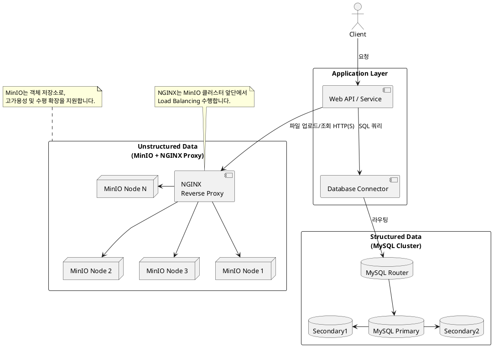
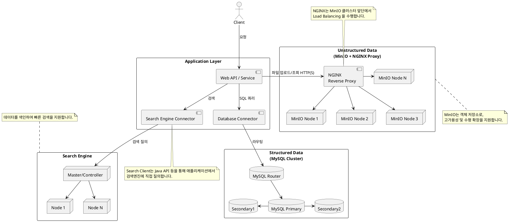
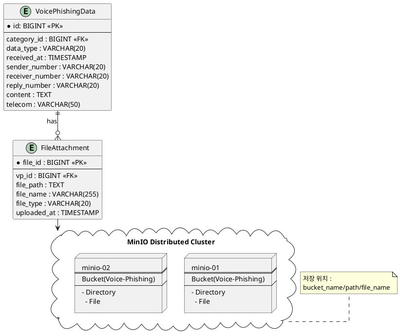
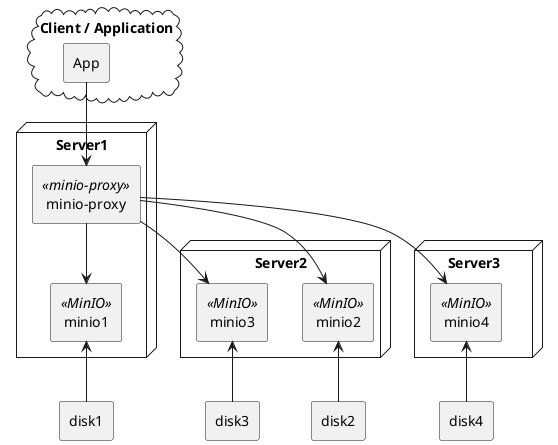

# 설계서 : DS-1-2-1, DS-1-2-2

## 1. 요구사항

정형 및 비정형 데이터 저장/관리를 위한 스토리지 설계 및 개발
확장성과 안정성을 보장하는 수평적 확산 분산 스토리지 아키텍쳐 설계 및 개발

## 2. 전체 구성



필요한 경우 검색엔진을 추가한다.



## 3. 정형, 비정형 데이터 관계

다음은 보이스피싱 데이터를 데이터베이스와 오브젝트 스토리지에 저장 시 관계를 보여준다.



## 4. 고려사항

### 4.1. 검색

1. 인덱스(Elasticsearch/OpenSearch 연동)
    - 검색 비중이 큰 경우 색인을 위해 검색엔진 사용 고려

    인덱스 예시

    ```json
    Index: voice_phishing_idx

    {
      "log_id": 123456,
      "message_type": "피싱",
      "received_at": "2025-07-02T13:45:00Z",
      "sender_number": "010xxx",
      "receiver_number": "010xxxx",
      "reply_number": "15441122",
      "content": "저금리 대출을 안내드립니다...",
      "telecom": "KT",
      "category_id": 3,
      "category_name": "대출사기",
      "attachments": [
        {
          "file_name": "audio.m4a",
          "file_type": "audio",
          "file_url": "s3://...."
        }
      ]
    }
    ```

2. 검색 최적화를 위한 필드 설계

    | 필드                    | 타입           | Mapping 전략                               |
    | ----------------------- | -------------- | ------------------------------------------ |
    | message_type            | keyword        | 정확 검색용 (filter 조건)                  |
    | content                 | text + keyword | 분석기 사용 (nori, ngram 등) + exact match |
    | received_at             | date           | 시계열 검색, 범위 검색                     |
    | telecom / category_name | keyword        | 필터링용                                   |
    | attachments.file_type   | keyword        | 파일 유형 필터링 가능                      |

3. 쿼리 예시

    ```json
    GET /voice_phishing/_search
    {
      "query": {
        "bool": {
          "must": [
            { "match": { "content": "저금리 대출" }},
            { "term": { "message_type": "피싱" }},
            { "range": { "received_at": { "gte": "now-30d/d" }}}
          ]
        }
      }
    }
    ```

### 4.2. MinIO

1. 하나의 디렉토리(버킷 내 prefix)당 최대 파일 수 제한  
    예: /voice-phishing/YYYY/MM/DD/NNNN/처럼 경로를 분산시켜 파일 수 제한 회피 (NNNN은 인덱스 혹은 해시 prefix 등)
2. 파일 경로 재사용 방지
    기존 경로 존재 시 저장하지 않거나, 별도로 관리

**슈도 코드**  

```text
function upload_to_minio(file):
    1. 파일 확장자 = extract_extension(file.name)
    2. 날짜 기반 prefix = /voice-phishing/YYYY/MM/DD/
    3. 해시 prefix 디렉토리 = 해시 앞 4자리 (예: ab12)
    4. full_path = prefix + hash_prefix + "/" + hash + "." + 확장자
    5. MinIO에 해당 path 존재 여부 확인
        → 존재하면: 중복으로 간주, 업로드하지 않음
        → 없으면: 업로드 진행
    6. 업로드 후 full_path를 DB에 저장
```

## 5. 하드웨어와 서비스 구성

수평확장 및 운영 안전성을 보장하기 위해서는 최소 2대의 서버가 필요하며 권장은 3대의 서버를 기준으로 한다.

서버 내 저장장치 혹은 외부 저장소를 연결하는 경우 데이터 저장소 종류 별 분리와 Primary, Secondary 를 분리하여 각 저장소 서비스들에 연결한다.



## 5. 참고

MinIO Distributed 구성 참고 링크
`https://1week.tistory.com/106`

MySQL


Postgres
`https://support.ptc.com/help/thingworx/platform/r9/ko/index.html#page/ThingWorx/Help/ThingWorxHighAvailability/ExampleDeploymentofPostgreSQLHAwithPgpoolII.html`

OpenSearch Cluster
`https://docs.opensearch.org/docs/latest/tuning-your-cluster/`