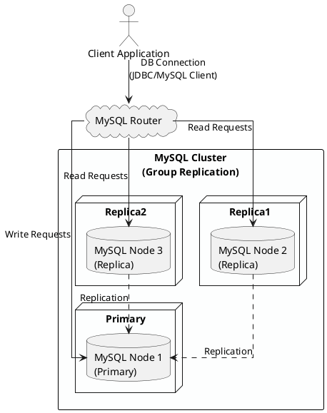

# MySQL

## 1. 개요

이 문서는 정형 데이터와 시스템 데이터 저장을 목적으로 안정성을 고려한 MySQL 고가용성(High Availability) 구성에 대해서 다룬다.
MySQL Replication + MySQL Router를 활용하며, 이 구성은 일반적으로 MySQL InnoDB Cluster 구성과 유사하며, 읽기/쓰기 분리,
자동 장애 조치, 로드 밸런싱을 제공합니다.

## 2. 목적

- MySQL 데이터베이스의 서비스 중단 최소화
- 데이터 무결성을 유지하면서 장애 시 자동 장애 조치(Failover)
- 읽기 요청 분산(Read Scale-out)

## 3. 구성 요소

| 구성 요소                    | 설명                                                         |
| ---------------------------- | ------------------------------------------------------------ |
| MySQL 서버 (Primary/Replica) | Group Replication을 통해 동기화                              |
| MySQL Router                 | 클라이언트와 MySQL 서버 간의 중간 계층으로, 쓰기/읽기 라우팅 |
| MySQL Shell / Admin          | 클러스터 초기 구성 및 관리 도구                              |
| Application                  | DB에 접속하는 사용자 애플리케이션                            |

### 3.1. 아키텍처 다이어그램 (PlantUML)



### 3.2. 구성 요소 주요 기능

1. MySQL Group Replication
    - MySQL1: Primary (Leader)
    - MySQL2, MySQL3: Replica (Follower)
    - 동기 replication (Group replication, single-primary 모드)

2. MySQL Router
    - 클라이언트가 직접 DB를 지정하지 않아도, 읽기/쓰기 자동 라우팅
    - metadata_cache를 통해 MySQL Cluster 구성 정보를 참조

3. Failover 및 장애 조치
    - Primary 장애 시 자동 선출 (auto-failover)
    - MySQL Router는 자동으로 새 Primary로 라우팅 전환

## 4. 설치 및 구성 순서 요약

1. MySQL 서버 3대 설치
    - 동일한 group_replication 설정
    - 하나의 Primary + 두 개의 Replica

2. InnoDB Cluster 초기화
    - mysqlsh 사용
    - dba.createCluster("clusterName") 등 명령어 실행
3. MySQL Router 설치 및 bootstrap

    ```shell
    mysqlrouter --bootstrap cluster_user@host:3306 --directory /etc/mysqlrouter
    ```

4. 애플리케이션 구성
   - MySQL Router 주소만 사용 (localhost:6446 등)

## 5. 파티셔닝

1. 목적
    - 데이터 양 증가에 따른 성능 저하 방지 및 쿼리 최적화

2. 파티셔닝 요소 및 설명

    | 구성 요소         | 설명                                                         |
    | ----------------- | ------------------------------------------------------------ |
    | Partitioned Table | 범위(RANGE), 리스트(LIST), 해시(HASH) 방식으로 테이블을 분할 |
    | Partitioning Key  | 일반적으로 날짜, ID 범위 등을 기준으로 설정                  |
    | 관리 스크립트     | 파티션 생성/병합/정리 자동화 스크립트 (ex. cron + SQL)       |

3. 파티셔닝 전략

    테이블 예시: log

    ```SQL
    CREATE TABLE logs (
    id BIGINT NOT NULL,
    log_date DATE NOT NULL,
    message TEXT,
    PRIMARY KEY(id, log_date)
    )
    PARTITION BY RANGE (TO_DAYS(log_date)) (
    PARTITION p2024_01 VALUES LESS THAN (TO_DAYS('2024-02-01')),
    PARTITION p2024_02 VALUES LESS THAN (TO_DAYS('2024-03-01')),
    PARTITION p_max     VALUES LESS THAN MAXVALUE
    );
    ```

4. 전략 선택 가이드

    | 파티션 방식 | 추천 사용 경우               |
    | ----------- | ---------------------------- |
    | RANGE       | 시간 기반 로그, 거래 데이터  |
    | LIST        | 지역/카테고리 분류 값        |
    | HASH        | 균등 분산 목적 (ex. ID 기반) |
    | KEY         | 자동 해시 분산               |

5. 파티션 유지 관리
    - 신규 파티션 자동 생성 (매월 cron job 등)
    - 오래된 파티션 제거 또는 아카이빙
    - 파티션 단위 백업/복원 지원

6. 테스트 & 검증
    - 각 쿼리에 EXPLAIN PARTITIONS로 프루닝 확인
    - 대용량 INSERT/DELETE/SELECT 테스트
    - 파티션 누락 시 장애 발생 방지 테스트