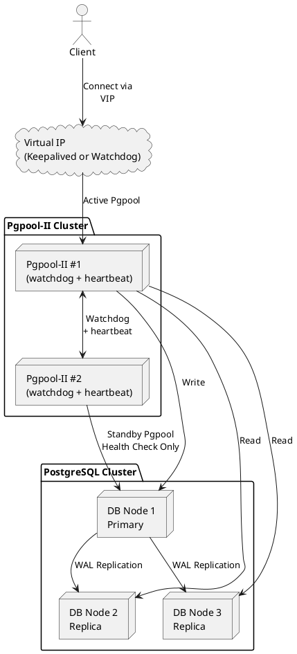

# PostgreSQL 분산 처리 및 고가용성 아키텍처 설계서

이 문서는 PostgreSQL 데이터베이스의 고가용성(High Availability, HA) 구성을 위한 시스템 아키텍처를 설명합니다. 이 아키텍처는 데이터 손실을 최소화하고 서비스 연속성을 보장하는 데 중점을 둡니다.

## 1. 개요

현대 서비스에서 데이터베이스의 가용성은 핵심적인 요구사항입니다. 단일 장애 지점(Single Point of Failure, SPOF)을 제거하고,
예기치 않은 시스템 장애 발생 시에도 신속하게 서비스를 복구하여 비즈니스 연속성을 유지하는 것이 중요합니다.
본 설계서는 PostgreSQL의 스트리밍 복제(Streaming Replication)와 자동 페일오버(Automatic Failover) 솔루션을 활용한 고가용성 아키텍처를 제시합니다.

## 2. 목표

* **데이터 무결성 및 일관성 보장**: 장애 발생 시에도 데이터 손실을 최소화하고, 모든 노드 간의 데이터 일관성을 유지합니다.
* **서비스 연속성 확보**: 주(Primary) 노드 장애 발생 시 자동으로 보조(Standby) 노드로 전환하여 서비스 중단을 최소화합니다.
* **읽기 부하 분산**: 보조 노드를 읽기 전용으로 활용하여 주 노드의 부하를 분산하고 읽기 성능을 향상시킵니다.
* **운영 및 관리 용이성**: HA 구성의 배포, 모니터링, 유지보수 절차를 명확히 정의합니다.

## 3. 전체 구성

### 3.1. 시스템 구성 요소

PostgreSQL 고가용성 아키텍처는 다음과 같은 주요 구성 요소로 이루어집니다.

| 구성 요소                         | 설명 및 역할                                                                                                                                                                                                                                             |
| --------------------------------- | -------------------------------------------------------------------------------------------------------------------------------------------------------------------------------------------------------------------------------------------------------- |
| 클라이언트 (Client)               | PostgreSQL에 접근하는 애플리케이션 또는 사용자. Pgpool-II의 VIP를 통해 연결함으로써 내부 장애를 인식하지 않아도 됨                                                                                                                                       |
| VIP (Virtual IP)                  | Pgpool-II 인스턴스 중 하나에 할당되는 가상 IP 주소. 클라이언트는 이 IP로 접속하며, 장애 시 다른 Pgpool-II 인스턴스로 자동 이동됨                                                                                                                         |
| Pgpool-II                         | PostgreSQL 클러스터 앞단에 위치하는 프록시 서버로 다음 역할을 수행: - 클라이언트 연결 관리 (Connection Pooling) - Primary/Replica 식별 및 쿼리 라우팅 - Failover/Failback 처리 (스크립트 연동) - Health Check 및 Monitoring - Load Balancing (읽기 분산) |
| Watchdog (Pgpool 내장)            | Pgpool-II 간 클러스터를 구성하고, 장애 감지 및 VIP 관리 기능을 수행: - 다른 Pgpool-II 인스턴스 상태 감시 (heartbeat) - VIP를 Active Pgpool에 할당 - Active Pgpool 장애 시 VIP 자동 이동 및 승격                                                          |
| PostgreSQL Primary (DB Node 1)    | 클러스터의 주 노드로 쓰기 연산을 처리하며 WAL 로그를 Replica로 전송함                                                                                                                                                                                    |
| PostgreSQL Replica (DB Node 2, 3) | Streaming Replication을 통해 Primary의 데이터를 복제하며 읽기 쿼리 처리에 활용됨                                                                                                                                                                         |
| Streaming Replication             | PostgreSQL 내장 기능으로 Primary의 Write-Ahead Log(WAL)를 Replica로 실시간 전송하여 데이터 일관성을 유지함                                                                                                                                               |
| Failover Command Script           | Pgpool-II에서 Primary 장애 감지 시 실행되는 사용자 정의 스크립트로, Replica를 Promote하여 새로운 Primary로 전환함                                                                                                                                        |
| Follow Master Command             | Failover 이후 나머지 Replica들이 새로운 Primary를 따라가도록 재구성하는 스크립트                                                                                                                                                                         |
|                                   |                                                                                                                                                                                                                                                          |

## 4. 장애 대응 흐름 요약

1. 클라이언트는 VIP를 통해 Pgpool-II에 연결
2. Pgpool-II는 PostgreSQL 상태를 지속적으로 점검하며 쿼리를 라우팅
3. Primary 장애 발생 시:
    * Pgpool-II가 장애 감지
    * 지정된 Replica를 Promote (failover_command)
    * VIP를 다른 Pgpool-II 인스턴스로 이전 (watchdog)
    * 클라이언트는 여전히 VIP로 접속하므로 변경 사항을 인식할 필요 없음

## 5. 모니터링 및 알림

* **데이터베이스 성능**: `pg_stat_activity`, `pg_stat_replication` 등을 통해 쿼리 성능, 연결 수, 복제 지연 등을 모니터링합니다.
* **노드 상태**: 각 PostgreSQL 노드, Patroni Agent, DCS 노드의 CPU, 메모리, 디스크 사용량, 네트워크 상태 등을 모니터링합니다.
* **HA 클러스터 상태**: Patroni의 `patronictl list` 명령 등을 통해 Primary/Standby 역할, 복제 상태, 페일오버 이벤트 등을 모니터링합니다.
* **경고 시스템**: 주요 지표 임계값 초과 또는 장애 발생 시 Slack, 이메일, SMS 등으로 자동 알림이 발송되도록 설정합니다. (예: Prometheus + Grafana, Zabbix, Nagios)

## 6. 운영 및 유지보수

* **정기적인 패치**: PostgreSQL, OS, HA 관리 도구 등 모든 구성 요소에 대한 보안 패치 및 업데이트를 주기적으로 적용합니다. 스위치오버를 활용하여 서비스 중단 없이 패치를 적용할 수 있습니다.
* **로그 관리**: 모든 노드의 로그를 중앙 집중화된 로그 관리 시스템(예: ELK Stack, Splunk)으로 수집하여 문제 해결 및 감사에 활용합니다.
* **문서화**: 페일오버, 스위치오버, 백업/복구 절차를 포함한 모든 운영 절차를 명확히 문서화합니다.
* **주기적인 테스트**: 페일오버 및 스위치오버 절차를 주기적으로 테스트하여 실제 장애 발생 시 신속하고 정확하게 대응할 수 있도록 숙련도를 높입니다.

## 7. 백업 및 복구 전략

고가용성 구성은 장애 시 서비스 연속성을 위한 것이며, **데이터 백업 및 복구는 데이터 손실 방지를 위한 별도의 중요한 전략**입니다.

* **WAL 아카이빙**: Primary 노드에서 WAL 파일을 지속적으로 아카이브 스토리지에 저장합니다. 이는 특정 시점 복구(PITR)의 기반이 됩니다.
* **베이스 백업 (Base Backup)**: 주기적으로 (예: 매일 또는 매주) 전체 데이터베이스의 베이스 백업을 수행합니다. `pg_basebackup` 유틸리티를 사용하거나, 클라우드 환경에서는 스냅샷 기능을 활용할 수 있습니다.
* **백업 저장 위치**: 백업 데이터는 원격의 안전한 스토리지에 보관하며, 재해 복구(Disaster Recovery, DR) 시나리오를 대비하여 다른 지역에 복제하는 것을 고려합니다.
* **복구 테스트**: 백업 데이터의 유효성을 정기적으로 확인하고, 실제 복구 절차를 시뮬레이션하여 복구 시간을 단축하고 절차를 숙지합니다.