# 보이스피싱 데이터 포털 테이블 설계서

본 문서는 보이스피싱 데이터 수집, 접근제어, 데이터셋 생성과 공유를 위한 데이터베이스 테이블 설계를 다룹니다.

## 시스템 개요

### 주요 도메인

1. **사용자 관리**: Keycloak 기반 사용자, 그룹, 역할 관리
2. **데이터 수집**: 보이스피싱 관련 음성, 텍스트, 이미지 데이터 저장
3. **접근 제어**: API 엔드포인트별 세밀한 권한 관리
4. **데이터셋 관리**: 동적 데이터셋 생성 및 공유

## ERD (PlantUML)

```plantuml
@startuml VoicePhishingDataPortal

!define PRIMARY_KEY(x) <b><color:red>x</color></b>
!define FOREIGN_KEY(x) <color:blue>x</color>

package "User Management Domain" {
  entity "users" as users {
  }

  entity "groups" as groups {
  }

  entity "roles" as roles {
  }

  entity "user_groups" as user_groups {
  }

  entity "user_roles" as user_roles {
  }

  entity "group_roles" as group_roles {
  }

  entity "user_attributes" as user_attributes {
  }
}

note left of "User Management Domain"
    "사용자 정보는 keycloak 데이터를 사용"
endnote

package "Voice Phishing Data Domain" {
  entity "vp_data_records" as vp_data {
    PRIMARY_KEY(data_id) : VARCHAR(36)
    --
    data_type : ENUM('VOICE', 'TEXT', 'IMAGE') NOT NULL
    sender_number : VARCHAR(20)
    receiver_number : VARCHAR(20)
    callback_number : VARCHAR(20)
    content : TEXT
    receiver_carrier : ENUM('SKT', 'KT', 'LGU+', 'MVNO', 'UNKNOWN')
    metadata : JSON
    created_at : TIMESTAMP DEFAULT CURRENT_TIMESTAMP
    updated_at : TIMESTAMP DEFAULT CURRENT_TIMESTAMP ON UPDATE CURRENT_TIMESTAMP
  }

  entity "vp_file_info" as vp_files {
    PRIMARY_KEY(file_id) : VARCHAR(36)
    --
    FOREIGN_KEY(data_id) : VARCHAR(36) NOT NULL
    file_name : VARCHAR(255) NOT NULL
    file_format : VARCHAR(20) NOT NULL
    file_size : BIGINT NOT NULL
    file_path : VARCHAR(1000) NOT NULL
    duration : DECIMAL(10,3)
    mime_type : VARCHAR(100)
    created_at : TIMESTAMP DEFAULT CURRENT_TIMESTAMP
  }
  
}

package "Data Category" {
  entity "categories" as categories {
    PRIMARY_KEY(category_id) : BIGINT AUTO_INCREMENT
    --
    name: VARCHAR(50) NOT NULL
    parent_category : VARCHAR(50)
    description : VARCHAR(200)
    created_at : TIMESTAMP DEFAULT CURRENT_TIMESTAMP
    updated_at : TIMESTAMP DEFAULT CURRENT_TIMESTAMP ON UPDATE CURRENT_TIMESTAMP
  }

  entity "tags" as tags {
    PRIMARY_KEY(tag_id) : BIGINT AUTO_INCREMENT
    --
    tag_name : VARCHAR(50) NOT NULL
    category : VARCHAR(50)
    description : VARCHAR(200)
    created_at : TIMESTAMP DEFAULT CURRENT_TIMESTAMP
  }

  entity "tag_relations" as data_tags {
    PRIMARY_KEY(relation_id) : BIGINT AUTO_INCREMENT
    --
    FOREIGN_KEY(data_id) : VARCHAR(36) NOT NULL
    FOREIGN_KEY(tag_id) : BIGINT NOT NULL
    FOREIGN_KEY(tagged_by) : VARCHAR(36) NOT NULL
    tagged_at : TIMESTAMP DEFAULT CURRENT_TIMESTAMP
  }
}

package "Access Control Domain" {
  entity "api_endpoints" as endpoints {
    PRIMARY_KEY(endpoint_id) : VARCHAR(36)
    --
    api_path : VARCHAR(500) NOT NULL
    http_method : ENUM('GET', 'POST') NOT NULL
    service_name : VARCHAR(100) NOT NULL
    description : VARCHAR(500)
    is_active : BOOLEAN DEFAULT TRUE
    created_at : TIMESTAMP DEFAULT CURRENT_TIMESTAMP
    updated_at : TIMESTAMP DEFAULT CURRENT_TIMESTAMP ON UPDATE CURRENT_TIMESTAMP
  }

  entity "access_rules" as access_rules {
    PRIMARY_KEY(rule_id) : VARCHAR(36)
    --
    FOREIGN_KEY(endpoint_id) : VARCHAR(36) NOT NULL
    rule_name : VARCHAR(100) NOT NULL
    description : VARCHAR(500)
    effect : ENUM('ALLOW', 'DENY') NOT NULL
    priority : INT DEFAULT 100
    is_enabled : BOOLEAN DEFAULT TRUE
    conditions : JSON
    created_at : TIMESTAMP DEFAULT CURRENT_TIMESTAMP
    updated_at : TIMESTAMP DEFAULT CURRENT_TIMESTAMP ON UPDATE CURRENT_TIMESTAMP
  }

  entity "access_logs" as access_logs {
    PRIMARY_KEY(log_id) : BIGINT AUTO_INCREMENT
    --
    FOREIGN_KEY(user_id) : VARCHAR(36) NOT NULL
    FOREIGN_KEY(endpoint_id) : VARCHAR(36)
    api_path : VARCHAR(500) NOT NULL
    http_method : VARCHAR(10) NOT NULL
    ip_address : VARCHAR(45)
    request_time : TIMESTAMP NOT NULL
    response_status : INT
    is_allowed : BOOLEAN NOT NULL
    deny_reason : VARCHAR(200)
    FOREIGN_KEY(applied_rule_id) : VARCHAR(36)
    processing_time_ms : INT
    created_at : TIMESTAMP DEFAULT CURRENT_TIMESTAMP
  }
}

package "Dataset Management Domain" {
  entity "datasets" as datasets {
    PRIMARY_KEY(dataset_id) : VARCHAR(36)
    --
    dataset_name : VARCHAR(100) NOT NULL
    description : TEXT
    search_filter : JSON NOT NULL
    total_count : BIGINT DEFAULT 0
    total_size : BIGINT DEFAULT 0
    status : ENUM('CREATING', 'READY', 'EXPIRED', 'ERROR') DEFAULT 'CREATING'
    is_public : BOOLEAN DEFAULT FALSE
    download_limit : INT
    access_limit : INT
    expires_at : TIMESTAMP
    FOREIGN_KEY(created_by) : VARCHAR(36) NOT NULL
    created_at : TIMESTAMP DEFAULT CURRENT_TIMESTAMP
    updated_at : TIMESTAMP DEFAULT CURRENT_TIMESTAMP ON UPDATE CURRENT_TIMESTAMP
  }

  entity "dataset_data_relations" as dataset_data {
    PRIMARY_KEY(relation_id) : BIGINT AUTO_INCREMENT
    --
    FOREIGN_KEY(dataset_id) : VARCHAR(36) NOT NULL
    FOREIGN_KEY(data_id) : VARCHAR(36) NOT NULL
    added_at : TIMESTAMP DEFAULT CURRENT_TIMESTAMP
  }

  entity "dataset_access_permissions" as dataset_permissions {
    PRIMARY_KEY(permission_id) : BIGINT AUTO_INCREMENT
    --
    FOREIGN_KEY(dataset_id) : VARCHAR(36) NOT NULL
    permission_type : ENUM('USER', 'GROUP', 'ROLE') NOT NULL
    permission_target : VARCHAR(36) NOT NULL
    permission_level : ENUM('read', 'download', 'admin') NOT NULL
    granted_at : TIMESTAMP DEFAULT CURRENT_TIMESTAMP
    FOREIGN_KEY(granted_by) : VARCHAR(36) NOT NULL
  }

  entity "dataset_shares" as dataset_shares {
    PRIMARY_KEY(share_id) : VARCHAR(36)
    --
    FOREIGN_KEY(dataset_id) : VARCHAR(36) NOT NULL
    share_token : VARCHAR(128) NOT NULL
    share_url : VARCHAR(500)
    access_count : INT DEFAULT 0
    download_count : INT DEFAULT 0
    max_access_count : INT
    max_download_count : INT
    last_accessed_at : TIMESTAMP
    expires_at : TIMESTAMP
    is_active : BOOLEAN DEFAULT TRUE
    FOREIGN_KEY(created_by) : VARCHAR(36) NOT NULL
    created_at : TIMESTAMP DEFAULT CURRENT_TIMESTAMP
  }

  entity "dataset_access_logs" as dataset_logs {
    PRIMARY_KEY(log_id) : BIGINT AUTO_INCREMENT
    --
    FOREIGN_KEY(dataset_id) : VARCHAR(36) NOT NULL
    FOREIGN_KEY(share_id) : VARCHAR(36)
    FOREIGN_KEY(user_id) : VARCHAR(36)
    access_type : ENUM('view', 'download', 'preview') NOT NULL
    ip_address : VARCHAR(45)
    user_agent : VARCHAR(500)
    accessed_at : TIMESTAMP DEFAULT CURRENT_TIMESTAMP
  }

  entity "dataset_tags" as dataset_tags {
    PRIMARY_KEY(dataset_tag_id) : BIGINT AUTO_INCREMENT
    --
    FOREIGN_KEY(dataset_id) : VARCHAR(36) NOT NULL
    tag_name : VARCHAR(50) NOT NULL
    FOREIGN_KEY(tagged_by) : VARCHAR(36) NOT NULL
    tagged_at : TIMESTAMP DEFAULT CURRENT_TIMESTAMP
  }
}

' Relationships
users ||--o{ user_groups : "belongs to"
groups ||--o{ user_groups : "contains"
users ||--o{ user_roles : "has"
roles ||--o{ user_roles : "assigned to"
groups ||--o{ group_roles : "has"
roles ||--o{ group_roles : "assigned to"
groups ||--o{ groups : "parent/child"
users ||--o{ user_attributes : "has"

vp_data ||--o{ vp_files : "contains"
vp_data ||--o{ data_tags : "tagged with"
tags ||--o{ categories : "belongs to"
tags ||--o{ data_tags : "applied to"
users ||--o{ vp_data : "verified by"
users ||--o{ data_tags : "tagged by"

endpoints ||--o{ access_rules : "governed by"
access_rules ||--o{ access_logs : "applied in"
users ||--o{ access_logs : "performed by"
endpoints ||--o{ access_logs : "accessed"

users ||--o{ datasets : "created by"
datasets ||--o{ dataset_data : "contains"
vp_data ||--o{ dataset_data : "included in"
datasets ||--o{ dataset_permissions : "accessible by"
users ||--o{ dataset_permissions : "granted by"
datasets ||--o{ dataset_shares : "shared as"
users ||--o{ dataset_shares : "created by"
dataset_shares ||--o{ dataset_logs : "accessed via"
datasets ||--o{ dataset_logs : "accessed"
users ||--o{ dataset_logs : "accessed by"
datasets ||--o{ dataset_tags : "tagged with"
users ||--o{ dataset_tags : "tagged by"

@enduml
```



## 도메인별 상세 테이블 설계

### 1. 사용자 관리 도메인 (User Management Domain)

#### 1.1 users (사용자)

| 컬럼명           | 타입         | 제약조건                            | 설명                      |
| ---------------- | ------------ | ----------------------------------- | ------------------------- |
| user_id          | VARCHAR(36)  | PRIMARY KEY                         | 내부 사용자 식별자 (UUID) |
| keycloak_user_id | VARCHAR(36)  | NOT NULL, UNIQUE                    | Keycloak 사용자 ID        |
| username         | VARCHAR(50)  | NOT NULL, UNIQUE                    | 사용자명                  |
| email            | VARCHAR(100) | NOT NULL, UNIQUE                    | 이메일 주소               |
| first_name       | VARCHAR(100) | NULL                                | 이름                      |
| last_name        | VARCHAR(100) | NULL                                | 성                        |
| enabled          | BOOLEAN      | DEFAULT TRUE                        | 계정 활성화 상태          |
| email_verified   | BOOLEAN      | DEFAULT FALSE                       | 이메일 인증 상태          |
| created_at       | TIMESTAMP    | DEFAULT CURRENT_TIMESTAMP           | 생성일시                  |
| updated_at       | TIMESTAMP    | DEFAULT CURRENT_TIMESTAMP ON UPDATE | 수정일시                  |

**인덱스:**

- `idx_users_keycloak_id` ON keycloak_user_id
- `idx_users_username` ON username
- `idx_users_email` ON email
- `idx_users_enabled` ON enabled

#### 1.2 groups (그룹)

| 컬럼명            | 타입         | 제약조건                            | 설명                    |
| ----------------- | ------------ | ----------------------------------- | ----------------------- |
| group_id          | VARCHAR(36)  | PRIMARY KEY                         | 내부 그룹 식별자 (UUID) |
| keycloak_group_id | VARCHAR(36)  | NOT NULL, UNIQUE                    | Keycloak 그룹 ID        |
| group_name        | VARCHAR(100) | NOT NULL                            | 그룹명                  |
| group_path        | VARCHAR(500) | NULL                                | 그룹 경로               |
| parent_group_id   | VARCHAR(36)  | FOREIGN KEY(groups.group_id)        | 상위 그룹 ID            |
| description       | TEXT         | NULL                                | 그룹 설명               |
| created_at        | TIMESTAMP    | DEFAULT CURRENT_TIMESTAMP           | 생성일시                |
| updated_at        | TIMESTAMP    | DEFAULT CURRENT_TIMESTAMP ON UPDATE | 수정일시                |

**인덱스:**

- `idx_groups_keycloak_id` ON keycloak_group_id
- `idx_groups_name` ON group_name
- `idx_groups_parent` ON parent_group_id

#### 1.3 roles (역할)

| 컬럼명           | 타입         | 제약조건                  | 설명                            |
| ---------------- | ------------ | ------------------------- | ------------------------------- |
| role_id          | VARCHAR(36)  | PRIMARY KEY               | 내부 역할 식별자 (UUID)         |
| keycloak_role_id | VARCHAR(36)  | NOT NULL, UNIQUE          | Keycloak 역할 ID                |
| role_name        | VARCHAR(100) | NOT NULL                  | 역할명                          |
| description      | VARCHAR(500) | NULL                      | 역할 설명                       |
| is_composite     | BOOLEAN      | DEFAULT FALSE             | 복합 역할 여부                  |
| is_client_role   | BOOLEAN      | DEFAULT FALSE             | 클라이언트 역할 여부            |
| container_id     | VARCHAR(36)  | NULL                      | 컨테이너 ID (realm 또는 client) |
| created_at       | TIMESTAMP    | DEFAULT CURRENT_TIMESTAMP | 생성일시                        |

**인덱스:**

- `idx_roles_keycloak_id` ON keycloak_role_id
- `idx_roles_name` ON role_name
- `idx_roles_client` ON is_client_role

#### 1.4 user_groups (사용자-그룹 관계)

| 컬럼명        | 타입        | 제약조건                               | 설명        |
| ------------- | ----------- | -------------------------------------- | ----------- |
| user_group_id | BIGINT      | PRIMARY KEY, AUTO_INCREMENT            | 관계 식별자 |
| user_id       | VARCHAR(36) | NOT NULL, FOREIGN KEY(users.user_id)   | 사용자 ID   |
| group_id      | VARCHAR(36) | NOT NULL, FOREIGN KEY(groups.group_id) | 그룹 ID     |
| assigned_at   | TIMESTAMP   | DEFAULT CURRENT_TIMESTAMP              | 할당일시    |

**인덱스:**

- `idx_user_groups_user` ON user_id
- `idx_user_groups_group` ON group_id
- `uk_user_groups` UNIQUE(user_id, group_id)

#### 1.5 user_roles (사용자-역할 관계)

| 컬럼명       | 타입        | 제약조건                             | 설명        |
| ------------ | ----------- | ------------------------------------ | ----------- |
| user_role_id | BIGINT      | PRIMARY KEY, AUTO_INCREMENT          | 관계 식별자 |
| user_id      | VARCHAR(36) | NOT NULL, FOREIGN KEY(users.user_id) | 사용자 ID   |
| role_id      | VARCHAR(36) | NOT NULL, FOREIGN KEY(roles.role_id) | 역할 ID     |
| assigned_at  | TIMESTAMP   | DEFAULT CURRENT_TIMESTAMP            | 할당일시    |

**인덱스:**

- `idx_user_roles_user` ON user_id
- `idx_user_roles_role` ON role_id
- `uk_user_roles` UNIQUE(user_id, role_id)

#### 1.6 group_roles (그룹-역할 관계)

| 컬럼명        | 타입        | 제약조건                               | 설명        |
| ------------- | ----------- | -------------------------------------- | ----------- |
| group_role_id | BIGINT      | PRIMARY KEY, AUTO_INCREMENT            | 관계 식별자 |
| group_id      | VARCHAR(36) | NOT NULL, FOREIGN KEY(groups.group_id) | 그룹 ID     |
| role_id       | VARCHAR(36) | NOT NULL, FOREIGN KEY(roles.role_id)   | 역할 ID     |
| assigned_at   | TIMESTAMP   | DEFAULT CURRENT_TIMESTAMP              | 할당일시    |

**인덱스:**

- `idx_group_roles_group` ON group_id
- `idx_group_roles_role` ON role_id
- `uk_group_roles` UNIQUE(group_id, role_id)

#### 1.7 user_attributes (사용자 속성)

| 컬럼명          | 타입         | 제약조건                             | 설명        |
| --------------- | ------------ | ------------------------------------ | ----------- |
| attribute_id    | BIGINT       | PRIMARY KEY, AUTO_INCREMENT          | 속성 식별자 |
| user_id         | VARCHAR(36)  | NOT NULL, FOREIGN KEY(users.user_id) | 사용자 ID   |
| attribute_name  | VARCHAR(100) | NOT NULL                             | 속성명      |
| attribute_value | TEXT         | NULL                                 | 속성값      |
| created_at      | TIMESTAMP    | DEFAULT CURRENT_TIMESTAMP            | 생성일시    |

**인덱스:**

- `idx_user_attributes_user` ON user_id
- `idx_user_attributes_name` ON attribute_name
- `uk_user_attributes` UNIQUE(user_id, attribute_name)

### 2. 보이스피싱 데이터 도메인 (Voice Phishing Data Domain)

#### 2.1 vp_data_records (보이스피싱 데이터)

| 컬럼명              | 타입                                         | 제약조건                            | 설명                            |
| ------------------- | -------------------------------------------- | ----------------------------------- | ------------------------------- |
| data_id             | VARCHAR(36)                                  | PRIMARY KEY                         | 데이터 식별자 (UUID)            |
| data_type           | ENUM('VOICE', 'TEXT', 'IMAGE', 'VIDEO')      | NOT NULL                            | 데이터 타입                     |
| sender_number       | VARCHAR(20)                                  | NULL                                | 발신번호 (마스킹됨)             |
| receiver_number     | VARCHAR(20)                                  | NULL                                | 수신번호 (마스킹됨)             |
| callback_number     | VARCHAR(20)                                  | NULL                                | 회신번호                        |
| content             | TEXT                                         | NULL                                | 텍스트 내용 또는 음성 전사 내용 |
| receiver_carrier    | ENUM('SKT', 'KT', 'LGU+', 'MVNO', 'UNKNOWN') | NULL                                | 수신자 통신사                   |
| file_path           | VARCHAR(1000)                                | NULL                                | 파일 경로                       |
| metadata            | JSON                                         | NULL                                | 추가 메타데이터                 |
| collection_source   | VARCHAR(100)                                 | NULL                                | 수집 출처                       |
| collection_method   | VARCHAR(100)                                 | NULL                                | 수집 방법                       |
| is_verified         | BOOLEAN                                      | DEFAULT FALSE                       | 검증 완료 여부                  |
| verification_status | ENUM('PENDING', 'VERIFIED', 'REJECTED')      | DEFAULT 'PENDING'                   | 검증 상태                       |
| verified_by         | VARCHAR(36)                                  | FOREIGN KEY(users.user_id)          | 검증자                          |
| verified_at         | TIMESTAMP                                    | NULL                                | 검증일시                        |
| created_at          | TIMESTAMP                                    | DEFAULT CURRENT_TIMESTAMP           | 생성일시                        |
| updated_at          | TIMESTAMP                                    | DEFAULT CURRENT_TIMESTAMP ON UPDATE | 수정일시                        |

**인덱스:**

- `idx_vp_data_type` ON data_type
- `idx_vp_data_created` ON created_at
- `idx_vp_data_carrier` ON receiver_carrier
- `idx_vp_data_verified` ON is_verified
- `idx_vp_data_status` ON verification_status
- `idx_vp_data_sender` ON sender_number
- `idx_vp_data_callback` ON callback_number

**파티셔닝 전략:**

```sql
PARTITION BY RANGE (YEAR(created_at)) (
    PARTITION p2024 VALUES LESS THAN (2025),
    PARTITION p2025 VALUES LESS THAN (2026),
    PARTITION p2026 VALUES LESS THAN (2027),
    PARTITION p_future VALUES LESS THAN MAXVALUE
);
```

#### 2.2 vp_file_info (파일 정보)

| 컬럼명       | 타입                       | 제약조건                                       | 설명               |
| ------------ | -------------------------- | ---------------------------------------------- | ------------------ |
| file_id      | VARCHAR(36)                | PRIMARY KEY                                    | 파일 식별자 (UUID) |
| data_id      | VARCHAR(36)                | NOT NULL, FOREIGN KEY(vp_data_records.data_id) | 데이터 ID          |
| file_name    | VARCHAR(255)               | NOT NULL                                       | 파일명             |
| file_format  | VARCHAR(20)                | NOT NULL                                       | 파일 포맷          |
| file_size    | BIGINT                     | NOT NULL                                       | 파일 크기 (bytes)  |
| file_path    | VARCHAR(1000)              | NOT NULL                                       | 파일 경로          |
| storage_type | ENUM('LOCAL', 'S3', 'NFS') | DEFAULT 'LOCAL'                                | 저장소 타입        |
| duration     | DECIMAL(10,3)              | NULL                                           | 재생시간 (초)      |
| resolution   | VARCHAR(20)                | NULL                                           | 해상도             |
| bitrate      | INT                        | NULL                                           | 비트레이트         |
| encoding     | VARCHAR(50)                | NULL                                           | 인코딩 방식        |
| checksum     | VARCHAR(64)                | NULL                                           | 파일 체크섬        |
| mime_type    | VARCHAR(100)               | NULL                                           | MIME 타입          |
| created_at   | TIMESTAMP                  | DEFAULT CURRENT_TIMESTAMP                      | 생성일시           |

**인덱스:**

- `idx_vp_files_data` ON data_id
- `idx_vp_files_format` ON file_format
- `idx_vp_files_size` ON file_size
- `idx_vp_files_storage` ON storage_type

#### 2.3 data_tags (데이터 태그)

| 컬럼명      | 타입         | 제약조건                    | 설명        |
| ----------- | ------------ | --------------------------- | ----------- |
| tag_id      | BIGINT       | PRIMARY KEY, AUTO_INCREMENT | 태그 식별자 |
| tag_name    | VARCHAR(50)  | NOT NULL, UNIQUE            | 태그명      |
| category    | VARCHAR(50)  | NULL                        | 카테고리    |
| description | VARCHAR(200) | NULL                        | 태그 설명   |
| created_at  | TIMESTAMP    | DEFAULT CURRENT_TIMESTAMP   | 생성일시    |

**인덱스:**

- `idx_vp_tags_name` ON tag_name
- `idx_vp_tags_category` ON tag_category

#### 2.4 data_tag_relations (데이터-태그 관계)

| 컬럼명      | 타입        | 제약조건                                       | 설명          |
| ----------- | ----------- | ---------------------------------------------- | ------------- |
| relation_id | BIGINT      | PRIMARY KEY, AUTO_INCREMENT                    | 관계 식별자   |
| data_id     | VARCHAR(36) | NOT NULL, FOREIGN KEY(vp_data_records.data_id) | 데이터 ID     |
| tag_id      | BIGINT      | NOT NULL, FOREIGN KEY(vp_data_tags.tag_id)     | 태그 ID       |
| tagged_by   | VARCHAR(36) | NOT NULL, FOREIGN KEY(users.user_id)           | 태그 지정자   |
| tagged_at   | TIMESTAMP   | DEFAULT CURRENT_TIMESTAMP                      | 태그 지정일시 |

**인덱스:**

- `idx_vp_data_tag_data` ON data_id
- `idx_vp_data_tag_tag` ON tag_id
- `uk_vp_data_tag` UNIQUE(data_id, tag_id)

### 3. 접근 제어 도메인 (Access Control Domain)

#### 3.1 api_endpoints (API 엔드포인트)

| 컬럼명       | 타입                                          | 제약조건                            | 설명                     |
| ------------ | --------------------------------------------- | ----------------------------------- | ------------------------ |
| endpoint_id  | VARCHAR(36)                                   | PRIMARY KEY                         | 엔드포인트 식별자 (UUID) |
| api_path     | VARCHAR(500)                                  | NOT NULL                            | API 경로                 |
| http_method  | ENUM('GET', 'POST', 'PUT', 'DELETE', 'PATCH') | NOT NULL                            | HTTP 메서드              |
| service_name | VARCHAR(100)                                  | NOT NULL                            | 서비스명                 |
| description  | VARCHAR(500)                                  | NULL                                | API 설명                 |
| tags         | JSON                                          | NULL                                | API 태그                 |
| is_active    | BOOLEAN                                       | DEFAULT TRUE                        | 활성화 상태              |
| created_at   | TIMESTAMP                                     | DEFAULT CURRENT_TIMESTAMP           | 생성일시                 |
| updated_at   | TIMESTAMP                                     | DEFAULT CURRENT_TIMESTAMP ON UPDATE | 수정일시                 |

**인덱스:**

- `idx_endpoints_path_method` ON (api_path, http_method)
- `idx_endpoints_service` ON service_name
- `idx_endpoints_active` ON is_active
- `uk_endpoints` UNIQUE(api_path, http_method)

#### 3.2 access_rules (접근 규칙)

| 컬럼명      | 타입                  | 제약조건                                         | 설명                                    |
| ----------- | --------------------- | ------------------------------------------------ | --------------------------------------- |
| rule_id     | VARCHAR(36)           | PRIMARY KEY                                      | 규칙 식별자 (UUID)                      |
| endpoint_id | VARCHAR(36)           | NOT NULL, FOREIGN KEY(api_endpoints.endpoint_id) | 엔드포인트 ID                           |
| rule_name   | VARCHAR(100)          | NOT NULL                                         | 규칙명                                  |
| description | VARCHAR(500)          | NULL                                             | 규칙 설명                               |
| effect      | ENUM('ALLOW', 'DENY') | NOT NULL                                         | 허용/거부 효과                          |
| priority    | INT                   | DEFAULT 100                                      | 우선순위 (낮을수록 높음)                |
| is_enabled  | BOOLEAN               | DEFAULT TRUE                                     | 규칙 활성화 상태                        |
| conditions  | JSON                  | NOT NULL                                         | 접근 조건 (사용자, 그룹, 역할, 속성 등) |
| created_at  | TIMESTAMP             | DEFAULT CURRENT_TIMESTAMP                        | 생성일시                                |
| updated_at  | TIMESTAMP             | DEFAULT CURRENT_TIMESTAMP ON UPDATE              | 수정일시                                |

**인덱스:**

- `idx_access_rules_endpoint` ON endpoint_id
- `idx_access_rules_priority` ON priority
- `idx_access_rules_enabled` ON is_enabled
- `idx_access_rules_effect` ON effect

#### 3.3 access_logs (접근 로그)

| 컬럼명             | 타입         | 제약조건                               | 설명               |
| ------------------ | ------------ | -------------------------------------- | ------------------ |
| log_id             | BIGINT       | PRIMARY KEY, AUTO_INCREMENT            | 로그 식별자        |
| user_id            | VARCHAR(36)  | NOT NULL, FOREIGN KEY(users.user_id)   | 사용자 ID          |
| endpoint_id        | VARCHAR(36)  | FOREIGN KEY(api_endpoints.endpoint_id) | 엔드포인트 ID      |
| api_path           | VARCHAR(500) | NOT NULL                               | 요청 API 경로      |
| http_method        | VARCHAR(10)  | NOT NULL                               | HTTP 메서드        |
| ip_address         | VARCHAR(45)  | NULL                                   | 클라이언트 IP      |
| user_agent         | VARCHAR(500) | NULL                                   | User Agent         |
| request_time       | TIMESTAMP    | NOT NULL                               | 요청 시간          |
| response_status    | INT          | NULL                                   | 응답 상태 코드     |
| is_allowed         | BOOLEAN      | NOT NULL                               | 접근 허용 여부     |
| deny_reason        | VARCHAR(200) | NULL                                   | 거부 이유          |
| applied_rule_id    | VARCHAR(36)  | FOREIGN KEY(access_rules.rule_id)      | 적용된 규칙 ID     |
| processing_time_ms | INT          | NULL                                   | 처리 시간 (밀리초) |
| created_at         | TIMESTAMP    | DEFAULT CURRENT_TIMESTAMP              | 생성일시           |

**인덱스:**

- `idx_access_logs_user` ON user_id
- `idx_access_logs_time` ON request_time
- `idx_access_logs_allowed` ON is_allowed
- `idx_access_logs_endpoint` ON endpoint_id

**파티셔닝 전략:**

```sql
PARTITION BY RANGE (UNIX_TIMESTAMP(created_at)) (
    PARTITION p_current VALUES LESS THAN (UNIX_TIMESTAMP('2025-02-01')),
    PARTITION p_202502 VALUES LESS THAN (UNIX_TIMESTAMP('2025-03-01')),
    PARTITION p_202503 VALUES LESS THAN (UNIX_TIMESTAMP('2025-04-01')),
    -- 월별 파티션 계속...
);
```

### 4. 데이터셋 관리 도메인 (Dataset Management Domain)

#### 4.1 datasets (데이터셋)

| 컬럼명         | 타입                                          | 제약조건                             | 설명                   |
| -------------- | --------------------------------------------- | ------------------------------------ | ---------------------- |
| dataset_id     | VARCHAR(36)                                   | PRIMARY KEY                          | 데이터셋 식별자 (UUID) |
| dataset_name   | VARCHAR(100)                                  | NOT NULL                             | 데이터셋 이름          |
| description    | TEXT                                          | NULL                                 | 데이터셋 설명          |
| search_filter  | JSON                                          | NOT NULL                             | 검색 필터 조건         |
| total_count    | BIGINT                                        | DEFAULT 0                            | 포함된 데이터 수       |
| total_size     | BIGINT                                        | DEFAULT 0                            | 총 크기 (bytes)        |
| status         | ENUM('CREATING', 'READY', 'EXPIRED', 'ERROR') | DEFAULT 'CREATING'                   | 데이터셋 상태          |
| is_public      | BOOLEAN                                       | DEFAULT FALSE                        | 공개 데이터셋 여부     |
| download_limit | INT                                           | NULL                                 | 다운로드 횟수 제한     |
| access_limit   | INT                                           | NULL                                 | 접근 횟수 제한         |
| expires_at     | TIMESTAMP                                     | NULL                                 | 만료 시간              |
| created_by     | VARCHAR(36)                                   | NOT NULL, FOREIGN KEY(users.user_id) | 생성자                 |
| created_at     | TIMESTAMP                                     | DEFAULT CURRENT_TIMESTAMP            | 생성일시               |
| updated_at     | TIMESTAMP                                     | DEFAULT CURRENT_TIMESTAMP ON UPDATE  | 수정일시               |

**인덱스:**

- `idx_datasets_name` ON dataset_name
- `idx_datasets_status` ON status
- `idx_datasets_created_by` ON created_by
- `idx_datasets_public` ON is_public
- `idx_datasets_expires` ON expires_at

#### 4.2 dataset_data_relations (데이터셋-데이터 관계)

| 컬럼명      | 타입        | 제약조건                                       | 설명        |
| ----------- | ----------- | ---------------------------------------------- | ----------- |
| relation_id | BIGINT      | PRIMARY KEY, AUTO_INCREMENT                    | 관계 식별자 |
| dataset_id  | VARCHAR(36) | NOT NULL, FOREIGN KEY(datasets.dataset_id)     | 데이터셋 ID |
| data_id     | VARCHAR(36) | NOT NULL, FOREIGN KEY(vp_data_records.data_id) | 데이터 ID   |
| added_at    | TIMESTAMP   | DEFAULT CURRENT_TIMESTAMP                      | 추가일시    |

**인덱스:**

- `idx_dataset_data_dataset` ON dataset_id
- `idx_dataset_data_data` ON data_id
- `uk_dataset_data` UNIQUE(dataset_id, data_id)

#### 4.3 dataset_access_permissions (데이터셋 접근 권한)

| 컬럼명            | 타입                              | 제약조건                                   | 설명          |
| ----------------- | --------------------------------- | ------------------------------------------ | ------------- |
| permission_id     | BIGINT                            | PRIMARY KEY, AUTO_INCREMENT                | 권한 식별자   |
| dataset_id        | VARCHAR(36)                       | NOT NULL, FOREIGN KEY(datasets.dataset_id) | 데이터셋 ID   |
| permission_type   | ENUM('USER', 'GROUP', 'ROLE')     | NOT NULL                                   | 권한 타입     |
| permission_target | VARCHAR(36)                       | NOT NULL                                   | 권한 대상 ID  |
| permission_level  | ENUM('read', 'download', 'admin') | NOT NULL                                   | 권한 레벨     |
| granted_at        | TIMESTAMP                         | DEFAULT CURRENT_TIMESTAMP                  | 권한 부여일시 |
| granted_by        | VARCHAR(36)                       | NOT NULL, FOREIGN KEY(users.user_id)       | 권한 부여자   |

**인덱스:**

- `idx_dataset_permissions_dataset` ON dataset_id
- `idx_dataset_permissions_target` ON (permission_type, permission_target)
- `uk_dataset_permissions` UNIQUE(dataset_id, permission_type, permission_target)

#### 4.4 dataset_shares (데이터셋 공유)

| 컬럼명             | 타입         | 제약조건                                   | 설명               |
| ------------------ | ------------ | ------------------------------------------ | ------------------ |
| share_id           | VARCHAR(36)  | PRIMARY KEY                                | 공유 식별자 (UUID) |
| dataset_id         | VARCHAR(36)  | NOT NULL, FOREIGN KEY(datasets.dataset_id) | 데이터셋 ID        |
| share_token        | VARCHAR(128) | NOT NULL, UNIQUE                           | 공유 토큰          |
| share_url          | VARCHAR(500) | NULL                                       | 공유 URL           |
| access_count       | INT          | DEFAULT 0                                  | 접근 횟수          |
| download_count     | INT          | DEFAULT 0                                  | 다운로드 횟수      |
| max_access_count   | INT          | NULL                                       | 최대 접근 횟수     |
| max_download_count | INT          | NULL                                       | 최대 다운로드 횟수 |
| last_accessed_at   | TIMESTAMP    | NULL                                       | 마지막 접근 시간   |
| expires_at         | TIMESTAMP    | NULL                                       | 만료 시간          |
| is_active          | BOOLEAN      | DEFAULT TRUE                               | 활성화 상태        |
| created_by         | VARCHAR(36)  | NOT NULL, FOREIGN KEY(users.user_id)       | 생성자             |
| created_at         | TIMESTAMP    | DEFAULT CURRENT_TIMESTAMP                  | 생성일시           |

**인덱스:**

- `idx_dataset_shares_dataset` ON dataset_id
- `idx_dataset_shares_token` ON share_token
- `idx_dataset_shares_active` ON is_active
- `idx_dataset_shares_expires` ON expires_at

#### 4.5 dataset_access_logs (데이터셋 접근 로그)

| 컬럼명      | 타입                                | 제약조건                                   | 설명          |
| ----------- | ----------------------------------- | ------------------------------------------ | ------------- |
| log_id      | BIGINT                              | PRIMARY KEY, AUTO_INCREMENT                | 로그 식별자   |
| dataset_id  | VARCHAR(36)                         | NOT NULL, FOREIGN KEY(datasets.dataset_id) | 데이터셋 ID   |
| share_id    | VARCHAR(36)                         | FOREIGN KEY(dataset_shares.share_id)       | 공유 ID       |
| user_id     | VARCHAR(36)                         | FOREIGN KEY(users.user_id)                 | 사용자 ID     |
| access_type | ENUM('view', 'download', 'preview') | NOT NULL                                   | 접근 타입     |
| ip_address  | VARCHAR(45)                         | NULL                                       | 클라이언트 IP |
| user_agent  | VARCHAR(500)                        | NULL                                       | User Agent    |
| accessed_at | TIMESTAMP                           | DEFAULT CURRENT_TIMESTAMP                  | 접근일시      |

**인덱스:**

- `idx_dataset_logs_dataset` ON dataset_id
- `idx_dataset_logs_user` ON user_id
- `idx_dataset_logs_accessed` ON accessed_at
- `idx_dataset_logs_type` ON access_type

#### 4.6 dataset_tags (데이터셋 태그)

| 컬럼명         | 타입        | 제약조건                                   | 설명          |
| -------------- | ----------- | ------------------------------------------ | ------------- |
| dataset_tag_id | BIGINT      | PRIMARY KEY, AUTO_INCREMENT                | 태그 식별자   |
| dataset_id     | VARCHAR(36) | NOT NULL, FOREIGN KEY(datasets.dataset_id) | 데이터셋 ID   |
| tag_name       | VARCHAR(50) | NOT NULL                                   | 태그명        |
| tagged_by      | VARCHAR(36) | NOT NULL, FOREIGN KEY(users.user_id)       | 태그 지정자   |
| tagged_at      | TIMESTAMP   | DEFAULT CURRENT_TIMESTAMP                  | 태그 지정일시 |

**인덱스:**

- `idx_dataset_tags_dataset` ON dataset_id
- `idx_dataset_tags_name` ON tag_name
- `uk_dataset_tags` UNIQUE(dataset_id, tag_name)

## 인덱스 및 성능 최적화

### 복합 인덱스

```sql
-- 보이스피싱 데이터 검색을 위한 복합 인덱스
CREATE INDEX idx_vp_data_search ON vp_data_records(data_type, created_at, receiver_carrier, is_verified);

-- 접근 로그 분석을 위한 복합 인덱스
CREATE INDEX idx_access_logs_analysis ON access_logs(user_id, request_time, is_allowed);

-- 데이터셋 검색을 위한 복합 인덱스
CREATE INDEX idx_datasets_search ON datasets(status, is_public, created_by, created_at);
```

### 파티셔닝 전략

#### 1. 시간 기반 파티셔닝

- **vp_data_records**: 연도별 파티셔닝
- **access_logs**: 월별 파티셔닝
- **dataset_access_logs**: 월별 파티셔닝

#### 2. 데이터 보관 정책

```sql
-- 접근 로그 보관 정책 (1년 후 자동 삭제)
CREATE EVENT delete_old_access_logs
ON SCHEDULE EVERY 1 DAY
DO
DELETE FROM access_logs 
WHERE created_at < DATE_SUB(NOW(), INTERVAL 1 YEAR);

-- 데이터셋 접근 로그 보관 정책 (6개월 후 자동 삭제)
CREATE EVENT delete_old_dataset_logs
ON SCHEDULE EVERY 1 DAY
DO
DELETE FROM dataset_access_logs 
WHERE accessed_at < DATE_SUB(NOW(), INTERVAL 6 MONTH);
```

## 보안 고려사항

### 1. 개인정보 보호

- 전화번호는 마스킹하여 저장 (예: 010-****-1234)
- 민감한 콘텐츠는 암호화 저장
- 접근 로그에는 개인식별정보 최소화

### 2. 데이터 무결성

- 파일 체크섬을 통한 무결성 검증
- 외래키 제약조건을 통한 참조 무결성 보장
- 트리거를 통한 데이터 일관성 유지

### 3. 접근 제어

- 행 레벨 보안(RLS) 적용 고려
- 민감한 테이블에 대한 감사 로그 활성화
- 데이터베이스 사용자별 최소 권한 원칙 적용

## 예시 SQL

### 데이터셋 생성 예시

```sql
-- 새 데이터셋 생성
INSERT INTO datasets (
    dataset_id, dataset_name, description, search_filter, created_by
) VALUES (
    UUID(), 
    '2024년 SKT 음성 데이터셋',
    'SKT 고객 대상 보이스피싱 음성 데이터',
    JSON_OBJECT(
        'dataTypes', JSON_ARRAY('VOICE'),
        'startDate', '2024-01-01',
        'endDate', '2024-12-31',
        'receiverCarriers', JSON_ARRAY('SKT')
    ),
    'user-uuid-here'
);

-- 검색 조건에 맞는 데이터를 데이터셋에 추가
INSERT INTO dataset_data_relations (dataset_id, data_id)
SELECT 'dataset-uuid-here', data_id
FROM vp_data_records
WHERE data_type = 'VOICE'
  AND created_at BETWEEN '2024-01-01' AND '2024-12-31'
  AND receiver_carrier = 'SKT'
  AND is_verified = TRUE;
```

### 접근 권한 확인 쿼리

```sql
-- 특정 사용자의 API 접근 권한 확인
SELECT 
    ar.effect,
    ar.priority,
    ar.rule_name
FROM access_rules ar
JOIN api_endpoints ae ON ar.endpoint_id = ae.endpoint_id
WHERE ae.api_path = '/api/v1/data/records'
  AND ae.http_method = 'GET'
  AND ar.is_enabled = TRUE
  AND (
    JSON_CONTAINS(ar.conditions, JSON_ARRAY('user-id'), '$.users') OR
    JSON_CONTAINS(ar.conditions, JSON_ARRAY('user-group-id'), '$.groups') OR
    JSON_CONTAINS(ar.conditions, JSON_ARRAY('user-role'), '$.roles')
  )
ORDER BY ar.priority ASC;
```

### 데이터셋 통계 쿼리

```sql
-- 데이터셋별 이용 통계
SELECT 
    d.dataset_name,
    COUNT(dal.log_id) as total_accesses,
    COUNT(CASE WHEN dal.access_type = 'download' THEN 1 END) as downloads,
    COUNT(DISTINCT dal.user_id) as unique_users,
    MAX(dal.accessed_at) as last_accessed
FROM datasets d
LEFT JOIN dataset_access_logs dal ON d.dataset_id = dal.dataset_id
WHERE d.created_at >= DATE_SUB(NOW(), INTERVAL 30 DAY)
GROUP BY d.dataset_id, d.dataset_name
ORDER BY total_accesses DESC;
```

이 설계서는 보이스피싱 데이터 포털의 요구사항을 충족하면서도 확장성과 성능을 고려한 체계적인 데이터베이스 설계를 제공합니다.