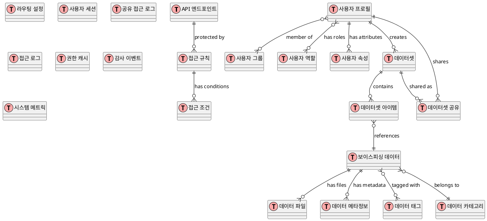

# 보이스피싱 데이터 포털 테이블 설계서

본 문서는 보이스피싱 데이터 수집, 접근제어, 데이터셋 생성과 공유를 위한 데이터베이스 테이블 설계를 다룹니다.

## 목차

1. [전체 ERD](#전체-erd)
2. [Gateway & Route](#gateway--route)
3. [User Management](#user-management)
4. [VoicePhishing Data](#voicephishing-data)
5. [Dataset & Share](#dataset--share)
6. [Access Control](#access-control)
7. [Audit & Monitoring](#audit--monitoring)

## 전체 ERD



## Gateway & Route

### API Endpoints 테이블

| 컬럼명       | 타입         | 제약             | 설명                                 |
| ------------ | ------------ | ---------------- | ------------------------------------ |
| id           | UUID         | PK               | API 엔드포인트 고유 식별자           |
| path         | VARCHAR(500) | NOT NULL, UNIQUE | API 경로 (예: /api/v1/data/records)  |
| method       | VARCHAR(10)  | NOT NULL         | HTTP 메서드 (GET, POST, PUT, DELETE) |
| service_name | VARCHAR(100) | NOT NULL         | 서비스명                             |
| description  | TEXT         | NULL             | API 설명                             |
| is_public    | BOOLEAN      | DEFAULT FALSE    | 공개 API 여부                        |
| rate_limit   | INTEGER      | DEFAULT 1000     | 요청 제한 (분당)                     |
| timeout_ms   | INTEGER      | DEFAULT 30000    | 타임아웃 (밀리초)                    |
| tags         | JSON         | NULL             | API 태그 목록                        |
| created_at   | TIMESTAMP    | DEFAULT NOW()    | 생성 시간                            |
| updated_at   | TIMESTAMP    | DEFAULT NOW()    | 수정 시간                            |

```sql
CREATE INDEX idx_api_endpoints_path_method ON api_endpoints(path, method);
CREATE INDEX idx_api_endpoints_service ON api_endpoints(service_name);
```

### Route Configurations 테이블

| 컬럼명                  | 타입         | 제약                  | 설명                    |
| ----------------------- | ------------ | --------------------- | ----------------------- |
| id                      | UUID         | PK                    | 라우팅 설정 고유 식별자 |
| api_endpoint_id         | UUID         | FK                    | API 엔드포인트 참조     |
| upstream_url            | VARCHAR(500) | NOT NULL              | 업스트림 서버 URL       |
| load_balancer_type      | VARCHAR(20)  | DEFAULT 'ROUND_ROBIN' | 로드밸런싱 방식         |
| circuit_breaker_enabled | BOOLEAN      | DEFAULT TRUE          | 서킷브레이커 활성화     |
| retry_count             | INTEGER      | DEFAULT 3             | 재시도 횟수             |
| health_check_url        | VARCHAR(500) | NULL                  | 헬스체크 URL            |
| is_active               | BOOLEAN      | DEFAULT TRUE          | 활성화 상태             |
| created_at              | TIMESTAMP    | DEFAULT NOW()         | 생성 시간               |
| updated_at              | TIMESTAMP    | DEFAULT NOW()         | 수정 시간               |

## User Management

### User Profiles 테이블

| 컬럼명              | 타입         | 제약             | 설명               |
| ------------------- | ------------ | ---------------- | ------------------ |
| id                  | UUID         | PK               | 사용자 고유 식별자 |
| keycloak_user_id    | VARCHAR(100) | UNIQUE, NOT NULL | Keycloak 사용자 ID |
| username            | VARCHAR(50)  | UNIQUE, NOT NULL | 사용자명           |
| email               | VARCHAR(255) | UNIQUE, NOT NULL | 이메일             |
| first_name          | VARCHAR(100) | NOT NULL         | 이름               |
| last_name           | VARCHAR(100) | NOT NULL         | 성                 |
| phone               | VARCHAR(20)  | NULL             | 전화번호           |
| organization        | VARCHAR(200) | NULL             | 소속 기관          |
| department          | VARCHAR(100) | NULL             | 부서               |
| position            | VARCHAR(100) | NULL             | 직책               |
| is_enabled          | BOOLEAN      | DEFAULT TRUE     | 계정 활성화 상태   |
| email_verified      | BOOLEAN      | DEFAULT FALSE    | 이메일 인증 상태   |
| last_login_at       | TIMESTAMP    | NULL             | 마지막 로그인 시간 |
| password_changed_at | TIMESTAMP    | NULL             | 비밀번호 변경 시간 |
| created_at          | TIMESTAMP    | DEFAULT NOW()    | 생성 시간          |
| updated_at          | TIMESTAMP    | DEFAULT NOW()    | 수정 시간          |

### User Groups 테이블

| 컬럼명            | 타입         | 제약             | 설명             |
| ----------------- | ------------ | ---------------- | ---------------- |
| id                | UUID         | PK               | 그룹 고유 식별자 |
| keycloak_group_id | VARCHAR(100) | UNIQUE, NOT NULL | Keycloak 그룹 ID |
| name              | VARCHAR(100) | NOT NULL         | 그룹명           |
| path              | VARCHAR(500) | NOT NULL         | 그룹 경로        |
| parent_id         | UUID         | FK               | 상위 그룹 ID     |
| level             | INTEGER      | DEFAULT 0        | 그룹 레벨        |
| description       | TEXT         | NULL             | 그룹 설명        |
| max_members       | INTEGER      | NULL             | 최대 멤버 수     |
| is_active         | BOOLEAN      | DEFAULT TRUE     | 활성화 상태      |
| created_at        | TIMESTAMP    | DEFAULT NOW()    | 생성 시간        |
| updated_at        | TIMESTAMP    | DEFAULT NOW()    | 수정 시간        |

### User Group Memberships 테이블

| 컬럼명        | 타입        | 제약             | 설명               |
| ------------- | ----------- | ---------------- | ------------------ |
| id            | UUID        | PK               | 멤버십 고유 식별자 |
| user_id       | UUID        | FK               | 사용자 ID          |
| group_id      | UUID        | FK               | 그룹 ID            |
| role_in_group | VARCHAR(50) | DEFAULT 'MEMBER' | 그룹 내 역할       |
| joined_at     | TIMESTAMP   | DEFAULT NOW()    | 가입 시간          |
| expires_at    | TIMESTAMP   | NULL             | 만료 시간          |

### User Roles 테이블

| 컬럼명           | 타입         | 제약             | 설명                 |
| ---------------- | ------------ | ---------------- | -------------------- |
| id               | UUID         | PK               | 역할 고유 식별자     |
| keycloak_role_id | VARCHAR(100) | UNIQUE, NOT NULL | Keycloak 역할 ID     |
| name             | VARCHAR(100) | NOT NULL         | 역할명               |
| description      | TEXT         | NULL             | 역할 설명            |
| is_composite     | BOOLEAN      | DEFAULT FALSE    | 복합 역할 여부       |
| is_client_role   | BOOLEAN      | DEFAULT FALSE    | 클라이언트 역할 여부 |
| client_id        | VARCHAR(100) | NULL             | 클라이언트 ID        |
| permissions      | JSON         | NULL             | 권한 목록            |
| is_active        | BOOLEAN      | DEFAULT TRUE     | 활성화 상태          |
| created_at       | TIMESTAMP    | DEFAULT NOW()    | 생성 시간            |
| updated_at       | TIMESTAMP    | DEFAULT NOW()    | 수정 시간            |

### User Role Assignments 테이블

| 컬럼명      | 타입      | 제약          | 설명             |
| ----------- | --------- | ------------- | ---------------- |
| id          | UUID      | PK            | 할당 고유 식별자 |
| user_id     | UUID      | FK            | 사용자 ID        |
| role_id     | UUID      | FK            | 역할 ID          |
| assigned_at | TIMESTAMP | DEFAULT NOW() | 할당 시간        |
| assigned_by | UUID      | FK            | 할당자 ID        |
| expires_at  | TIMESTAMP | NULL          | 만료 시간        |

### User Attributes 테이블

| 컬럼명          | 타입         | 제약          | 설명             |
| --------------- | ------------ | ------------- | ---------------- |
| id              | UUID         | PK            | 속성 고유 식별자 |
| user_id         | UUID         | FK            | 사용자 ID        |
| attribute_name  | VARCHAR(100) | NOT NULL      | 속성명           |
| attribute_value | TEXT         | NOT NULL      | 속성값           |
| is_system       | BOOLEAN      | DEFAULT FALSE | 시스템 속성 여부 |
| created_at      | TIMESTAMP    | DEFAULT NOW() | 생성 시간        |
| updated_at      | TIMESTAMP    | DEFAULT NOW() | 수정 시간        |

```sql
CREATE UNIQUE INDEX idx_user_attributes_unique ON user_attributes(user_id, attribute_name);
```

## VoicePhishing Data

### Voice Phishing Data 테이블

| 컬럼명           | 타입         | 제약             | 설명                                    |
| ---------------- | ------------ | ---------------- | --------------------------------------- |
| id               | UUID         | PK               | 데이터 고유 식별자                      |
| data_type        | VARCHAR(50)  | NOT NULL         | 데이터 타입 (SMS, CALL, EMAIL 등)       |
| collected_at     | TIMESTAMP    | NOT NULL         | 수집 시간                               |
| sender_number    | VARCHAR(50)  | NULL             | 보낸번호 (마스킹됨)                     |
| receiver_number  | VARCHAR(50)  | NULL             | 받은번호 (마스킹됨)                     |
| callback_number  | VARCHAR(50)  | NULL             | 회신번호                                |
| content          | TEXT         | NULL             | 텍스트 내용 또는 음성 전사 내용         |
| content_hash     | VARCHAR(64)  | NULL             | 내용 해시 (중복 검출용)                 |
| receiver_carrier | VARCHAR(50)  | NULL             | 수신자 통신사                           |
| source_system    | VARCHAR(100) | NOT NULL         | 수집 시스템                             |
| confidence_score | DECIMAL(3,2) | NULL             | 피싱 신뢰도 점수 (0.00-1.00)            |
| threat_level     | VARCHAR(20)  | NULL             | 위험 수준 (LOW, MEDIUM, HIGH, CRITICAL) |
| is_verified      | BOOLEAN      | DEFAULT FALSE    | 검증 완료 여부                          |
| verified_by      | UUID         | FK               | 검증자 ID                               |
| verified_at      | TIMESTAMP    | NULL             | 검증 시간                               |
| status           | VARCHAR(20)  | DEFAULT 'ACTIVE' | 상태 (ACTIVE, ARCHIVED, DELETED)        |
| created_at       | TIMESTAMP    | DEFAULT NOW()    | 생성 시간                               |
| updated_at       | TIMESTAMP    | DEFAULT NOW()    | 수정 시간                               |

```sql
CREATE INDEX idx_voice_phishing_data_type ON voice_phishing_data(data_type);
CREATE INDEX idx_voice_phishing_data_collected_at ON voice_phishing_data(collected_at);
CREATE INDEX idx_voice_phishing_data_sender ON voice_phishing_data(sender_number);
CREATE INDEX idx_voice_phishing_data_callback ON voice_phishing_data(callback_number);
CREATE INDEX idx_voice_phishing_data_content_hash ON voice_phishing_data(content_hash);
```

### Data Files 테이블

| 컬럼명                 | 타입          | 제약            | 설명                                |
| ---------------------- | ------------- | --------------- | ----------------------------------- |
| id                     | UUID          | PK              | 파일 고유 식별자                    |
| voice_phishing_data_id | UUID          | FK              | 보이스피싱 데이터 ID                |
| file_name              | VARCHAR(255)  | NOT NULL        | 원본 파일명                         |
| file_path              | VARCHAR(1000) | NOT NULL        | 저장 경로                           |
| file_format            | VARCHAR(20)   | NOT NULL        | 파일 포맷 (mp3, wav, jpg, png, txt) |
| file_size              | BIGINT        | NOT NULL        | 파일 크기 (bytes)                   |
| mime_type              | VARCHAR(100)  | NULL            | MIME 타입                           |
| duration               | DECIMAL(10,3) | NULL            | 재생시간 (초)                       |
| resolution             | VARCHAR(20)   | NULL            | 해상도 (1920x1080)                  |
| bitrate                | INTEGER       | NULL            | 비트레이트                          |
| encoding               | VARCHAR(50)   | NULL            | 인코딩 방식                         |
| checksum               | VARCHAR(64)   | NOT NULL        | 파일 체크섬                         |
| storage_type           | VARCHAR(20)   | DEFAULT 'LOCAL' | 저장소 타입 (LOCAL, S3, NFS)        |
| is_encrypted           | BOOLEAN       | DEFAULT FALSE   | 암호화 여부                         |
| encryption_key_id      | VARCHAR(100)  | NULL            | 암호화 키 ID                        |
| created_at             | TIMESTAMP     | DEFAULT NOW()   | 생성 시간                           |

```sql
CREATE INDEX idx_data_files_voice_phishing_data_id ON data_files(voice_phishing_data_id);
CREATE INDEX idx_data_files_checksum ON data_files(checksum);
```

### Data Metadata 테이블

| 컬럼명                 | 타입         | 제약             | 설명                   |
| ---------------------- | ------------ | ---------------- | ---------------------- |
| id                     | UUID         | PK               | 메타데이터 고유 식별자 |
| voice_phishing_data_id | UUID         | FK               | 보이스피싱 데이터 ID   |
| metadata_key           | VARCHAR(100) | NOT NULL         | 메타데이터 키          |
| metadata_value         | TEXT         | NOT NULL         | 메타데이터 값          |
| data_type              | VARCHAR(20)  | DEFAULT 'STRING' | 데이터 타입            |
| is_searchable          | BOOLEAN      | DEFAULT TRUE     | 검색 가능 여부         |
| created_at             | TIMESTAMP    | DEFAULT NOW()    | 생성 시간              |

```sql
CREATE INDEX idx_data_metadata_voice_phishing_data_id ON data_metadata(voice_phishing_data_id);
CREATE INDEX idx_data_metadata_key ON data_metadata(metadata_key);
```

### Data Categories 테이블

| 컬럼명      | 타입         | 제약             | 설명                 |
| ----------- | ------------ | ---------------- | -------------------- |
| id          | UUID         | PK               | 카테고리 고유 식별자 |
| name        | VARCHAR(100) | UNIQUE, NOT NULL | 카테고리명           |
| description | TEXT         | NULL             | 카테고리 설명        |
| parent_id   | UUID         | FK               | 상위 카테고리 ID     |
| level       | INTEGER      | DEFAULT 0        | 카테고리 레벨        |
| sort_order  | INTEGER      | DEFAULT 0        | 정렬 순서            |
| is_active   | BOOLEAN      | DEFAULT TRUE     | 활성화 상태          |
| created_at  | TIMESTAMP    | DEFAULT NOW()    | 생성 시간            |

### Data Tags 테이블

| 컬럼명      | 타입        | 제약             | 설명             |
| ----------- | ----------- | ---------------- | ---------------- |
| id          | UUID        | PK               | 태그 고유 식별자 |
| name        | VARCHAR(50) | UNIQUE, NOT NULL | 태그명           |
| color       | VARCHAR(7)  | NULL             | 태그 색상 (HEX)  |
| description | TEXT        | NULL             | 태그 설명        |
| usage_count | INTEGER     | DEFAULT 0        | 사용 횟수        |
| is_system   | BOOLEAN     | DEFAULT FALSE    | 시스템 태그 여부 |
| created_at  | TIMESTAMP   | DEFAULT NOW()    | 생성 시간        |

### Data Tag Associations 테이블

| 컬럼명                 | 타입      | 제약          | 설명                 |
| ---------------------- | --------- | ------------- | -------------------- |
| id                     | UUID      | PK            | 연관 고유 식별자     |
| voice_phishing_data_id | UUID      | FK            | 보이스피싱 데이터 ID |
| tag_id                 | UUID      | FK            | 태그 ID              |
| tagged_by              | UUID      | FK            | 태그 추가자 ID       |
| tagged_at              | TIMESTAMP | DEFAULT NOW() | 태그 추가 시간       |

```sql
CREATE UNIQUE INDEX idx_data_tag_associations_unique ON data_tag_associations(voice_phishing_data_id, tag_id);
```

## Dataset & Share

### Datasets 테이블

| 컬럼명              | 타입         | 제약               | 설명                                   |
| ------------------- | ------------ | ------------------ | -------------------------------------- |
| id                  | UUID         | PK                 | 데이터셋 고유 식별자                   |
| name                | VARCHAR(200) | NOT NULL           | 데이터셋 이름                          |
| description         | TEXT         | NULL               | 데이터셋 설명                          |
| search_filter       | JSON         | NOT NULL           | 검색 필터 조건                         |
| total_count         | INTEGER      | DEFAULT 0          | 포함된 총 데이터 수                    |
| total_size          | BIGINT       | DEFAULT 0          | 총 크기 (bytes)                        |
| status              | VARCHAR(20)  | DEFAULT 'CREATING' | 상태 (CREATING, READY, ERROR, EXPIRED) |
| is_public           | BOOLEAN      | DEFAULT FALSE      | 공개 데이터셋 여부                     |
| allowed_users       | JSON         | NULL               | 접근 허용 사용자 ID 목록               |
| allowed_groups      | JSON         | NULL               | 접근 허용 그룹 ID 목록                 |
| allowed_roles       | JSON         | NULL               | 접근 허용 역할 목록                    |
| required_attributes | JSON         | NULL               | 필수 속성 조건                         |
| download_limit      | INTEGER      | NULL               | 다운로드 횟수 제한                     |
| access_limit        | INTEGER      | NULL               | 접근 횟수 제한                         |
| expires_at          | TIMESTAMP    | NULL               | 만료 시간                              |
| created_by          | UUID         | FK, NOT NULL       | 생성자 ID                              |
| created_at          | TIMESTAMP    | DEFAULT NOW()      | 생성 시간                              |
| updated_at          | TIMESTAMP    | DEFAULT NOW()      | 수정 시간                              |

```sql
CREATE INDEX idx_datasets_created_by ON datasets(created_by);
CREATE INDEX idx_datasets_status ON datasets(status);
CREATE INDEX idx_datasets_expires_at ON datasets(expires_at);
```

### Dataset Items 테이블

| 컬럼명                 | 타입      | 제약          | 설명                 |
| ---------------------- | --------- | ------------- | -------------------- |
| id                     | UUID      | PK            | 아이템 고유 식별자   |
| dataset_id             | UUID      | FK            | 데이터셋 ID          |
| voice_phishing_data_id | UUID      | FK            | 보이스피싱 데이터 ID |
| item_order             | INTEGER   | NOT NULL      | 아이템 순서          |
| included_files         | JSON      | NULL          | 포함된 파일 ID 목록  |
| added_at               | TIMESTAMP | DEFAULT NOW() | 추가 시간            |

```sql
CREATE INDEX idx_dataset_items_dataset_id ON dataset_items(dataset_id);
CREATE UNIQUE INDEX idx_dataset_items_unique ON dataset_items(dataset_id, voice_phishing_data_id);
```

### Dataset Shares 테이블

| 컬럼명             | 타입         | 제약             | 설명               |
| ------------------ | ------------ | ---------------- | ------------------ |
| id                 | UUID         | PK               | 공유 고유 식별자   |
| dataset_id         | UUID         | FK               | 데이터셋 ID        |
| share_token        | VARCHAR(100) | UNIQUE, NOT NULL | 공유 토큰          |
| share_name         | VARCHAR(200) | NULL             | 공유명             |
| share_description  | TEXT         | NULL             | 공유 설명          |
| share_url          | VARCHAR(500) | NOT NULL         | 공유 URL           |
| access_count       | INTEGER      | DEFAULT 0        | 접근 횟수          |
| download_count     | INTEGER      | DEFAULT 0        | 다운로드 횟수      |
| max_access_count   | INTEGER      | NULL             | 최대 접근 횟수     |
| max_download_count | INTEGER      | NULL             | 최대 다운로드 횟수 |
| password_hash      | VARCHAR(255) | NULL             | 접근 비밀번호 해시 |
| allowed_ips        | JSON         | NULL             | 허용 IP 목록       |
| last_accessed_at   | TIMESTAMP    | NULL             | 마지막 접근 시간   |
| expires_at         | TIMESTAMP    | NULL             | 만료 시간          |
| is_active          | BOOLEAN      | DEFAULT TRUE     | 활성화 상태        |
| created_by         | UUID         | FK, NOT NULL     | 생성자 ID          |
| created_at         | TIMESTAMP    | DEFAULT NOW()    | 생성 시간          |
| updated_at         | TIMESTAMP    | DEFAULT NOW()    | 수정 시간          |

```sql
CREATE INDEX idx_dataset_shares_dataset_id ON dataset_shares(dataset_id);
CREATE INDEX idx_dataset_shares_token ON dataset_shares(share_token);
CREATE INDEX idx_dataset_shares_expires_at ON dataset_shares(expires_at);
```

### Share Access Logs 테이블

| 컬럼명        | 타입        | 제약          | 설명                       |
| ------------- | ----------- | ------------- | -------------------------- |
| id            | UUID        | PK            | 로그 고유 식별자           |
| share_id      | UUID        | FK            | 공유 ID                    |
| access_type   | VARCHAR(20) | NOT NULL      | 접근 타입 (VIEW, DOWNLOAD) |
| user_id       | UUID        | FK            | 사용자 ID (로그인한 경우)  |
| ip_address    | INET        | NOT NULL      | 접근 IP                    |
| user_agent    | TEXT        | NULL          | 사용자 에이전트            |
| success       | BOOLEAN     | NOT NULL      | 성공 여부                  |
| error_message | TEXT        | NULL          | 오류 메시지                |
| file_count    | INTEGER     | NULL          | 다운로드 파일 수           |
| file_size     | BIGINT      | NULL          | 다운로드 파일 크기         |
| accessed_at   | TIMESTAMP   | DEFAULT NOW() | 접근 시간                  |

```sql
CREATE INDEX idx_share_access_logs_share_id ON share_access_logs(share_id);
CREATE INDEX idx_share_access_logs_accessed_at ON share_access_logs(accessed_at);
CREATE INDEX idx_share_access_logs_ip ON share_access_logs(ip_address);
```

## Access Control

### Access Rules 테이블

| 컬럼명          | 타입         | 제약          | 설명                     |
| --------------- | ------------ | ------------- | ------------------------ |
| id              | UUID         | PK            | 접근 규칙 고유 식별자    |
| api_endpoint_id | UUID         | FK            | API 엔드포인트 ID        |
| rule_name       | VARCHAR(200) | NOT NULL      | 규칙명                   |
| description     | TEXT         | NULL          | 규칙 설명                |
| effect          | VARCHAR(10)  | NOT NULL      | 효과 (ALLOW, DENY)       |
| priority        | INTEGER      | DEFAULT 100   | 우선순위 (낮을수록 높음) |
| is_enabled      | BOOLEAN      | DEFAULT TRUE  | 활성화 상태              |
| created_by      | UUID         | FK            | 생성자 ID                |
| created_at      | TIMESTAMP    | DEFAULT NOW() | 생성 시간                |
| updated_at      | TIMESTAMP    | DEFAULT NOW() | 수정 시간                |

```sql
CREATE INDEX idx_access_rules_api_endpoint_id ON access_rules(api_endpoint_id);
CREATE INDEX idx_access_rules_priority ON access_rules(priority);
```

### Access Conditions 테이블

| 컬럼명           | 타입         | 제약             | 설명                                               |
| ---------------- | ------------ | ---------------- | -------------------------------------------------- |
| id               | UUID         | PK               | 조건 고유 식별자                                   |
| access_rule_id   | UUID         | FK               | 접근 규칙 ID                                       |
| condition_type   | VARCHAR(20)  | NOT NULL         | 조건 타입 (USER, GROUP, ROLE, ATTRIBUTE, TIME, IP) |
| condition_key    | VARCHAR(100) | NULL             | 조건 키 (속성명 등)                                |
| operator         | VARCHAR(20)  | DEFAULT 'EQUALS' | 연산자 (EQUALS, IN, NOT_IN, CONTAINS)              |
| condition_values | JSON         | NOT NULL         | 조건 값 목록                                       |
| is_negated       | BOOLEAN      | DEFAULT FALSE    | 부정 조건 여부                                     |
| created_at       | TIMESTAMP    | DEFAULT NOW()    | 생성 시간                                          |

```sql
CREATE INDEX idx_access_conditions_rule_id ON access_conditions(access_rule_id);
CREATE INDEX idx_access_conditions_type ON access_conditions(condition_type);
```

### Access Logs 테이블

| 컬럼명           | 타입         | 제약          | 설명               |
| ---------------- | ------------ | ------------- | ------------------ |
| id               | UUID         | PK            | 로그 고유 식별자   |
| user_id          | UUID         | FK            | 사용자 ID          |
| api_endpoint_id  | UUID         | FK            | API 엔드포인트 ID  |
| request_path     | VARCHAR(500) | NOT NULL      | 요청 경로          |
| request_method   | VARCHAR(10)  | NOT NULL      | HTTP 메서드        |
| ip_address       | INET         | NOT NULL      | 클라이언트 IP      |
| user_agent       | TEXT         | NULL          | 사용자 에이전트    |
| allowed          | BOOLEAN      | NOT NULL      | 허용 여부          |
| applied_rules    | JSON         | NULL          | 적용된 규칙 목록   |
| denial_reason    | TEXT         | NULL          | 거부 사유          |
| response_time_ms | INTEGER      | NULL          | 응답 시간 (밀리초) |
| request_size     | BIGINT       | NULL          | 요청 크기          |
| response_size    | BIGINT       | NULL          | 응답 크기          |
| accessed_at      | TIMESTAMP    | DEFAULT NOW() | 접근 시간          |

```sql
CREATE INDEX idx_access_logs_user_id ON access_logs(user_id);
CREATE INDEX idx_access_logs_api_endpoint_id ON access_logs(api_endpoint_id);
CREATE INDEX idx_access_logs_accessed_at ON access_logs(accessed_at);
CREATE INDEX idx_access_logs_allowed ON access_logs(allowed);
```

### Permission Cache 테이블

| 컬럼명        | 타입         | 제약          | 설명                          |
| ------------- | ------------ | ------------- | ----------------------------- |
| id            | UUID         | PK            | 캐시 고유 식별자              |
| user_id       | UUID         | NOT NULL      | 사용자 ID                     |
| resource_type | VARCHAR(50)  | NOT NULL      | 리소스 타입                   |
| resource_id   | VARCHAR(100) | NOT NULL      | 리소스 ID                     |
| permission    | VARCHAR(50)  | NOT NULL      | 권한 (READ, WRITE, DELETE 등) |
| granted       | BOOLEAN      | NOT NULL      | 권한 부여 여부                |
| expires_at    | TIMESTAMP    | NOT NULL      | 만료 시간                     |
| created_at    | TIMESTAMP    | DEFAULT NOW() | 생성 시간                     |

```sql
CREATE UNIQUE INDEX idx_permission_cache_unique ON permission_cache(user_id, resource_type, resource_id, permission);
CREATE INDEX idx_permission_cache_expires_at ON permission_cache(expires_at);
```

## Audit & Monitoring

### Audit Events 테이블

| 컬럼명        | 타입         | 제약          | 설명               |
| ------------- | ------------ | ------------- | ------------------ |
| id            | UUID         | PK            | 이벤트 고유 식별자 |
| event_type    | VARCHAR(50)  | NOT NULL      | 이벤트 타입        |
| user_id       | UUID         | FK            | 사용자 ID          |
| resource_type | VARCHAR(50)  | NULL          | 리소스 타입        |
| resource_id   | VARCHAR(100) | NULL          | 리소스 ID          |
| action        | VARCHAR(50)  | NOT NULL      | 수행된 작업        |
| details       | JSON         | NULL          | 상세 정보          |
| ip_address    | INET         | NULL          | 클라이언트 IP      |
| user_agent    | TEXT         | NULL          | 사용자 에이전트    |
| success       | BOOLEAN      | NOT NULL      | 성공 여부          |
| error_message | TEXT         | NULL          | 오류 메시지        |
| occurred_at   | TIMESTAMP    | DEFAULT NOW() | 발생 시간          |

```sql
CREATE INDEX idx_audit_events_user_id ON audit_events(user_id);
CREATE INDEX idx_audit_events_event_type ON audit_events(event_type);
CREATE INDEX idx_audit_events_occurred_at ON audit_events(occurred_at);
CREATE INDEX idx_audit_events_resource ON audit_events(resource_type, resource_id);
```

### System Metrics 테이블

| 컬럼명       | 타입          | 제약          | 설명               |
| ------------ | ------------- | ------------- | ------------------ |
| id           | UUID          | PK            | 메트릭 고유 식별자 |
| metric_name  | VARCHAR(100)  | NOT NULL      | 메트릭명           |
| metric_value | DECIMAL(15,4) | NOT NULL      | 메트릭 값          |
| metric_unit  | VARCHAR(20)   | NULL          | 측정 단위          |
| tags         | JSON          | NULL          | 태그 정보          |
| collected_at | TIMESTAMP     | DEFAULT NOW() | 수집 시간          |

```sql
CREATE INDEX idx_system_metrics_name ON system_metrics(metric_name);
CREATE INDEX idx_system_metrics_collected_at ON system_metrics(collected_at);
```

## 인덱스 및 제약조건 요약

### 주요 외래키 제약조건

```sql
-- User Management
ALTER TABLE user_group_memberships ADD CONSTRAINT fk_user_group_memberships_user FOREIGN KEY (user_id) REFERENCES user_profiles(id) ON DELETE CASCADE;
ALTER TABLE user_group_memberships ADD CONSTRAINT fk_user_group_memberships_group FOREIGN KEY (group_id) REFERENCES user_groups(id) ON DELETE CASCADE;
ALTER TABLE user_role_assignments ADD CONSTRAINT fk_user_role_assignments_user FOREIGN KEY (user_id) REFERENCES user_profiles(id) ON DELETE CASCADE;
ALTER TABLE user_role_assignments ADD CONSTRAINT fk_user_role_assignments_role FOREIGN KEY (role_id) REFERENCES user_roles(id) ON DELETE CASCADE;

-- Voice Phishing Data
ALTER TABLE data_files ADD CONSTRAINT fk_data_files_voice_phishing_data FOREIGN KEY (voice_phishing_data_id) REFERENCES voice_phishing_data(id) ON DELETE CASCADE;
ALTER TABLE data_metadata ADD CONSTRAINT fk_data_metadata_voice_phishing_data FOREIGN KEY (voice_phishing_data_id) REFERENCES voice_phishing_data(id) ON DELETE CASCADE;
ALTER TABLE data_tag_associations ADD CONSTRAINT fk_data_tag_associations_voice_phishing_data FOREIGN KEY (voice_phishing_data_id) REFERENCES voice_phishing_data(id) ON DELETE CASCADE;
ALTER TABLE data_tag_associations ADD CONSTRAINT fk_data_tag_associations_tag FOREIGN KEY (tag_id) REFERENCES data_tags(id) ON DELETE CASCADE;

-- Dataset & Share
ALTER TABLE datasets ADD CONSTRAINT fk_datasets_created_by FOREIGN KEY (created_by) REFERENCES user_profiles(id);
ALTER TABLE dataset_items ADD CONSTRAINT fk_dataset_items_dataset FOREIGN KEY (dataset_id) REFERENCES datasets(id) ON DELETE CASCADE;
ALTER TABLE dataset_items ADD CONSTRAINT fk_dataset_items_voice_phishing_data FOREIGN KEY (voice_phishing_data_id) REFERENCES voice_phishing_data(id);
ALTER TABLE dataset_shares ADD CONSTRAINT fk_dataset_shares_dataset FOREIGN KEY (dataset_id) REFERENCES datasets(id) ON DELETE CASCADE;
ALTER TABLE dataset_shares ADD CONSTRAINT fk_dataset_shares_created_by FOREIGN KEY (created_by) REFERENCES user_profiles(id);

-- Access Control
ALTER TABLE access_rules ADD CONSTRAINT fk_access_rules_api_endpoint FOREIGN KEY (api_endpoint_id) REFERENCES api_endpoints(id) ON DELETE CASCADE;
ALTER TABLE access_conditions ADD CONSTRAINT fk_access_conditions_access_rule FOREIGN KEY (access_rule_id) REFERENCES access_rules(id) ON DELETE CASCADE;
```

### 파티셔닝 전략

대용량 데이터 처리를 위한 파티셔닝:

```sql
-- 날짜별 파티셔닝 (월 단위)
CREATE TABLE voice_phishing_data_y2025m01 PARTITION OF voice_phishing_data
FOR VALUES FROM ('2025-01-01') TO ('2025-02-01');

-- 접근 로그 파티셔닝 (일 단위)
CREATE TABLE access_logs_y2025m01 PARTITION OF access_logs
FOR VALUES FROM ('2025-01-01') TO ('2025-02-01');
```

이 테이블 설계는 보이스 피싱 데이터 포털의 모든 주요 기능을 지원하며, 확장성과 성능을 고려하여 설계되었습니다.
