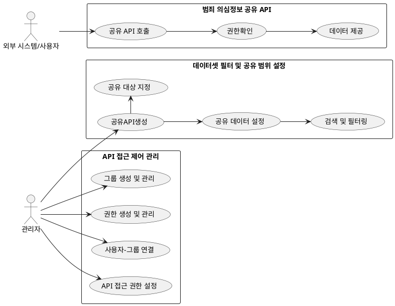
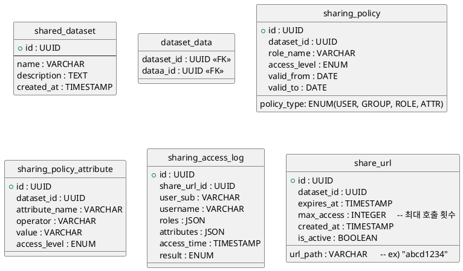

# 범죄 의심정보 공유 설계서

## 1. 개요

이 문서는 범죄 의심 정보를 안전하게 공유하기 위한 기술 개발을 목적으로 다음 기술(요구사항) 요소들에 대한 설계를 다룬다.

- API 별 접근 통제를 위한 사용자 그룹 및 권한 관리 기능
- 범죄 의심정보를 외부에서 안전하게 공유 가능한 REST API 개발
- 공유 API 별 데이터 필터 및 공유 범위 지정이 가능한 데이터셋 설정 기능
- 공유 API 별 접근 통제를 위한 사용자 그룹 및 권한 관리 기능

## 2. 유즈케이스



## 3. 시퀀스다이어그램

1. API 접근요청 흐름

    ```plantuml
    @startuml
    actor User
    participant "게이트웨이" as Gateway
    participant "인증서버" as Auth
    participant "데이터 공유 서비스" as App
    participant "접근제어" as ACL

    User -> Gateway : API 요청 (/voice-phishing)
    Gateway -> Auth : JWT 토큰 검증
    Auth --> Gateway : 사용자 ID, 그룹 정보
    Gateway -> App : API 요청 전달
    App -> ACL : 권한 조회
    alt 권한 허용
        ACL --> App : 접근 가능
        App --> Gateway : 응답 데이터
        Gateway --> User : 200 OK + 응답 데이터
    else 권한 없음
        ACL --> App : 접근 불가
        App --> Gateway : 접근 불가 
        Gateway --> User : 접근 불가
    end
    @enduml
    ```

2. 데이터 공유 설정 흐름

    ```plantuml
    @startuml
    actor Admin
    participant "관리 UI" as UI
    participant "데이터 공유 서비스" as DS
    participant "DB" as DB
    participant "접근제어" as ACL

    Admin -> UI : 데이터 공유 설정 : 공유 대상, 공유 범위 입력 
    UI -> DS : 공유 데이터셋 생성 요청
    DS -> DB : 데이터셋 설정
    DS -> ACL : 접근제어 정보 설정
    DS --> UI : 성공 메시지
    @enduml
    ```

## 4. 테이블 설계



## 5. 인터페이스

1. 데이터셋 생성

    - Method: POST
    - URL: /api/v1/dataset
    - Role: Admin
    - Request Body

      ```json
      {
        "name": "보이스피싱 의심 신고 데이터",
        "description": "2025년 6월 수집된 신고 데이터",
        "data_filter": [
          "data_type": "spam"
        ],
        "data_list": [
          "id_001",
          "id_002",
          "id_003",
          "id_004",
        ]
      }
      ```

    - Response

      ```json
      {
        "code": 200,
        "body": {
          "dataset_id": "uuid-1234",
          "name": "보이스피싱 의심 신고 데이터",
          "created_at": "2025-07-02T12:00:00Z"
        }
      }
      ```

2. 공유 API(URL) 생성

    - Method: POST
    - URL: /api/v1/share-url
    - Role: Admin
    - Request Body

      ```json
      {
        "dataset_id": "uuid-1234",
        "role": [
          "manager",
          "police"
        ],
        "attribute": [
          "team manager"
        ],
        "expires_at": "2025-07-31T23:59:59Z",
        "max_access": 100,
      }
      ```

    - Response

      ```json
      {
        "code": 200,
        "body": {
          "share_url": "/share/abc123xyz",
          "expires_at": "2025-07-31T23:59:59Z",
          "is_active": true
        }
      }
      ```

3. 공유 API 리스트 조회

    - Method: GET
    - URL: /api/v1/share-url/list
    - Role: Admin
    - Response

      ```json
      {
        "code": 200,
        "body": [
          {
            "share_url": "/share/abc123xyz",
            "dataset_name": "보이스피싱 의심 신고 데이터",
            "expires_at": "2025-07-31T23:59:59Z",
            "access_count": 14,
            "is_active": true
          },
          {
            "share_url": "/share/def456pqr",
            "dataset_name": "스미싱 신고 데이터",
            "expires_at": "2025-06-30T23:59:59Z",
            "access_count": 42,
            "is_active": false
          }
        ]
      }
      ```

4. 공유 API 설정 수정

    - Method: POST
    - URL: /api/v1/share-url/{url_path}
    - Role: Admin
    - Request Body

      ```json
      {
        "expires_at": "2025-08-15T00:00:00Z",
        "max_access": 200,
        "is_active": true
      }
      ```

    - Response

      ```json
      {
        "code": 200,
        "body": {
          "message": "공유 URL 설정이 수정되었습니다.",
          "share_url": "/share/abc123xyz"
        }
      }
      ```
