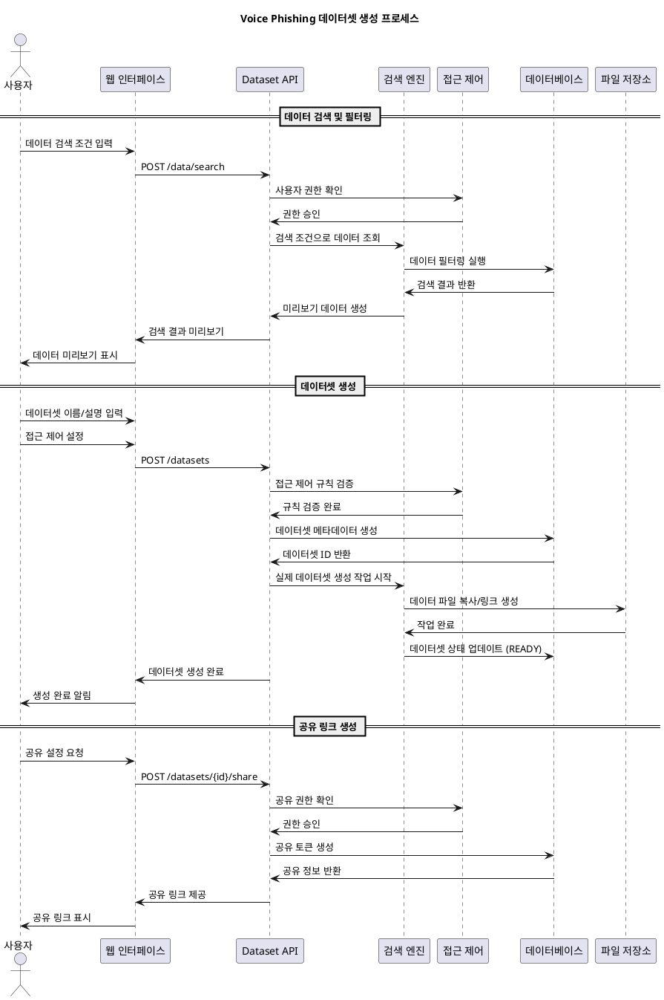
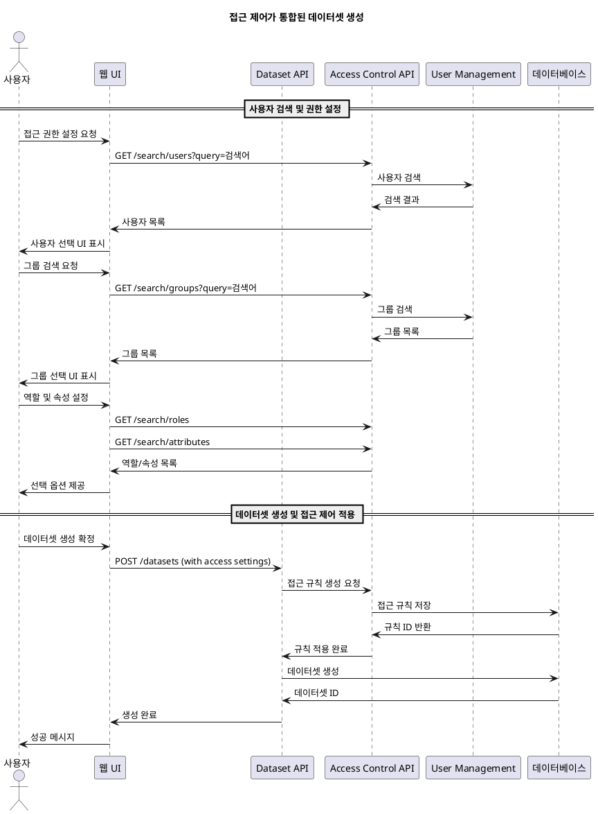
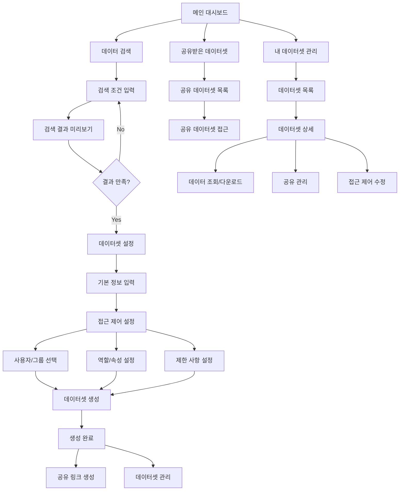
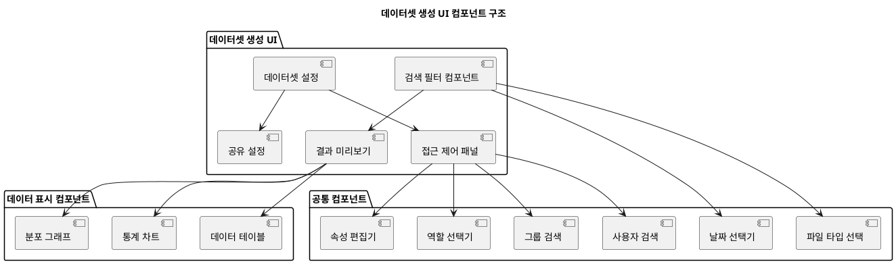
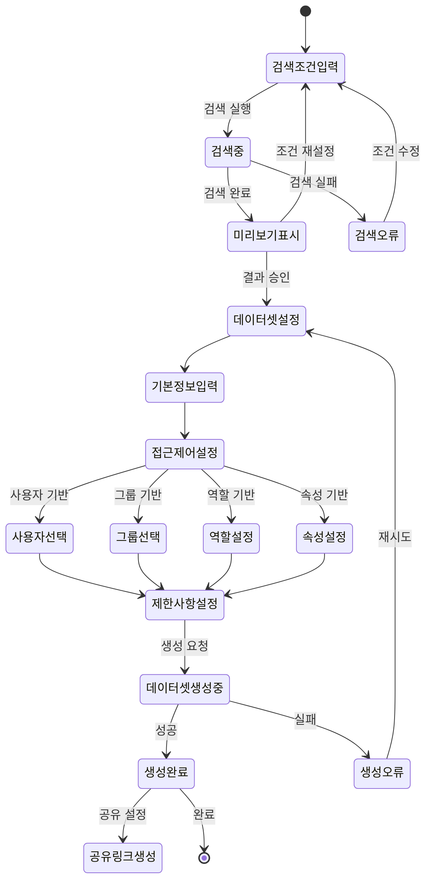
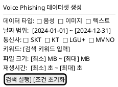
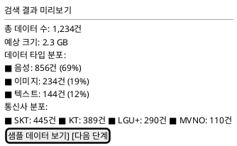
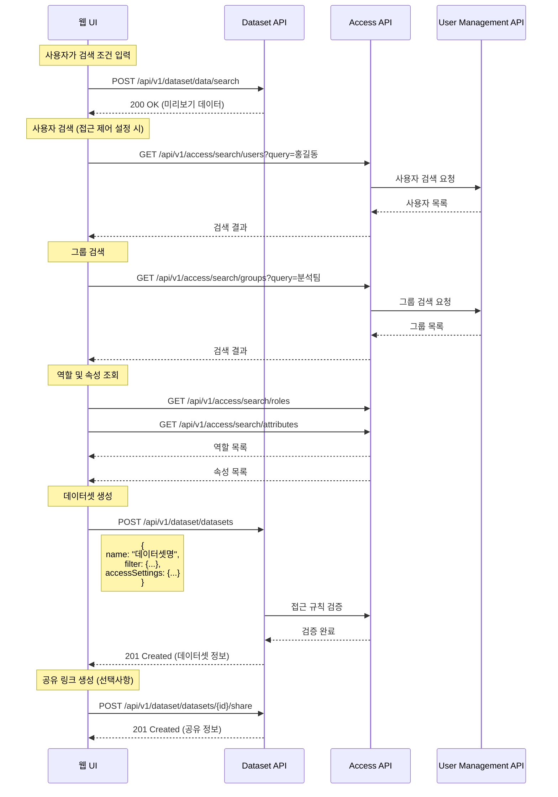

# Voice Phishing 데이터셋 생성 시퀀스 및 UI 설계

작성일: 2025년 7월 4일  
작성자: JB  

## 개요

Voice Phishing 데이터 공유 플랫폼에서 데이터셋을 생성하고 공유하는 과정의 시퀀스 다이어그램과 사용자 인터페이스 설계를 정의합니다.

## 1. 데이터셋 생성 시퀀스 다이어그램

### 1.1 전체 데이터셋 생성 프로세스



### 1.2 접근 제어 통합 시퀀스



## 2. 사용자 인터페이스 설계

### 2.1 사용자 인터페이스 플로우



### 2.2 컴포넌트 다이어그램



### 2.3 상태 다이어그램



## 3. 화면 와이어프레임

### 3.1 데이터 검색 화면





### 3.2 접근 제어 설정 화면

```text
┌─────────────────────────────────────────────────────────────┐
│ 2단계: 데이터셋 설정                                         │
├─────────────────────────────────────────────────────────────┤
│ 기본 정보                                                   │
│ 데이터셋 이름: [보이스피싱_2024Q4_데이터]                    │
│ 설명: [2024년 4분기 보이스피싱 데이터 모음]                  │
│ 만료일: [30일 후] ▼                                        │
├─────────────────────────────────────────────────────────────┤
│ 접근 제어 설정                                               │
│                                                             │
│ ○ 공개 데이터셋                                             │
│ ● 제한된 접근                                               │
│                                                             │
│ 허용 대상:                                                  │
│ ┌─────────────────────┬─────────────────────────────────┐   │
│ │ 사용자              │ 그룹                            │   │
│ │ [검색...        ] ▼│ [검색...               ] ▼    │   │
│ │ ✓ 홍길동(hong@ex..)  │ ✓ 데이터분석팀                   │   │
│ │ ✓ 김철수(kim@exa..)  │ ✓ 연구개발팀                     │   │
│ │ + 사용자 추가        │ + 그룹 추가                     │   │
│ └─────────────────────┴─────────────────────────────────┘   │
│                                                             │
│ ┌─────────────────────┬─────────────────────────────────┐   │
│ │ 역할                │ 속성 조건                        │   │
│ │ □ data-analyst      │ department = "보안팀"           │   │
│ │ □ researcher        │ clearance_level >= "LEVEL_3"    │   │
│ │ □ admin             │ + 조건 추가                     │   │
│ └─────────────────────┴─────────────────────────────────┘   │
│                                                             │
│ 제한 사항:                                                  │
│ 다운로드 횟수: [10] 회                                      │
│ 접근 횟수: [100] 회                                         │
│                                                             │
│              [이전] [데이터셋 생성]                          │
└─────────────────────────────────────────────────────────────┘
```

## 4. API 호출 시퀀스

### 4.1 실제 API 호출 순서



이 문서는 Voice Phishing 데이터셋 생성의 전체 프로세스를 시각화하고, 사용자 인터페이스의 구조와 흐름을 명확하게 정의합니다.
