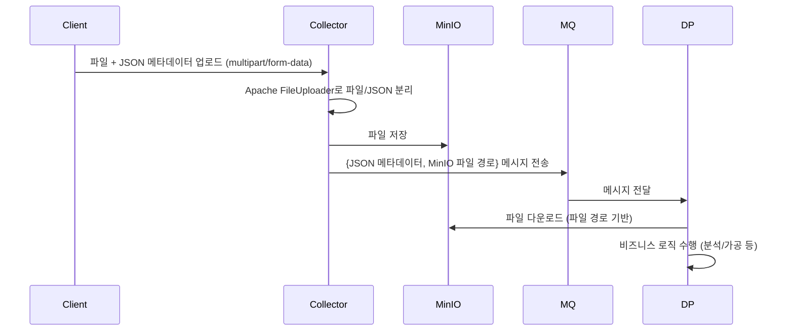
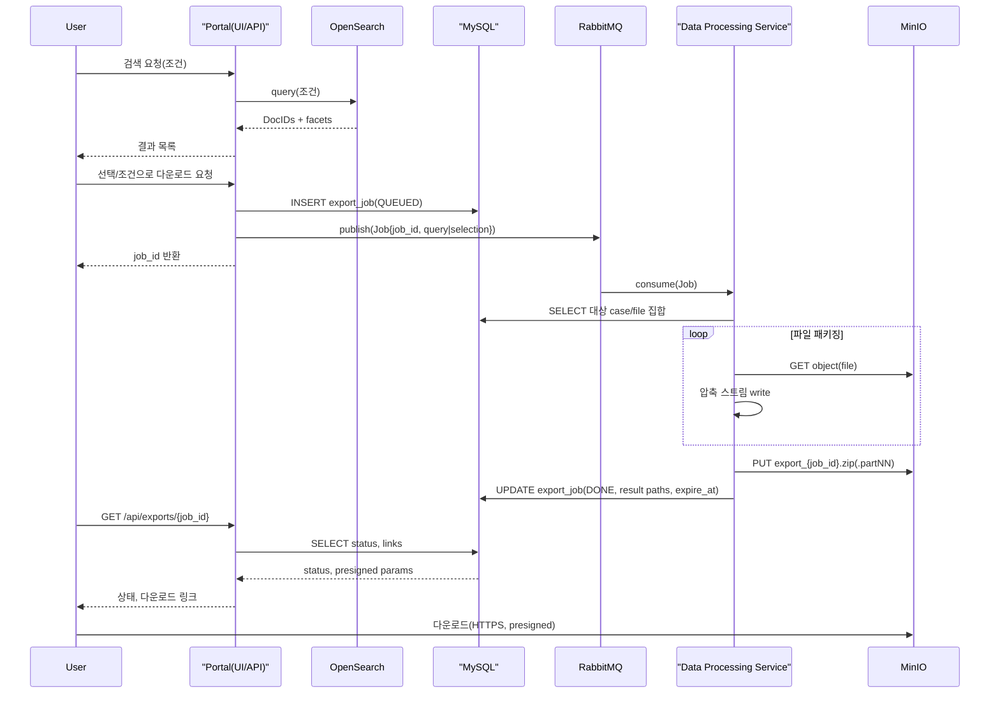

# Collector

## 개요

이 문서는 보이스 피싱 데이터 포탈에서 데이터 업로드를 수신하고 처리하는 Collector 서비스에 대해서 설명한다.

## 기술스택

## 

## 연동




반영본 아래에 제공합니다. 시퀀스 다이어그램은 PlantUML 형식입니다.

기술 설계서

대용량 데이터 공유 기능 설계 (개정 v1.1)

1) 시스템 구성 업데이트

| 컴포넌트           | 기술         | 역할                                                                     |
| ------------------ | ------------ | ------------------------------------------------------------------------ |
| 포털(Portal)       | Next.js 등   | 검색 UI, 다운로드 요청/상태 조회, 링크 노출                              |
| 검색 서비스        | OpenSearch   | 메타데이터 전문·필터링 검색                                              |
| 데이터베이스       | MySQL        | 정합성 기준 저장소. 사례 메타데이터, 파일 매핑, 배치 작업 상태(Job) 관리 |
| 오브젝트 저장소    | MinIO        | 원본 첨부 저장, 결과 압축 파일 업로드                                    |
| 메시지 큐          | RabbitMQ     | 대량 다운로드 요청 비동기화, 재시도                                      |
| 데이터 처리 서비스 | Python/Go 등 | 후보 집합 조회, 패키징/압축, MinIO 업로드, 링크/상태 갱신                |

아키텍처 흐름

```text
[User]
  |
  v
[Portal UI] --(검색쿼리)--> [OpenSearch]
   |                               |
   |<--(결과 DocIDs)---------------|
   |--(선택/조건으로 다운로드 요청)--> [Portal API]
   |                                   |
   |                    publish(Job) -> [RabbitMQ Queue: export.requests]
                                        |
                                consume -> [Data Processing Service]
                                        |--(SELECT)--> [MySQL]
                                        |--(GET objs)--> [MinIO]
                                        |--(PUT zip)--> [MinIO: export-bucket]
                                        |--(UPDATE link/status)--> [MySQL]
   |<--(poll status / fetch link)---- [Portal API]
   |--(다운로드)---------------------> [MinIO presigned URL]
```

2) 기능 요구사항 정리(갱신)

| ID    | 요구사항      | 상세                                                                  |
| ----- | ------------- | --------------------------------------------------------------------- |
| FR-01 | 검색          | OpenSearch 인덱스에서 조건 검색, 포털은 DocID 목록만 보유             |
| FR-02 | 정합성        | 다운로드 후보의 최종 필터·경로는 MySQL 기준으로 재확인                |
| FR-03 | 요청 비동기화 | RabbitMQ 큐로 Job 게시. 중복 방지용 request_hash 사용                 |
| FR-04 | 패키징        | metadata.csv + 파일 집합을 Zip/Tar.gz. 2GB 단위 분할 옵션             |
| FR-05 | 결과 저장     | 결과 압축 파일을 MinIO export-bucket/{job_id}/... 경로에 저장         |
| FR-06 | 링크 전달     | MinIO 사전서명 URL(유효시간 기본 24h) 생성 후 MySQL에 저장, 포털 노출 |
| FR-07 | 재시도        | 워커 실패 시 RabbitMQ DLQ → 지수 백오프 재처리                        |
| FR-08 | 감사          | 요청자/조건/건수/완료시간/결함파일 수 로깅                            |

3) 데이터 모델(핵심 테이블)

```text
-- VoicePhishingReport
CREATE TABLE voice_phishing_report (
  id BIGINT PRIMARY KEY,
  report_type TEXT,
  content text,
  file_path text,
  ...
  ...
);

-- 내보내기 작업
CREATE TABLE export_job (
  job_id CHAR(26) PRIMARY KEY,
  requester VARCHAR(100),
  request_hash CHAR(64),                  -- 조건/선택 해시
  query_json JSON,                        -- 검색 조건 스냅샷
  total_reports INT,
  total_files INT,
  status ENUM('QUEUED','RUNNING','DONE','FAILED','EXPIRED'),
  result_manifest VARCHAR(512),           -- manifest 경로
  result_archive VARCHAR(512),            -- zip/tar 경로(또는 prefix)
  link_expires_at DATETIME,
  created_at DATETIME, updated_at DATETIME,
  error_text TEXT,
  UNIQUE(request_hash)
);
```

4) 큐·버킷·경로 표준

| 항목            | 값                                                    |
| --------------- | ----------------------------------------------------- |
| 요청 큐         | export.requests                                       |
| MinIO 소스 버킷 | voicephishing                                         |
| MinIO 결과 버킷 | voicephishing-export                                  |
| 결과 prefix     | jobs/{job_id}/                                        |
| 결과 파일       | dataset_{job_id}.zip 또는 dataset_{job_id}.partNN.zip |
| 매니페스트      | manifest_{job_id}.json + metadata.csv                 |

5) API (요약)
    - POST /api/exports
    - body: { query|selection_ids, format: "zip"|"targz", split_bytes?: number }
    - resp: { job_id }
    - GET /api/exports/{job_id}
    - resp: { status, counts, download_urls?: [url], expire_at? }
    - GET /api/exports/{job_id}/metadata
    - resp: text/csv 스트리밍

6) 패키징 규칙

폴더 구조
```text
export_{job_id}/
 ├── metadata.csv
 ├── manifest.json
 └── files/
     └── {case_id}/{ordinal}.{ext}
```
metadata.csv 필드: id,{metadata fields},{file_path}

7) 보안·성능 설계(핵심)
    - RBAC, 모든 API는 JWT(또는 세션)+권한 검증.
    - MinIO presigned URL 만료 기본 24h. 필요 시 연장 API 별도.
    - 압축 스트리밍, 임시 디스크 사용량 상한. 파일 병렬 Fetch(Pool) + 쓰기 파이프라인.
    - 대량 시 스플릿 압축. 워커 수는 큐 소비량·IO 대역폭에 맞춰 HPA.

8) 오류·재시도

| 상황           | 처리                                               |
| -------------- | -------------------------------------------------- |
| 일부 파일 누락 | metadata.csv에 error_code 기입, 성공 파일만 패키징 |
| 링크 만료      | 상태 EXPIRED, 재발급 엔드포인트 제공               |
| 워커 장애      | DLQ로 이동 후 알람, 운영자 승인 재처리             |

9) 운영·가시성
- 감사로그: 요청자, 조건 해시, 생성/완료/다운로드 IP.

10) UML 시퀀스 다이어그램 (PlantUML)



11) 테스트 포인트
- 1만·5만·10만 건 규모별 처리시간, 실패율, 메모리/디스크 워터마크.
- presigned URL 만료/재발급, 분할 압축 병렬 다운로드 무결성(SHA256).