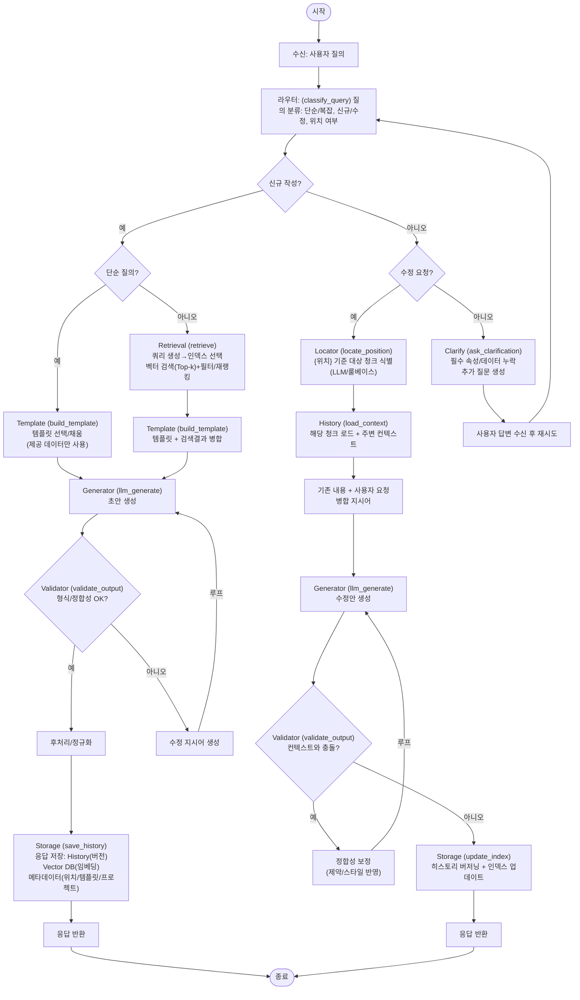

# 그라피오 스크럼

## 온톨로지

온톨로지는 어디까지 가능한가?

- 온톨로지 서비스에 대한 정의
  - platform api dhk service api 를 구분하여 정리 필요
  - 팔란티어 내용 리뷰 및 공유

## 온톨로지 생성 과정

1. connection instance
2. raw data 등록
3. raw 데이터 등록 시 메타 타입은 자동 생성
4. object type 생성 및 메타 타입 연결

## 21일

인천공항공사 데모 앱 개발 필요
시간이 1달정도 밖에 없음

## 22일 - 인천공항공사 - AI 디지털워크 전환 사업

업무도우미 all-in-one  : 내부 사규 등 문서 업로드 후 질의 응답

스마트 해외사업(도면 데이터 기반 AI Chat)
DWG - 오토 데스크 도면 데이터로 메타데이터(치수, ...)가 있음.
DWG의 메타데이터(도면) 기반 질의응답


1. 과업내역서 작성
2. 업무에 대한 주요 업무 흐름 안내 및 사용자 질의 응답


1. 질의
  1. 단순 질의 : {....} 사업을 위한 과업내역서 초안을 작성해줘
  2. 복잡 질의 : {이름} {목적} {기간} {대표기능} 정보가 포함된 사용자 질의

2. 응답
  1. 단순 질의 응답 : 사용자가 제공한 정보만을 이용해 공통 포맷 형식에 맞춰 문서 작성
  2. 복잡 질의 응답 : 사용자가 제공한 정보를 이용해 데이터를 검색하고 검색 결과를 이용해 포맷에 맞춰 문서 작성

---> 결과 값을 디비(벡터) 저장 필요

3. 질의
   1. 내용 추가/수정 요청 : {위치} + {사용자 요청}이 포함된 질의
      1. ex > '응답에서 데이터를 검색'이 아니라 xxx 으로 해줘

4. 응답
   1. 히스토리 데이터 필요성 확인
   2. 필요하다면 히스토리에서 {위치} 정보를 기반으로 데이터를 검색
   3. 해당 청크의 데이터 + 사용자 질의를 이용해 응답 전달
   4. 변경된 히스토리 저장

Input -> 최초/수정
-> 최초 -> 템플릿 -> LLM -> 응답 -> 저장
        -> 템플릿 + 데이터 검색 결과 -> LLM -> 응답 -> 저장

-> 수정 -> 위치 탐색(LLM) -> 기존 데이터 + 사용자 요청 -> LLM -> 응답 -> 저장
(반복)

준비
- 데이터(과업내역서) : 임준범
- 그래프 노드 구성 : 김재웅
- 초안 템플릿 : 

다음주
- 초안 템플릿 : 
- 노드 별 개발

---

### 템플릿 기반 휴먼인더루프

1. '{XXXX:문서 종류}' 문서 작성을 도와줘

네~... 
목차 제공
---
다음 질문 예시를 제공
{xxxx} 목차를 추가하고, {xxxx} 를 빼줘.
{프로젝트 이름}은 ... 이야. 개요를 작성해줘. 

2. 목차 수정 요청 or 목차 순서에 따라 내용 제공

2.1. 목차 수정 제공

3. 목차 별 내용에 대한 사용자 요청

4. 목차 별 내용 제공

5. 수정 요청 -> 4 단계, 좋아! 다음 목차

예외 : 목차를 변경해줘
현재 까지 작성된 내용에 대한 확인 요청 등



Metadata Format
```json
{
  "title": "outline metadata",
  "description": "목차 템플릿을 위한 메타데이터",
  "type": "object",
  "properties": {
    "statusType": {
      "description": "사업의 형태에 따른 분류",
      "type": "string",
      "enum": [
        "new",
        "update",
        "operation",
        "..."
      ]
    },
    "industryType": {
      "description": "사업 종류에 따른 분류",
      "type": "string",
      "enum": [
        "it",
        "construction",
        "..."
      ]
    },
    "documentType": {
      "description": "문서 종류",
      "type": "string",
      "enum": [
        "입찰공고",
        "과업내역서",
        "제안요청서"
      ]
    }
  }
}
```

Template Format
```json
{
  "title": "outlineTemplate",
  "description": "목차 템플릿",
  "type": "object",
  "definitions": {
    "outlineTemplate": {
      "description": "목차 템플릿 정의",
      "type": "object",
      "properties": {
        "level": {
          "description": "목차 수준(대목차, 중목차, 소목차)에 따라 1, 2, 3 부여", 
          "type": "integer"
        },
        "order": {
          "description": "목차 수준(대목차, 중목차, 소목차)에서의 순서", 
          "type": "integer"
        },
        "label": {
          "description": "목차 앞에 위치하는 숫자 정보. 예제 : '1.', '1.1.'",
          "type": "string"
        },
        "title": {
          "description": "목차에서 숫자부분을 제외한 내용",
          "type": "string"
        }
      }
    }
  },
  "properties": {
    "outlineTemplates": {
      "description": "목차 템플릿",
      "type": "array",
      "items": {
        "$ref": "#definitions/oulineTemplate"
      }
    }
  }
}
```

"Description": "소프트웨어 개발 사업을 위한 과업내역서 템플릿",
"Metadata": "신규, 개선 소프트웨어 사업을 위한 과업내역서",
"Template": |-
"
제1장 사업 개요
	1.	사업명
	2.	사업기간
	3.	추진 배경 및 필요성
	4.	주요 과업
	5.	관련 법령·정책·기준 (필요 시)
⸻
제2장 운용 현황
	1.	현행 시스템 개요
	2.	운영 절차 및 업무 흐름
	3.	문제점 및 개선 필요사항
⸻
제3장 추진 방안
	1.	목표 시스템 구성 방안
	1.	시스템 구성
	2.	주요 기능
	2.	추진 체계
	3.	추진 일정
⸻
제4장 과업 내용
	1.	요구사항 정의(총괄표)
	2.	과업 요구사항 목록
	3.	상세 요구사항
	•	기능 요구사항(SFR)
	•	비기능 요구사항(성능, 보안 등)
	•	시스템 인터페이스 요구사항(SIR)
	•	데이터 요구사항(DAR)
	•	테스트 요구사항(TER)
	•	품질 요구사항(QUR)
	•	제약사항(COR)
	•	프로젝트 관리·지원 요구사항(PMR, PSR)
"

요구사항 필터
*) 시연 시 동일한 사업 정보를 입력해서 초안을 작성한다고 가정한다.
| Name     | Description                     |
| -------- | ------------------------------- |
| ID       | ...                             |
| 사업배경 | 사업 개요(시스템 설명)의 내용들 |
| 임베딩   | ....                            |

요구사항(requirments)

| Name     | Description                     |
| -------- | ------------------------------- |
| ID       | ...                             |
| 필터 ID  | ...                             |
| 사업배경 | 사업 개요(시스템 설명)의 내용들 |
| 분류     | 기능, 보안, 운영, 유지보수, ... |
| 이름     | ....                            |
| 내용     | ....                            |
| 임베딩   | 이름 + 내용                     |


1. 요구사항 목록

-> 사업 배경(목표 시스템)을 기준으로 목차 리스트를 뽑고,
-> 정제(동일 요구사항 제거 및 LLM을 이용한 정제)

2. 세부 요구사항 작성 시

-> 기능 이름 + 기능 설명을 이용해 요구사항 검색(임베딩)
-> LLM 질의 ( 참고 데이터 + 프롬프트를 활용해 응답 데이터에 대한 요구사항 추가 )


---

파일 업로드 + 초안 작성의 경우

1. 업로드 + 청킹
--> 사용자 : 첨부된 문서를 참고해서 .... 초안을 작성해줘
2. 목차 및 내용 요약 요청 -> LLM 

3. 목차 별 내용 작성 요청 -> LLM

---

꼭 있었으면 하는 데이터(메타+콘텐츠)
	1.	문서 수준 메타데이터

	•	목적/대상 독자/톤(격식, 반말/존댓말)/길이 목표(페이지, 단어)/언어/버전
	•	준수해야 하는 표준/규정(예: ISO, 내부 가이드)과 금지어·권장어 목록
	•	표·그림 번호 규칙, 인용/참고문헌 스타일(예: IEEE, APA)

	2.	섹션(3-depth) 수준 메타데이터

	•	section_id(안정 ID), path(예: 1.2.3), title, section_intent(이 섹션이 답해야 할 질문)
	•	콘텐츠 유형(배경/절차/사양/요구사항/결론/FAQ 등)
	•	예상 분량/필수 포함 포인트(키 포인트 체크리스트)
	•	허용 포맷(서술형/목록/표/코드/수식)
	•	필수/선택 변수 목록(예: 제품명, 버전, 성능 수치)과 검증 규칙

	3.	소스 연결 정보(근거 추적용)

	•	각 섹션이 참조하는 내부 문서/표/그림/URL/데이터셋의 source_id, 위치(anchor), 발행일, 신뢰도
	•	소스별 사용 가능 라이선스/보안 등급(내부/대외비/공개)

	4.	스타일 & 용어 가이드(짧아도 핵심 규칙)

	•	문장 스타일 예시(좋은/나쁜 예)
	•	용어 글로서리(용어, 정의, 금지 대체어, 영문/국문 표기)
	•	수치 표기 규칙(소수점 자리수, 단위, 날짜·시간·통화 포맷)

	5.	스니펫/샘플(재사용 가능한 문단)

	•	자주 쓰는 보일러플레이트 문구를 변수화해 저장(예: 안전 고지, 법적 문구)
	•	“좋은 초안”의 골든 샘플과 그에 매핑된 섹션 ID

	6.	평가/피드백 데이터

	•	자동 점검 룰: 길이, 금지어, 출처 누락, 표/그림 미참조, TODO 남김 여부
	•	인간 리뷰 체크리스트 & 과거 리뷰 코멘트(섹션 ID와 연결)

RAG에 잘 먹히는 데이터 구성(스키마/저장 형태)

아래처럼 계층+변수+소스가 한 눈에 보이도록 JSON/YAML로 관리하면 좋아요. (예시는 YAML)

```yaml
doc_template:
  id: "STD-PRD-001"
  title: "제품 요구사항 명세서"
  language: "ko-KR"
  audience: "내부 엔지니어/PM"
  tone: "formal"
  length_target: { pages: 12 }
  compliance: ["ISO/IEC 25010"]
  glossary_ref: "glossary_v3"
sections:
  - id: "1"
    path: "1"
    title: "개요"
    intent: "문서 목적과 범위를 명확히 한다"
    type: "배경"
    required_points:
      - "문서의 적용 범위"
      - "대상 제품/버전"
    allowed_formats: ["paragraph", "list"]
    variables:
      - { name: "product_name", type: "string", required: true }
      - { name: "release_version", type: "semver", required: true }
    sources: [{ source_id: "INT-WIKI-42#intro", trust: 0.9, date: "2025-03-12" }]
  - id: "1.1"
    path: "1.1"
    title: "문서 범위"
    intent: "포함/제외 범위를 구체화"
    type: "요구사항"
    checklist: ["포함 기능", "제외 기능", "가정/제약"]
    length_hint: "150-250 words"
    sources: [{ source_id: "JIRA-PRD-987#scope" }]
variables:
  product_name: "Aquila"
  release_version: "v2.4.0"
style_guide:
  forbidden_terms: ["최고의", "완벽한"]
  preferred_terms:
    - { term: "지연시간", prefer: "레이턴시" }
numbers_format:
  decimals: 2
  units: { latency: "ms", throughput: "req/s" }
snippets:
  legal_notice_v1: "본 문서는 내부 전용이며 외부 배포를 금합니다."
evaluation:
  rules:
    - id: "R1" # 출처 누락 금지
      type: "citation_required_per_section"`
    - id: "R2" # 길이 상한
      type: "section_word_limit"
      params: { max: 350 }
```

구현 팁(검색·생성 품질을 좌우)
	•	계층형 인덱싱: 문서 전체 임베딩 + 섹션 임베딩 + 문단 임베딩을 함께 저장하고, 쿼리→상위 섹션 히트→하위 확장 방식으로 재순위화.
	•	세밀한 청킹: 3-depth 기준으로 “문단 단위(150–300자)” 청킹 + section_id/path를 메타로 붙이기.
	•	다중 신호 재순위화: BM25(키워드) + 임베딩 스코어 + 메타 가중치(섹션 타입/신뢰도/신선도).
	•	변수 주입(Slot filling): 초안 프롬프트에서 variables를 미리 채워 넣고, 누락된 변수는 TODO로 표시하게.
	•	근거 인용 강제: 섹션별 최소 1개 source_id 포함을 규칙화하고, 초안 내 [ref: source_id] 형태로 남긴 뒤 후처리에서 실제 서지/링크로 변환.
	•	가드레일: 금지어/톤/길이/표·그림 참조 누락을 생성 후 자동 점검 → 수정 프롬프트 재주입(반복 1~2회).
	•	버전·변경 이력: 템플릿/가이드/스니펫의 버전을 메타로 저장하고, 초안에 사용된 버전 해시를 푸터에 기록.
	•	피드백 루프: 리뷰 코멘트를 섹션 ID 기준으로 수집해 “수정 전/후 페어”를 축적 → 다음 초안의 재순위화/지시어에 반영.


https://chatgpt.com/g/g-67368c5aab488190bc8ea466cc440501-hanguggonghanggongsa-bodojaryo-jagseongbos/c/689ea913-3d08-832b-a168-eedbdc98421d 

📂 공통 프롬프트


# 보도자료 작성 규칙

## 문체 및 스타일

- 문체는 저널리스트적, 공식적이고 정제된 언어 사용
- 모든 언어는 한국표준어, 한글맞춤법, 외래어표기법에 맞게 작성
- 외국어는 한글로 표기 후 괄호 안에 원어 병기 (예: 공항서비스센터(Airport Service Center))
- 불필요한 표현 배제, 간결하고 핵심 위주의 문장
- 어미 통일: "~한다" 체 사용
  - 예: ~했습니다 X → ~한다 O

## 어휘 규칙

- '하여' → '해', '되어' → '됐'으로 바꿈
- 중복되는 어미 지양
- '인천공항공사'는 본문 최초 1회만 사용, 이후에는 '공사'로 표기
- '홈페이지' → '누리집', '이메일' → '전자우편'으로 표기
- "｢ "와 "｣"는 사용 금지, 일반 큰따옴표(" ") 사용
- 날짜는 "8.15.(목)" X → "8월 15일" O


## 문단 구성 규칙

보도자료는 총 7개 단락으로 구성되며, 주제에 따라 약간의 변형이 있습니다.

### 사업 추진 / 해외사업 수주
1. 육하원칙 개요
2. 사업 목적
3. 사업 주요내용
4. 기대효과
5. 이후 계획
6. 담당자 정보
7. 사장 또는 본부장 멘트

### 행사 / 업무협약 / 공모전 / 채용
1. 육하원칙 개요
2. 행사 목적
3. 주요 참여자 및 내용 개요
4. 행사 세부내용
5. 이후 계획
6. 사장 또는 본부장 멘트

### 공항정보 / 서비스 / 프로모션
1. 육하원칙 개요
2. 정보 제공 배경
3. 정보 상세 내용
4. 이용 방법
5. 기대효과
6. 향후 계획
7. 사장 또는 본부장 멘트

### 수상 / 특허취득
1. 육하원칙 개요
2. 수상 목적 또는 수상 기관 소개
3. 수상 이유
4. 이후 계획
5. 사장 또는 본부장 멘트

### 여객수요 / 운항계획
1. 육하원칙 개요
2. 수요 또는 계획 개요
3. 분석 또는 편성 이유
4. 상세 내용
5. 추가 정보
6. 향후 계획
7. 사장 또는 본부장 멘트


## 제목/부제목 규칙

- 제목은 주목도를 높이기 위한 키워드 중심 구성
- 부제목은 보도자료 핵심 요약

## 분량

- 최대 2,500단어
- 짧고 핵심 있는 문장을 우선하며 국민과 언론이 이해하기 쉽게 구성


📂 14개 유형별 프롬프트

[사업추진]
공사가 새롭게 시작하는 사업, 기술 도입, 인프라 확장 등 구체적인 실행계획을 국민과 언론에 알리는 목적으로 작성
스마트공항 구축, 에너지 절감 사업, 신기술 도입 등

## 보도자료 작성을 위한 필요 정보
- 사업명
- 추진 시기 및 배경
- 대상 공항
- 주요 기술 또는 설비 내용
- 기대 효과
- 향후 계획

[해외사업수주]
해외 프로젝트 수주 또는 운영권 획득 등 국외사업 관련 성과 중심으로 작성
해외 공항 운영권 획득, 해외 프로젝트 수주 등

## 보도자료 작성을 위한 필요 정보
- 수주한 나라
- 공항명
- 운영범위
- 사업 기간
- 금액
- 수주 방식
- 참여 배경
- 기대 효과

[행사]
공사 주관 또는 참여 행사를 국민과 언론에 효과적으로 알리기 위해 작성
기념식, 캠페인, 공항 행사, 사회공헌활동 등

## 보도자료 작성을 위한 필요 정보
- 행사 명칭
- 일시 및 장소
- 주최/주관
- 주요 프로그램
- 주요 참석자
- 행사 목적 및 의미
- 후속 계획

[업무협약(MOU)]
공사와 외부기관 간 협력 체결 사실과 그 목적을 명확히 전달하는 데 중점을 두며 작성
유관기관과의 협약 체결, 전략적 제휴

## 사용자 입력 필요한 항목
- 협약 체결일, 장소
- 협약명
- 참여 기관 및 주요 인물
- 협약 목적과 배경
- 주요 협력 내용
- 후속 추진 계획

[공모전]
공사 주관 또는 후원으로 진행되는 공모전의 개최 사실과 참여를 독려하는 목적으로 작성
아이디어, 콘텐츠, 디자인, 영상 등 공모전 개최

## 보도자료 작성을 위한 정보 요청
- 공모전 명칭
- 개최 기간
- 주최/주관 및 후원 기관
- 참여 대상 및 방식
- 공모 주제 및 시상 내역
- 활용 계획
- 포스터나 관련 이미지(선택)

[채용]
공사의 신규 인력 채용 계획을 국민과 구직자에게 투명하게 알리고, 적극적인 지원을 유도하기 위한 목적으로 작성
정규직, 인턴, 사회형평채용 등 인재 채용 안내

## 보도자료 작성을 위한 정보 요청
- 채용 공고 명칭 및 일정
- 채용 분야 및 인원
- 지원 자격 및 전형 절차
- 접수 방법
- 설명회 또는 홍보 계획
- 사장 또는 본부장의 채용 관련 메시지

[공항정보]
공항을 이용하는 국민에게 유용한 정보(운항, 교통, 편의시설 등)를 명확하고 친절하게 전달하는 목적으로 작성
항공편, 시설, 교통 등 공항 이용에 필요한 정보 제공

## 보도자료 작성을 위한 정보 요청
- 어떤 공항의 정보인지
- 정보 제공 시기
- 제공 정보의 종류
- 이용 방법
- 배경 및 필요성
- 향후 계획

[서비스]
공사가 새롭게 도입하거나 개선한 고객 편의 서비스, 무인기기, 디지털 시스템 등을 국민에게 알리는 목적으로 작성
고객 편의 서비스, 무인 시스템, 앱 출시 등

## 보도자료 작성을 위한 정보 요청
- 서비스 명칭 및 개요
- 도입 시기 및 공항
- 도입 배경 및 필요성
- 이용 방법
- 기대 효과
- 향후 확대 계획

[프로모션]
공사가 여객을 대상으로 진행하는 다양한 혜택·이벤트·마케팅 활동(할인, 경품, 제휴 등)을 알리고 참여를 유도하는 목적에 맞춰 작성
할인 이벤트, 공동 마케팅, 여행사 제휴 이벤트 등

## 보도자료 작성을 위한 정보 요청
- 프로모션 명칭
- 시행 기간 및 대상 공항
- 주요 혜택 내용
- 참여 방법 및 조건
- 주최 및 제휴사
- 향후 계획

[수상]
공사 또는 소속 직원이 받은 기관·산업·사회 분야 수상 실적을 대외적으로 알리고, 신뢰성과 위상을 높이기 위한 목적으로 작성
기관 수상, 공항평가 1위, ESG·고객만족 등 수상

## 보도자료 작성을 위한 정보 요청
- 수상 일시 및 장소
- 상 명칭 및 주최 기관
- 수상 분야 및 이유
- 공사의 관련 실적 또는 사례
- 수상에 따른 향후 계획
- 사장 또는 본부장 명의 멘트

[특허취득]
공사 또는 소속 직원이 개발한 기술·시스템 등이 특허권을 획득한 사실을 대외적으로 알리고, 기술력과 혁신성을 홍보하는 목적으로 작성
기술 개발로 인한 지식재산권 등록·인증

## 보도자료 작성을 위한 정보 요청
- 특허 명칭 및 등록일
- 발명 또는 개발 기술 개요
- 등록 기관(예: 특허청)
- 기술의 활용 분야 및 효과
- 향후 적용 계획
- 임원 멘트

[여객수요]
특정 시기 또는 기간 동안 공항을 이용한 여객 증가·감소 현황을 국민과 언론에 알리고, 수요 변화의 원인과 대응 방향을 설명하는 목적으로 작성
특정 기간 여객 증가·감소, 휴가철·명절 여객 동향

## 보도자료 작성을 위한 정보 요청
- 수요 집계 기간
- 전체 및 공항별 여객 수
- 전년 동기 대비 증감률
- 주요 수요 증가/감소 원인
- 향후 대응 방안
- 임원 멘트

[운항계획]
공사가 특정 시기 또는 정기적으로 항공편 운항(신규취항, 증편, 감편 등)에 대한 정보를 국민에게 알리고, 여객 이용을 안내하기 위한 목적으로 작성
계절별 항공편 증편·신규 취항, 운항노선 조정 등

## 보도자료 작성을 위한 정보 요청
- 운항기간
- 전체 편수 및 노선별 증감
- 운항계획 수립 배경
- 이용객 대상 안내사항
- 향후 계획
- 임원 멘트

[기타]
[사업 추진], [행사], [운항계획] 등 13개 정형화된 분류에 해당하지 않는 특별한 사안—예를 들어 내부 조직개편, 규정 개정, 시스템 고도화, 긴급 대응, 대외 성명 등— 에 활용

## 보도자료 작성을 위한 정보 요청
- 발표 또는 실행 날짜
- 조치의 목적 또는 배경
- 세부 내용
- 적용 범위 또는 영향
- 향후 계획
- 임원 멘트

'{\n    
"user_input": "인천공항공사, 공항 면세점과 면세물품 할인 행사 실시. 8월 13일부터 9월 10일까지 김포·김해·제주·청주공항에서 면세물품 최대 40% 할인.
인천공항공사(사장 이학제)는 8월 13일부터 9월 10일까지 김포·김해·제주·청주 등 4개 공항에 입점한 면세점과 공동으로 면세물품 할인 행사를 실시한다.
공사는 온라인 쇼핑, 로드샵 방문 등 여행객의 소비트렌드 변화와 고환율 영향으로 어려움을 겪는 공항 면세점과의 상생 협력을 위해 공동 프로모션을 마련했다.
 공사는 공항별 특성과 매출 분석을 바탕으로 선호도가 높은 상품을 선정하는 등 맞춤형 할인 행사를 진행하며, 이번 행사를 위해 8,100만원을 지원한다.
  김포공항 롯데면세점은 구매 금액($100~$500)에 따라 1만원~5만원의 금액할인을 제공하고, 외국 관광객이 많이 찾는 제주공항 롯데면세점은 외국인 고객을 
  대상으로 $100, $250 이상 구매시 각각 1만원, 3만원을 할인 적용한다. 김해·청주공항 경복궁면세점은 주류, 담배, 건강기능식품, 패션잡화 등 인기 품목에 대해 최대 40%까지 할인 혜택을 제공한다. 
  허주희 인천공항공사 글로컬사업본부장은 \'공항 이용객 만족도 향상과 면세점 활성화를 위해 추석 연휴와 연말에도 면세업계와 협력해 다양한 프로모션을 이어가겠다\'라고 말했다.",\n   
   "result": [\n        {\n            "언론사": "",\n            "기자": "",\n            "작성일": "",\n            "수정일": "",\n            "카테고리": "",\n            "언론보도유형": "",\n            "언론보도타입": "",\n            "언론보도유형2": "",\n            "언론보도타입2": "",\n            
   "보도문구": "인천공항공사, 공항 면세점과 면세물품 할인 행사 실시. 8월 13일부터 9월 10일까지 김포·김해·제주·청주공항에서 면세물품 최대 40% 할인. 
   인천공항공사(사장 이학제)는 8월 13일부터 9월 10일까지 김포·김해·제주·청주 등 4개 공항에 입점한 면세점과 공동으로 면세물품 할인 행사를 실시한다. 
   공사는 온라인 쇼핑, 로드샵 방문 등 여행객의 소비트렌드 변화와 고환율 영향으로 어려움을 겪는 공항 면세점과의 상생 협력을 위해 공동 프로모션을 마련했다. 
   공사는 공항별 특성과 매출 분석을 바탕으로 선호도가 높은 상품을 선정하는 등 맞춤형 할인 행사를 진행하며, 이번 행사를 위해 8,100만원을 지원한다. 
   김포공항 롯데면세점은 구매 금액($100~$500)에 따라 1만원~5만원의 금액할인을 제공하고, 외국 관광객이 많이 찾는 제주공항 롯데면세점은 외국인 
   고객을 대상으로 $100, $250 이상 구매시 각각 1만원, 3만원을 할인 적용한다. 김해·청주공항 경복궁면세점은 주류, 담배, 
   건강기능식품, 패션잡화 등 인기 품목에 대해 최대 40%까지 할인 혜택을 제공한다. 허주희 인천공항공사 글로컬사업본부장은 \'공항 이용객 만족도 향상과 면세점 활성화를 위해 추석 연휴와 연말에도 면세업계와 협력해 다양한 프로모션을 이어가겠다\'라고 말했다.",\n            "첨부파일명": ""\n        }\n    ]\n}\n}'