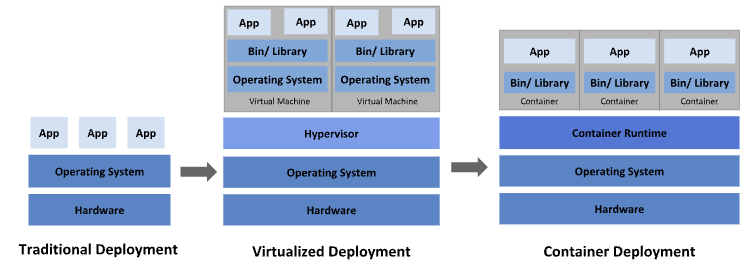
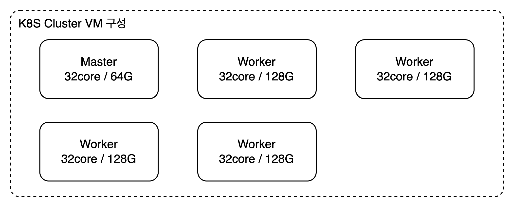
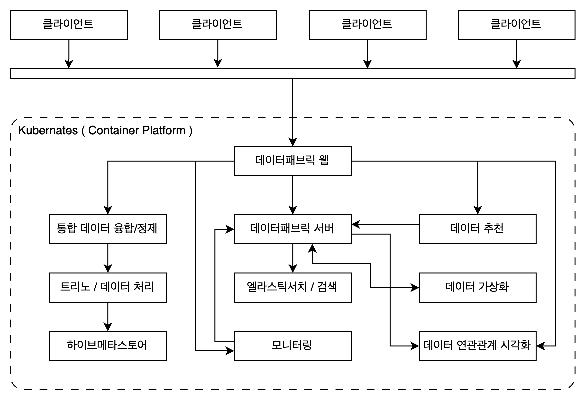

# 데이터패브릭 실증 준비 회의

## 시스템 구성

데이터패브릭 서비스는 컨테이너를 이용한 형태로 개발되었으며,
사내에서 `쿠버네티스`를 활용하여 개발 및 테스트를 하고 있습니다.

먼저 쿠버네티스 서비스 구성을 살펴보면 다음과 같습니다.

따라서 기본적으로 OS 외 설치되어야 하는 필수 서비스는 다음과 같습니다.

1. Container Runtime 아래 중 선택
   1. containerd
   2. CRI-O
   3. Docker Engine
2. Kubenates

### 예시 : 사내 구성

사내의 경우 쿠버네티스 클러스터를 위해 Master 1대 Worker 4대로 클러스터가 아래와 같이 구성되어 있습니다.

> 사내 쿠버네티스 클러스터는 데이터패브릭 전용이 아닙니다.
> 클러스터로부터 일부 리소스를 할당받아 동작하고 있습니다.

### 하드웨어 최소 요구사항

하드웨어 1대 (`쿠버네티스` 마스터 1대 or Docker 설치된 서버 1대)를 이용해 시스템을 구성한다.
하드웨어 1대로 구성할 경우 최소 사양은 다음과 같습니다.

| Name | Resource |
| ---- | -------- |
| CPU  | 32 Core  |
| MEM  | 64 GB    |
| Disk | 500G     |

## 데이터패브릭 서비스 구성

다음은 데이터패브릭 시스템을 구성하는 컨테이너(서비스)를 중심으로 작성한 그림입니다.

## 서비스 별 최소 요구사항

| 이름                           | 설명                                                         | CPU | MEM  |
| ------------------------------ | ------------------------------------------------------------ | --- | ---- |
| 웹(OVP)                        | 사용자 인터페이스                                            | 1   | 1024 |
| 서버(Server)                   | 코어 서버                                                    | 2   | 2048 |
| 내부 저장소(MySQL)             | 메타데이터 및 서비스 데이터 저장소                           | 2   | 2048 |
| 검색(Search)                   | 검색 서버                                                    | 2   | 2048 |
| 데이터가상화(Ingestion)        | 메타데이터 수집 엔진                                         | 4   | 8192 |
| 모니터링(Monitoring)           | 저장소 및 서비스 모니터링                                    | 1   | 2048 |
| 데이터 추천(Recommend)         | 데이터 탐색 및 융합 추천 엔진                                | 4   | 8192 |
| 통합 데이터 융합/정제(Dolphin) | 데이터 융합/정제(뷰 데이터 모델 생성)                        | 2   | 2048 |
| 트리노                         | 이기종 데이터 융합/정제를 위한 오픈소스 서비스(3개 컨테이너) | 4   | 8192 |
| 하이브메타스토어               | 데이터 융합/정제 및 트리노를 위한 데이터 저장소              | 2   | 2048 |
| 합계                           | --                                                           | 24  | 38G  |
