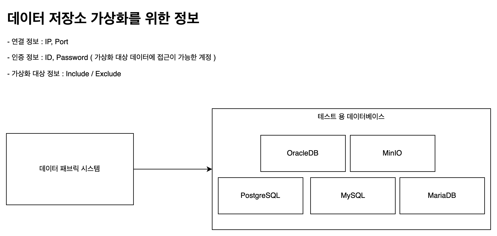

# 데이터패브릭 실증 준비 회의

## 시스템 구성

데이터패브릭 서비스는 컨테이너를 이용한 형태로 개발되었으며,
사내에서 `쿠버네티스`를 활용하여 개발 및 테스트를 하고 있습니다.

먼저 쿠버네티스 서비스 구성을 살펴보면 다음과 같습니다.

따라서 기본적으로 OS 외 설치되어야 하는 필수 서비스는 다음과 같습니다.

1. Container Runtime 아래 중 선택
   1. containerd
   2. CRI-O
   3. Docker Engine
2. Kubenates

### 예시 : 사내 구성

사내의 경우 쿠버네티스 클러스터를 위해 Master 1대 Worker 4대로 클러스터가 아래와 같이 구성되어 있습니다.

> 사내 쿠버네티스 클러스터는 데이터패브릭 전용이 아닙니다.
> 클러스터로부터 일부 리소스를 할당받아 동작하고 있습니다.

### 하드웨어 최소 요구사항

하드웨어 1대 (`쿠버네티스` 마스터 1대 or Docker 설치된 서버 1대)를 이용해 시스템을 구성한다.
하드웨어 1대로 구성할 경우 최소 사양은 다음과 같습니다.

| Name | Resource |
| ---- | -------- |
| CPU  | 32 Core  |
| MEM  | 64 GB    |
| Disk | 500G     |

## 데이터패브릭 서비스 구성

다음은 데이터패브릭 시스템을 구성하는 컨테이너(서비스)를 중심으로 작성한 그림입니다.

## 서비스 별 최소 요구사항

| 이름                           | 설명                                                         | CPU | MEM  |
| ------------------------------ | ------------------------------------------------------------ | --- | ---- |
| 웹(OVP)                        | 사용자 인터페이스                                            | 1   | 1024 |
| 서버(Server)                   | 코어 서버                                                    | 2   | 2048 |
| 내부 저장소(MySQL)             | 메타데이터 및 서비스 데이터 저장소                           | 2   | 2048 |
| 검색(Search)                   | 검색 서버                                                    | 2   | 2048 |
| 데이터가상화(Ingestion)        | 메타데이터 수집 엔진                                         | 4   | 8192 |
| 모니터링(Monitoring)           | 저장소 및 서비스 모니터링                                    | 1   | 2048 |
| 데이터 추천(Recommend)         | 데이터 탐색 및 융합 추천 엔진                                | 4   | 8192 |
| 통합 데이터 융합/정제(Dolphin) | 데이터 융합/정제(뷰 데이터 모델 생성)                        | 2   | 2048 |
| 트리노                         | 이기종 데이터 융합/정제를 위한 오픈소스 서비스(3개 컨테이너) | 4   | 8192 |
| 하이브메타스토어               | 데이터 융합/정제 및 트리노를 위한 데이터 저장소              | 2   | 2048 |
| 합계                           | --                                                           | 24  | 38G  |

## 사전 공유 문서 답변

1. 데이터 연계

   1단계의 경우 외부 데이터베이스 직접 연동보다 사내에 데이터베이스를 구축하여 수행하였습니다.
   실제 대전교통공사에서 실증의 경우 데이터저장소의 정보(연결, 인증)만 입력하여 연계 가능합니다.

   

2. 추가 하드웨어

   서비스 설치 환경이 폐쇄망 환경으로 모비젠 개발자, 엔지니어들의 노트북 반입이 어려운 경우
   서비스 설치를 위한 PC 및 USB(저장장치) 반일을 위한 절차의 공유가 필요합니다.

3. 네트워크 구성도

   데이터패브릭에서 데이터 가상화를 위해 내부 데이터 저장소에 접근하여 정보를 읽어오는 과정이 있으므로
   네트워크 연결이 가능해야 하며, 가상화 대상 데이터에 접근 가능한 계정이 필요합니다.

   데이터패브릭 서비스는 서비스 대역, 내부 통신 대역, 관리 대역 등 다중 네트워크 대역 환경을
   고려한 시스템이 아닙니다. 단일 네트워크 대역에서 동작합니다.

4. 대상 데이터

   데이터 패브릭 설치 환경과 내부 저장소 간 연결이 가능하다면 가상화가 가능합니다.
   다만 올해까지 수행하는 데이터저장소 타입(MySQL, MariadB, PostgreSQL, MinIO, OracleDB, MongoDB, Hive)에
   한하여 수행 가능합니다.

5. SSO인증

   공사 인증 서버에서 다음 프로토콜을 지원하는지 확인이 필요합니다.
   데이터패브릭 지원 가능한 프로토콜 리스트
      - OIDC (OpenID Connect) : OAuth 2.0 기반의 인증 프로토콜.
      - SAML 2.0 (Security Assertion Markup Language) : XML 기반의 인증 및 권한 부여 프로토콜.
