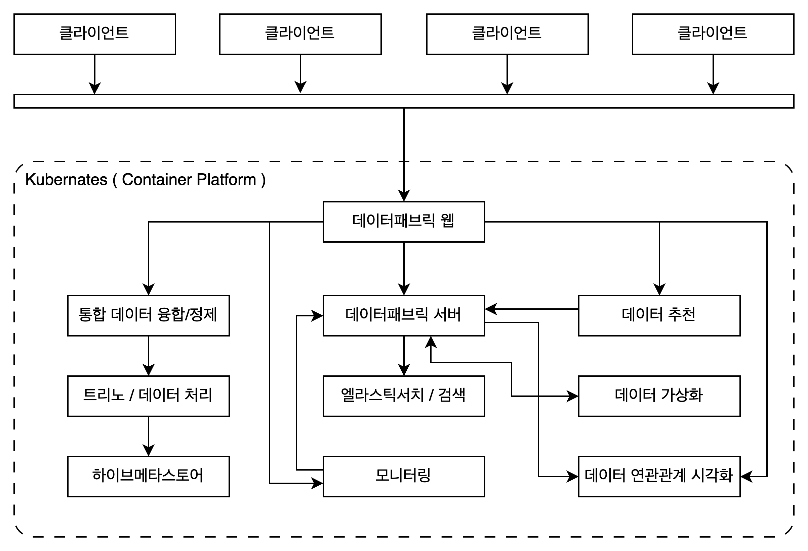
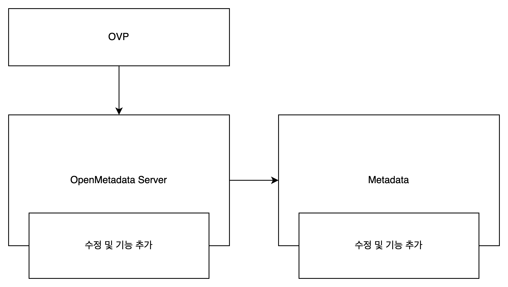
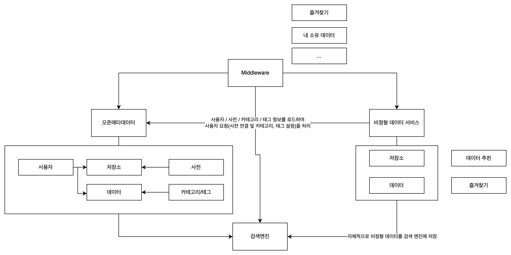

# 데이터패브릭 2단계 1차년도

## 개요

앞서 말씀드릴 부분은 우리가 1단계를 어떻게 수행했느냐입니다.

2차년도 `OpenMetadata` 사용하는 방향으로 결정함에따라 연구 목표를 위해
필요한 기능들을 `OpenMetadata`의 수정과 플러그인 형태로 개발하여 수행하였습니다.

`OpenMetadata` 를 감싸는 형태(Wrapping)로 가야하지 않았냐 의견이 있을텐데요.
> `OpenMetadata`의 사용자 관리, 권한, 데이터 탐색/검색, 태그/사전 등 데이터와 링크되는 기능들에 대해서
> 랩핑 형태로 구성하는 경우 `OpenMetdata`의 전체 기능을 사용하기 어렵다고 봤던 부분이 있습니다.

## 문제되는 부분

- `OpenMetadata`를 수정하고 사용한 부분의 부채  
   2차년도 업무의 양은 현저하게 줄었으나 `OpenMetadata`에서 지원하지 않는
   부분(데이터셋과 같은)에 대해서 대응하기 어려워졌습니다.  

## 대안

1. 기존 방법으로 진행  
    - `OpenMetadata`를 수정 and 플러그인 형태로 추가 기능 개발  
      - 비정형을 위한 부분에 대해서 추가할 부분은 하고
      - 데이터셋의 경우 `OpenMetadata`에 API를 추가하는 방법으로 진행  
2. `OpenMetadata` 수정 X
    - `OpenMetadata`를 원본 그대로 사용
    - 비정형 데이터를 위한 서비스 개발  
        - 비정형 데이터를 외부 저장소에 저장  
    - 미들웨어 서비스 개발 or OVP Server에 미들웨어 기능 추가  
3. `OpenMetadata` 대체  
    - 기존 서비스(돌핀, 모니터링, OVP 등)들의 변경을 최소화하는 방향으로 `OpenMetadata` 포팅  
    - `OpenMetadata`의 데이터 스키마의 변경 및 코드 간소화를 통해 유지 보수 난이도 하향  
    - 다만 업무의 양은 급격하게 증가될 것으로 봄.  

**재난안전에서와 같이 여러 종류의 데이터를 결합하여 데이터 셋으로 인식해야 하는 부분의 경우**  

1. 자동 구성
    - 규칙 : 압축 파일 혹은 특정 포맷의 JSON을 인지하여 데이터셋으로 인지
2. 수동 구성
    - 데이터 셋의 이름, 설명, 태그와 포함되는 데이터 선택 후 저장
    - 데이터 셋 정보를 저장하고 이를 활용

## 과제 목표 대비 대안 별 내용

### 기존 방법으로 수행

- 1.4.x 버전의 `OpenMetadata` 의 버전을 1.6.x 버전으로 업그레이드  
  - 1.6.x 버전에서 HTTP 를 이용한 메타데이터 수집 기능이 추가되었음.
  - 1.4.x 버전에서 추가/수정한 내용 적용  

1. 통합형 데이터 구조 및 통일화된 데이터 접근 인터페이스
    - 데이터의 저장 위치 및 형태를 가상화 하는 기술  
    - 통합 연계를 위한 메타 데이터 기술
        비정형 데이터(문서, 이미지, 음성, 영상)처리를 위한 기능 추가  
    - 데이터 뷰 생성 시 표준 메타 정보 추출 기술 개발  
    - 데이터 수집 및 정제 기능을 포함한 Agent 개발  
        x
    - 외부 연동을 위한 범용적인 데이터 조회 인터페이스 개발  
        JDBC : 개발 필요  
        RestAPI : 특정 API만을 문서로 제공  
    - 통합 데이터 뷰 융합/정제/변환 기능 개발  
    - 통합/연계를 위한 데이터 유형 및 저장소 확장
        `OpenMetadata` 에서 지원하는 저장소들을 위주로 추가
        2차년도에 수행한 MinIO만을 대상으로 비정형 데이터 처리 기능을 개발  

2. 다양한 잠재적 데이터의 관리/검색/탐색 기술  
    - 데이터 상태 모니터링 및 관리 기술
        모니터링 설정 기능 : 개발 필요
        추가 저장소 : 개발 필요
    - 추상화된 데이터 스키마를 탐색 하는 기능  
        탐색기와 같은 형태의 UI 개발 X  
        검색 엔진 클러스터링
        한국어를 위한 `OpenMetadata` 수정  
    - 데이터뷰 생성시 다중 데이터간 융합 추천 기능
        **데이터 추천 엔진 고도화 필요**  
    - 머신러닝 기반 데이터 카탈로그 생성 기술 개발  
        **개발필요**
    - 여러 데이터 모델을 융합 및 정제하고 관리하는 기술  
    - 데이터 처리 과정을 관리하기 위한 데이터 플로우 기능 개발
        > 25년도 신규 개발 기능  
        - UI 기반의 데이터플로우 기능 개발
            - 데이터 추출, 융합, 정제, 저장의 특정 데이터 요청 관리
            - 데이터 처리 상태에 대한 현황 모니터링 기능 제공
            - 데이터 처리 이력 확인 기능 제공
    - 데이터 메트릭 정보의 상태 관리/모니터링 기술 개발  
        > 25년도 신규 개발 기능  
        - 실행되는 쿼리의 히스토리 및 메트릭 정보 수집 기능 개발
          - 데이터 저장소 로그(쿼리) 및 통계정보 수집 기능 개발
          - 쿼리와 데이터베이스 통계 정보 제공 UI
        - 데이터 저장소 상태 조회 기능 개발
          - 개발 완료  
        - 메트릭 정보 분석 기능 개발
          - ???
        - 데이터 저장소부터 데이터 모델에 이르기까지 메트릭 정보를 시각적으로 표현하는 기술 개발
            > 시스템/저장소/데이터 별 메트릭 정보 수집과 시각화 기능 개발 필요
            > `OpenMetadata`의 프로파일링 + 데이터 모델 버전 히스토리 관리 기능을 이용해 데이터 변화 정보를 시각화

---

기존 티맥스 연구내용  

2. 다양한 잠재적 데이터의 관리/검색/탐색 기술  
    - 관계 데이터 간 유사 속성 관계 시각화

3. 복합 추론을 통해 지식화된 데이터셋의 관계의 시각화 기술  
    - 카테고리 기반 연관 데이터 복합관계 시각화 기능  
    - 관계형 데이터 간 동일 속성 파악을 위한 규칙 기반 알고리즘 개발  
    - 관계형 데이터 간 유사 속성 파악을 위한 머신러닝 모델 개발  
       `OpenMetadata` 의 메타데이터를 활용하여 수행  
    - 유의미한 데이터 조합 및 연관 규칙 시각화 기능 개발  
       동일속성, 유사속성 결과 데이터를 이용한 시각화  

---

4. 그 외 
    - 데이터 다운로드
        데이터 다운로드 모듈 추가  
    - SSO  
        OpenMetadata -> Keycloak <- 업체 사용자인증 서버  

### 미들웨어 개발  

- 비정형 데이터 처리 서비스  
  - 비정형 데이터를 위한 메타데이터 수집 서비스  
  - 검색엔진과 데이터베이스에 추가적인 공간을 만들어 저장  
- 미들웨어  
  - `OpenMetadata` 와 비정형 데이터 처리 서비스 양쪽에 API 별 요청을 처리  
    - `OpenMetdata` 데이터와 연결되는 부분에 대한 처리
    - 태그, 사전  
    - 데이터 추천/비추천
    - 데이터 즐겨찾기
    > 정형 데이터 가상화를 제외한 나머지 부분(데이터 - 사용자/추가정보로 이어지는 관계 정보)에 대한 처리 방법 설계와 개발 필요  
- 가상화 대상 데이터 확장(이미지, 음성, 영상)  
   비정형 데이터로부터 메타데이터 수집하고 관리할 서비스 개발  
   미들웨어에서 정형`OpenMetadata`, 비정형`신규서비스`와 연동하여 데이터 탐색
- 외부 연동  
   JDBC : 신규 개발  
   RestAPI : 미들웨어에서 처리
- 가상화 대상 서비스 추가  
   `OpenMetadata` 에서 지원하는 저장소들을 위주로 추가  
   2차년도에 수행한 MinIO만을 대상으로 비정형 데이터 처리 기능을 개발  
- 1안과 동일  
  - 모니터링  
  - 추상화된 데이터 스키마를 탐색 하는 기능  
  - 데이터뷰 생성시 다중 데이터간 융합 추천 기능
  - 머신러닝 기반 데이터 카탈로그 생성 기술 개발  
  - 데이터 처리 과정을 관리하기 위한 데이터 플로우 기능 개발
     25년도 신규 개발 기능  
  - 데이터 메트릭 정보의 상태 관리/모니터링 기술 개발  
     25년도 신규 개발 기능  
     시스템/저장소/데이터 별 메트릭 정보 수집과 시각화 기능 개발 필요
  - 데이터 다운로드
     데이터 다운로드 모듈 추가  
  - SSO  
     OpenMetadata -> Keycloak <- 업체 사용자인증 서버  

**티맥스 연구내용**  

- 관계 데이터 간 유사 속성 관계 시각화
- 카테고리 기반 연관 데이터 복합관계 시각화 기능  
- 관계형 데이터 간 동일 속성 파악을 위한 규칙 기반 알고리즘 개발  
- 관계형 데이터 간 유사 속성 파악을 위한 머신러닝 모델 개발  
   `OpenMetadata` 의 메타데이터를 활용하여 수행  
- 유의미한 데이터 조합 및 연관 규칙 시각화 기능 개발  
   동일속성, 유사속성 결과 데이터를 이용한 시각화  

### 신규 개발(OpenMetadat 포팅)  

- 신규개발
  - SpringBoot를 사용하여 `OpenMetadata` 서버(UI 제외) 코드를 포팅
    - `OpenMetadata`의 경우 RESTful 웹 서비스를 위해 `Dropwizard` 프레임워크를 사용
  - 스키마 간소화
    - `OpenMetadata`의 경우 데이터 타입 별(DatabaseService, StorageService, Database, DatabaseSchema, Table) 테이블 및 검색엔진 내 인덱스가 존재  
    - IRIS 처럼 연결정보 - 데이터모델 형태로 간소화  
  - 기능  
    - 사용자
      - 회원가입, 그룹, 역할 및 속성 부여 : OVP
      - 리소스(API) : OVP
        - 각 서비스에서 리소스 리스트를 제공(GET /resources)
      - 권한 : OVP
      - AccessControl 기능만을 구현
        - RBAC, Attribute 에 의한 데이터(API) 접근 허용 O/X  
    - 저장소
      - 파이프라인(데이터 가상화 모듈) 관리  
    - 검색
      - 검색 인덱스 역시 스키마와 동일하게 간소화
      - 단 인덱스 파티셔닝을 통해 검색 속도가 낮아지지 않도록 함.
    - 데이터 모델  
      - 샘플  
      - 리니지  
      - 프로파일링  
      - 메트릭  
    - 표준 메타데이터  
      - 데이터 사전  
      - 카테고리/태그  
    - 그 외
- 서비스 신규 개발에 따른 연관 서비스들의 수정  
  - `OpenMetadata` API를 최대한 반영하여 수정을 최소화 : 목표였죠...

- 그 외 추가 개발과 고도화의 경우 동일  

## 데이터 패브릭의 목표치를 상향하는 경우

### 1단계 요구사항 대비 미흡한 부분

1. 데이터 저장 위치 및 접속정보를 규격화하고 공유하는 기능 개발
    - 저장소 공유
        1. 저장소 접속 정보의 공유는 사용자(관리자 or 저장소 소유자) 측면에서 맞지 않음.
        2. 저장소 내 데이터 가상화 후 일반 사용자가 검색 및 탐색 설정(공개/비공개) 한다.
        > 저장소 공유 설정기능 개발
    - 저장소 상태 정보 반영
      > 저장소, 데이터의 연결 상태에 따른 정보 제공(UI에서 연결상태에 따라 다르게 표현)
2. 다양한 형태의 데이터를 통일된 형태로 접근하고 조회 할 수 있는 데이터 모델 기능 개발
    - 다양한 데이터(이미지, 음성, 영상, 데이터셋)를 위한 데이터 모델 설계
    - 데이터 탐색
        > 파일 탐색기 같은 데이터 탐색기 기능 개발  
        > 즐겨찾기, 최근열람 등 추가 정보 제공  
    - 데이터 상세보기 화면 탭 변경 필요
        > 다양한 데이터와 기존 탭 구성에서 빈 공간이 너무 많음.
    - 데이터 거버넌스에 따른 데이터 내용 비공개 처리
        > 자동 비공개 처리 + 수동 비공개 처리  
        > 샘플 데이터와 데이터 다운로드에 대해 '****' 처리 혹은 관리자 혹은 데이터 소유자와의 요청 프로세스
3. 정형화된텍스트, 비정형텍스트, 시계열 데이터에 대해 통합/연계를 할 수 있는 가상화 모듈 개발
4. 단일화된 데이터 조회 및 탐색 명령어 (SQL/DSL) 개발
5. 데이터의 성격, 형태, 저장위치 등 다양한 정보를 관리 할 수 있는 통합 메타데이터 디스크립션 제공
6. 정형 텍스트, 비정형 텍스트, 이미지, 동영상, 시계열 데이터의 메타 데이터를 추출할 수 있는 기능 개발 / 이종 데이터의 연계를 위한 메타 정보 추출
7. 자동으로 메타 데이터를 생성하는 기능 개발
    > 모니터링 이벤트 기반 메타데이터 수집
8. 수집된 데이터 스키마 및 메타데이터를 기반으로 사용자정의 모델링 기술 개발
    > 1. 데이터의 별칭(DisplayName)을 기준으로 화면에 노출 될 수 있도록 변경 필요  
    > 2. 사용자 정의 메타데이터 설정 기능  
    >> OpenMetadata의 경우 관리자가 만들어 둔 태그를 사용자가 선택하는 형태이며
    >> 태그를 선택하여 관리자(소유자)에게 허락을 구하는 형태로 이루어짐.
    >> 사용자가 자유롭게 태그를 설정할 수 있도록 한다.
9. 메타 및 데이터 정보를 수집하여 데이터 뷰에 대한 표준 메타 정보를 추출 가능하도록 가공 하는 모듈 개발
10. 수집된 데이터를 기반으로 모델 생성
    > 데이터 융합/정제 UI의 사용자 친화적 변경 필요
11. 표준 메타데이터
12. 데이터 뷰에서 표준 메타 데이터 추출 모듈 개발
13. 각종 필터 조건을 이용하여 모니터링 대상을 지정하고 상태를 조회할 수 있는 기능 개발
    > 모니터링 설정 기능  

    1. 모니터링 대상
        a. 데이터 저장소 별 on/off
        b. 데이터 저자옷 별 모니터링 시간
    2. default 모니터링 시간
    3. 모니터링 대상 데이터  
14. 저장소에 존재하는 데이터를 자동으로 인식하여 추상화하고 등록하는 기술 개발
    - 위에서 이미 언급
15. 원본 데이터 변화를 주기적으로 모니터링 하여 데이터 모델을 최신 상태로 유지하는 기술 개발
    - 모니터링 서비스에서 데이터 변경 감지 시 알림 기능 개발 필요
16. 추상화 된 데이터 스키마의 메타 정보 기반 검색 기능 개발
    > 검색 엔진 클러스터 구성
    > 검색 인덱스 설정(검색 최적화)  
    >> 인덱스 구성 및 한국어 검색 설정
17. 추상화된 데이터의 원본 데이터를 샘플링하여 제공
    - 이미지, 음성, 영상 데이터에 대한 샘플 제공  
    > 이미지 : 썸네일 형태로 제공  
    > 음성 : 텍스트로 변환하여 제공  
    > 영상 : 텍스트(자막), 주요 장면 캡처(가능한)
18. 데이터 검색 수행 시 클러스터링된 검색엔진에서 검색에 필요한 다중 저장소에 동시에 접근하여 검색 결과에 대한 비동기 조합으로 성능 최적화
    - 위에서 이미 언급
19. 데이터 융합 추천 -> 고도화 필요
    - 메타 및 데이터 정보를 수집하여 데이터 융합 추천이 가능하도록 가공하는 모듈 개발
    - 가공된 데이터에서 메타데이터를 이용하여 임베딩 알고리즘을 응용한 데이터 필드별 유사도 측정 알고리즘 개발
    - 데이터간 융합 추천 모듈 개발
    - 추출한 메타 데이터를 유형 별로 자동 군집 분류 하여 데이터 검색 및 연계/추론에 활용
    - 협업 필터링 방식을 응용한 데이터 추천 기능 개발
    > 기존 유사도 기반 추천 변경 필요
20. 머신러닝 기반 데이터 카탈로그 생성 기술
    - 데이터 스키마 및 데이터 뷰의 표준 메타 정보의 정보를 수집하여 데이터 카탈로그 생성이 가능하도록 가공하는 모듈 개발
    - 수집된 메타정보를 기반으로 모델 생성
    - 데이터 카탈로그 추천 모듈 개발
    > 하나의 데이터를 위한 데이터 카탈로그(Active Metdata)
    > 데이터 셋을 위한 데이터 카탈로그

## 티맥스 개발 건 연동 방안

내부에서 처리하기로 되었으므로 Server 직접 연동하여 데이터를 수집하고 동작하도록 함.

- 메타데이터 공유
  - API를 이용하여 데이터 조회(HTTP Get Fabric Server)
- 히스토리
  - API를 이용하여 데이터 조회(HTTP Get Fabric Server)
- 동일 속성(연관) 데이터 공유
  - API를 이용하여 데이터 조회(HTTP Get Fabric Server)
  - API를 이용하여 메타데이터 업데이트(HTTP Post Fabric Server)

## 단국대

데이터 타입 별 품질 체크를 위한 방안과 방법을 공유 받고 적용

## 성능 시험

3차년도, 4차년도 모두 진행  
일정 반영 필요  
