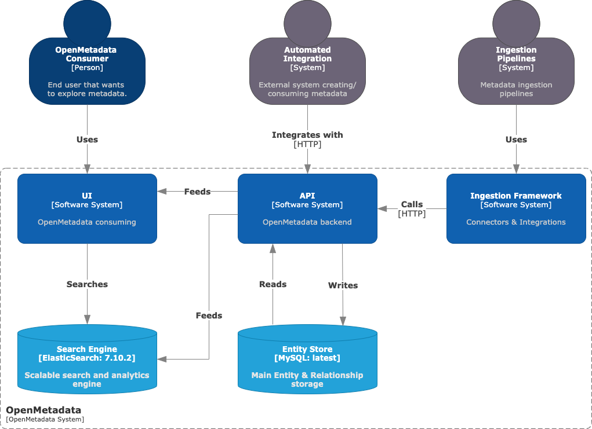
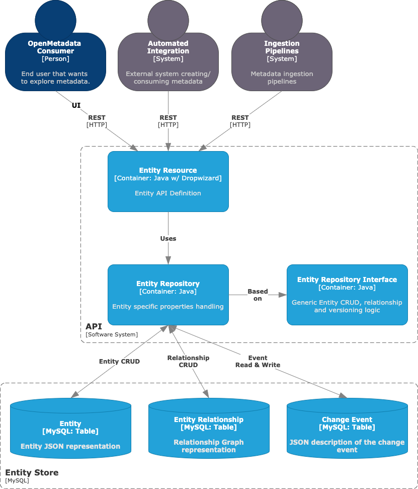

# Open Metadata Study

## Arch

### System Context  



- API Server  
    오픈메타데이터의 주요 프로세스. 메타데이터 엔티티와 상호 작용할 수 있는 방법을 정의.  
- UI  
    사용자가 모든 데이터 자산을 추적하는데 도움이 되는 Discovery 중심 도구.  
    사용자 간 협력과 가능하게 하고 연료를 공급하는 것이다.  
- 수집 프레임워크  
    이 시스템은 모든 커넥터의 기초. 즉, OpenMetadata와 우리가 통합하려는 메타데이터를 포함하는 외부 시스템 간의 상호 작용을 정의하는 구성 요소.  
- Entity Store  
    모든 엔티티의 상태와 관계에 대한 실시간 정보가 포함된 MySQL/PostgreSQL 스토리지.
- Search Engine  
    ElasticSearch에 의해 구동되는 이 시스템은 사용자가 메타데이터를 발견하는데 도움이 되는 UI의 인덱싱 시스템입니다.

### JSON Schema

Open Metadata 의 주요 3가지 구성 요소들은 통일된 구조의 메시지를 이용해 통신하고 동작한다.  
JSON Schema 를 이용해 UI(TypeScript), API Server(Java), Ingestion(Python) 각 구성요소들에서 동작한다.  

### API Server

사용자 요청(UI) 및 메타데이터 수집 프레임워크를 포함한 내,외부 통신 처리  
메타데이터 상태 업데이트




## Ingestion


### Database Schema

다음은 2차년도 데이터 패브릭에서 사용될 데이터 구조로 추가로 수집되는 데이터의 저장과 관련하여 내용을 정리하였다.  

1. 카테고리 : Domain  
    현재 수동으로 Domain을 설정하고 추가하도록 되어 있고, 연구범위내에서 활용 가능하다고 보여짐.  
2. 용어사전 : tag  
    공공데이터 표준 + 데이터 사전을 이용한 데이터 이름으로부터 유추되는 데이터의 경우 tag 영역에 추가
    예를 들어 다음과 같이 xxx_xxx_xxx 여러 단어로 구성된 테이블(컬럼) 이름이 있고, 각 단어가 용어사전의 내용과 매핑되는 경우
    다수의 태그를 추가한다.  
3. 추가 메타데이터 : 추가로 수집되는 메타데이터(ML, etc)  
    RDF(주어(subject), 서술어(predicate), object(object)) 형태의 저장 필요  
    추가 저장소 사용의 경우 search 부분과의 연동 방법에서 어려움이 있을 것으로 예상됨.
        -> airflow - ingestion 에서 table 정보를 취합하여 server와 통신하여 어떻게 처리하는지 분석 필요  
    검색과 데이터 상세 보기에서 보여져야 함. -> JSON schema 변경 or 추가 저장소 사용 + 연동  
        -> 연동 방안 논의 : 안형민, 고승범  
4. 뷰테이블과 융합/정제 모델  
    OpenMetadata에서 제공되는 뷰테이블 기능과 혼합하여 사용하고, 제공되는 리니지 그래프 기능을 함께 사용한다면 좋을 것으로 생각됨.  
    그러나 현재 서승환책임쪽에서 hive metastore 의 사용에 대해서 검토 중으로 관련 내용 정리 필요  
    OpenMetadata를 사용하는 경우 tableType 의 추가와 refer, herf 등 다양한 링크 기능의 사용이 가능함.  
        -> 문제는 ingestion, monitoring에서 어떻게 처리할 것인가의 고민이 추가됨.  

```yaml
id: "unique id of table instance"
name: "name of table. expected to be uniquee within a database"
displayName: "Display Name that identifies this table. It could be title or label from the source services"
fullyQualifiedName: "Fully qualified name of a table in the form `serviceName.databaseName.tableName`"
description: "Description of a table"
version: "Metadata version of the entity"
updatedAt: "Last update time corresponding to the new version of the entity in Unix epoch time milliseconds"
updatedBy: "User who made the update.(string)"
href: "Link to this table resource(string:uri)"
tableType: "This schema defines the type used for describing different types of tables(enum)"
  - "Regular"
  - "External"
  - "View"
  - "SecureView"
  - "MaterializedView"
  - "Iceberg"
  - "Local"
  - "Partitioned"
  - "Foreign"
  - "Transient"
columns: "Columns in this table(array)"
  - name: "column name"
    displayName: "Display Name that identifies this column name"
    dataType: "Data type of the column (int, date etc.)(enum)"
      - "NUMBER"
      - "TINYINT"
      - "SMALLINT"
      - "INT"
      - "BIGINT"
      - "BYTEINT"
      - "BYTES"
      - "FLOAT"
      - "DOUBLE"
      - "DECIMAL"
      - "NUMERIC"
      - "TIMESTAMP"
      - "..."
    arrayDataType: "Data type used array in dataType. For example, `array<int>` has dataType as `array` and arrayDataType as `int`(string)"
    dataLength: "Length of `char`, `varchar`, `binary`, `varbinary` `dataTypes`, else null. For example, `varchar(20)` has dataType as `varchar` and dataLength as `20`(int)"
    precision: |
        "The precision of a numeric is the total count of significant digits in the whole number, that is, the number of digits to both sides of the decimal point.  Precision is applicable Integer types, such as `INT`, `SMALLINT`, `BIGINT`, etc. It also applies to other Numeric types, such as `NUMBER`, `DECIMAL`, `DOUBLE`, `FLOAT`, etc."
    scale: "소수점 데이터 타입에서 소수점 아래 자릿수 개수. 정수형의 경우 0.(int)"
    dataTypeDisplay: |
        "Display name used for dataType. This is useful for complex types, such as `array<int>`, `map<int,string>`, `struct<>`, and union types.(string)"
    description: "Description of the column."
    fullyQualifiedName: "service.database.schema.table.columnName?"
    tags: "Tags associated with the column.(array)"
      - name: "Name of the tag or glossary term."
        displayName: "Display Name that identifies this tag."
        description: "Description for the tag label(markdown)"
        style: 
            color: "Hex Color Code"
            iconURL: "An icon to associate with GlossaryTerm, Tag, Domain or Data Product"
        source: "Label is from Tags or Glossary"
            enum: [ "Classification", "Glossary" ]
        labelType: 
            desc: |- 
                "Label type describes how a tag label was applied. 'Manual' indicates the tag label was applied by a person. '
                Derived' indicates a tag label was derived using the associated tag relationship (see Classification.json for more details). 
                'Propagated` indicates a tag label was propagated from upstream based on lineage. 
                'Automated' is used when a tool was used to determine the tag label."
            enum: [ "Manual", "Propagated", "Automated", "Derived" ]
        state: |
            "'Suggested' state is used when a tag label is suggested by users or tools. Owner of the entity must confirm the suggested labels before it is marked as 'Confirmed'.(enum)"
            - "Suggested"
            - "Confirmed"
        href: "Link to the tag resource"
    constraint: "Column level 제약 조건(enum)"
      - "NULL"
      - "NOT_NULL"
      - "UNIQUE"
      - "PRIMARY_KEY"
    ordinalPosition: "Ordinal position of the column.(int)"
    jsonSchema: "Json schema only if the dataType is JSON else null."
    children: "Child columns if dataType or arrayDataType is `map`, `struct`, or `union` else `null`.(array)"
        items: "column"
    profile: "Latest Data profile for a Column."
        ref: "#/definitions/columnProfile"
    customMetrics: "List of Custom Metrics registered for a table."
        items: 
            ref: "../../tests/customMetric.json"
    tableConstraints: "Table 제약 사항"
      - constraintType:
          - "UNIQUE"
          - "PRIMARY_KEY"
          - "FOREIGN_KEY"
          - "SORT_KEY"
          - "DIST_KEY"
        columns: "제약사항에 포함된 컬럼"
          - column_name_1
          - column_name_2
        referredColumns: "List of referred columns for the constraint."
          - fullQualifiedEntityName_1
          - fullQualifiedEntityName_2
    tablePartition: "This schema defines the partition column of a table and format the partition is created."
        columns: List of column names corresponding to the partition"
          - column_name_1
          - column_name_2
        intervalType: "type of partition interval, example time-unit, integer-range"
          - "TIME-UNIT"
          - "INTEGER-RANGE"
          - "INGESTION-TIME"
          - "COLUMN-VALUE"
          - "OTHER"
        interval: "partition interval , example hourly, daily, monthly."
    owner: "Owner of this table.(entityReference)"
    databaseSchema: "Reference to database schema that contains this table.(entityReference)"
    database: "Reference to Database that contains this table.(entityReference)"
    service: "Link to Database service this table is hosted in.(entityReference)"
    serviceType: "Service type this table is hosted in.(databaseServiceType(enum))"
      - Mysql
      - Mssql
      - Oracle
      - ...
    location: "Reference to the Location that contains this table.(entityReference)"
    viewDefinition: "View Definition in SQL. Applies to TableType.View only. SQL query statement. Example - 'select * from orders'."
    tags: "Tags for this table."
      - name: "Name of the tag or glossary term."
        displayName: "Display Name that identifies this tag."
        description: "Description for the tag label(markdown)"
        style: 
            color: "Hex Color Code"
            iconURL: "An icon to associate with GlossaryTerm, Tag, Domain or Data Product"
        source: "Label is from Tags or Glossary(enum)"
            - "Classification"
            - "Glossary"
        labelType: 
            desc: |- 
                "Label type describes how a tag label was applied. 'Manual' indicates the tag label was applied by a person. '
                Derived' indicates a tag label was derived using the associated tag relationship (see Classification.json for more details). 
                'Propagated` indicates a tag label was propagated from upstream based on lineage. 
                'Automated' is used when a tool was used to determine the tag label."
            enum: [ "Manual", "Propagated", "Automated", "Derived" ]
        state: "'Suggested' state is used when a tag label is suggested by users or tools. Owner of the entity must confirm the suggested labels before it is marked as 'Confirmed'."
            enum: ["Suggested", "Confirmed"]
        href: "Link to the tag resource"
    usageSummary: "Latest usage information for this table."
    followers: "Followers of this table."
      - "entityReference"
    joins: "Details of other tables this table is frequently joined with. 이 테이블이 자주 조인되는 다른 테이블 정보."
      - startDate: "Date can be only from today going back to last 29 days."
        dayCount: "일 별 조인 수"
        columnJoins: 
          - columnName: "column name"
            joinedWith: "Fully qualified names of the fields/entities that this field/entity is joined with."
              - fullyQualifiedName: "Fully qualified name of a table in the form `serviceName.databaseName.tableName / field?`"
                joinCount: "조인 수(int)"
        directTableJoins: "Joins with other tables that are not on a specific column (e.g: UNION join)",
          - joinedWith: "Fully qualified names of the fields/entities that this field/entity is joined with."
              - fullyQualifiedName: "Fully qualified name of a table in the form `serviceName.databaseName.tableName / field?`"
                joinCount: "조인 수(int)"
    sampleData: "Sample data for a table."
        columns: 
          - column_name_1
          - column_name_2 
        rows: "Data for multiple rows of the table."
          - [1, 2, "33", 44, "yyyy-mm-dd", "..."]
          - [2, 2, "45", 55, "yyyy-mm-dd", "..."]
    tableProfilerConfig: "Table Profiler Config to include or exclude columns from profiling.",
      "$ref": "#/definitions/tableProfilerConfig"
    customMetrics: "List of Custom Metrics registered for a table.(array)"
      items: 
        "$ref": "../../tests/customMetric.json"
    profile: "Latest Data profile for a table."
      "$ref": "#/definitions/tableProfile"
    testSuite: "Executable test suite associated with this table",
      "$ref": "../../tests/testSuite.json"
    dataModel: "This captures information about how the table is modeled. Currently only DBT model is supported."
      "$ref": "#/definitions/dataModel"
    changeDescription: "Change that lead to this version of the entity."
      "$ref": "../../type/entityHistory.json#/definitions/changeDescription"
    deleted: "When `true` indicates the entity has been soft deleted.(boolean)"
    retentionPeriod : "Retention period of the data in the table. Period is expressed as duration in ISO 8601 format in UTC. Example - `P23DT23H`. When not set, the retention period is inherited from the parent database schema, if it exists."
      "$ref": "../../type/basic.json#/definitions/duration"
    extension: "Entity extension data with custom attributes added to the entity."
      "$ref": "../../type/basic.json#/definitions/entityExtension"
    sourceUrl: ""Source URL of table."
      "$ref": "../../type/basic.json#/definitions/sourceUrl"
    domain : "Domain the table belongs to. When not set, the table inherits the domain from the database schema it belongs to."
      "$ref": "../../type/entityReference.json"
    dataProducts : "List of data products this entity is part of."
      "$ref" : "../../type/entityReferenceList.json"
    fileFormat: "File format in case of file/datalake tables."
      "$ref" : "#/definitions/fileFormat"
    votes : 
      "$ref": "../../type/votes.json"
    lifeCycle: "Life Cycle of the entity"
      "$ref": "../../type/lifeCycle.json"
    sourceHash: "Source hash of the entity(string)len[1-32]"
```

tableEntity_json

```json
{
    "id": "b7392c00-601d-487b-b76d-a48497997fca", 
    "name": "threads", 
    "columns": [
        {
            "name": "THREAD_ID", 
            "dataType": "BIGINT", 
            "constraint": "NOT_NULL", 
            "dataLength": 1, 
            "description": "A unique thread identifier.", 
            "dataTypeDisplay": "bigint", 
            "fullyQualifiedName": "Platform Test DB - MariaDB.default.performance_schema.threads.THREAD_ID"
        }, 
        {
            "name": "NAME", 
            "dataType": "VARCHAR", 
            "constraint": "NOT_NULL", 
            "dataLength": 128, 
            "description": "Name associated with the server's thread instrumentation code, for example thread/sql/main for the server's main() function, and thread/sql/one_connection for a user connection.", 
            "dataTypeDisplay": "varchar(128)", 
            "fullyQualifiedName": "Platform Test DB - MariaDB.default.performance_schema.threads.NAME"
        }, 
        {
            "name": "TYPE", 
            "dataType": "VARCHAR", 
            "constraint": "NOT_NULL", 
            "dataLength": 10, 
            "description": "FOREGROUND or BACKGROUND, depending on the thread type. User connection threads are FOREGROUND, internal server threads are BACKGROUND.", 
            "dataTypeDisplay": "varchar(10)", 
            "fullyQualifiedName": "Platform Test DB - MariaDB.default.performance_schema.threads.TYPE"
        }, 
        {
            "name": "PROCESSLIST_ID", 
            "dataType": "BIGINT", 
            "constraint": "NULL", 
            "dataLength": 1, 
            "description": "The PROCESSLIST.ID value for threads displayed in the INFORMATION_SCHEMA.PROCESSLIST table, or 0 for background threads. Also corresponds with the CONNECTION_ID() return value for the thread.", 
            "dataTypeDisplay": "bigint", 
            "fullyQualifiedName": "Platform Test DB - MariaDB.default.performance_schema.threads.PROCESSLIST_ID"
        }, 
        {
            "name": "PROCESSLIST_USER", 
            "dataType": "VARCHAR", 
            "constraint": "NULL", 
            "dataLength": 128, 
            "description": "Foreground thread user, or NULL for a background thread.", 
            "dataTypeDisplay": "varchar(128)", 
            "fullyQualifiedName": "Platform Test DB - MariaDB.default.performance_schema.threads.PROCESSLIST_USER"
        }, 
        {
            "name": "PROCESSLIST_HOST", 
            "dataType": "VARCHAR", 
            "constraint": "NULL", 
            "dataLength": 255, 
            "description": "Foreground thread host, or NULL for a background thread.", 
            "dataTypeDisplay": "varchar(255)", 
            "fullyQualifiedName": "Platform Test DB - MariaDB.default.performance_schema.threads.PROCESSLIST_HOST"
        }, 
        {
            "name": "PROCESSLIST_DB", 
            "dataType": "VARCHAR", 
            "constraint": "NULL", 
            "dataLength": 64, 
            "description": "Thread's default database, or NULL if none exists.", 
            "dataTypeDisplay": "varchar(64)", 
            "fullyQualifiedName": "Platform Test DB - MariaDB.default.performance_schema.threads.PROCESSLIST_DB"
        }, 
        {
            "name": "PROCESSLIST_COMMAND", 
            "dataType": "VARCHAR", 
            "constraint": "NULL", 
            "dataLength": 16, 
            "description": "Type of command executed by the thread. These correspond to the the COM_xxx client/server protocol commands, and the Com_xxx status variables. See Thread Command Values.", 
            "dataTypeDisplay": "varchar(16)", 
            "fullyQualifiedName": "Platform Test DB - MariaDB.default.performance_schema.threads.PROCESSLIST_COMMAND"
        }, {"name": "PROCESSLIST_TIME", "dataType": "BIGINT", "constraint": "NULL", "dataLength": 1, "description": "Time in seconds the thread has been in its current state.", "dataTypeDisplay": "bigint", "fullyQualifiedName": "Platform Test DB - MariaDB.default.performance_schema.threads.PROCESSLIST_TIME"}, {"name": "PROCESSLIST_STATE", "dataType": "VARCHAR", "constraint": "NULL", "dataLength": 64, "description": "Action, event or state indicating what the thread is doing.", "dataTypeDisplay": "varchar(64)", "fullyQualifiedName": "Platform Test DB - MariaDB.default.performance_schema.threads.PROCESSLIST_STATE"}, {"name": "PROCESSLIST_INFO", "dataType": "TEXT", "constraint": "NULL", "dataLength": 1, "description": "Statement being executed by the thread, or NULL if a statement is not being executed. If a statement results in calling other statements, such as for a stored procedure, the innermost statement from the stored procedure is shown here.", "dataTypeDisplay": "longtext", "fullyQualifiedName": "Platform Test DB - MariaDB.default.performance_schema.threads.PROCESSLIST_INFO"}, {"name": "PARENT_THREAD_ID", "dataType": "BIGINT", "constraint": "NULL", "dataLength": 1, "description": "THREAD_ID of the parent thread, if any. Subthreads can for example be spawned as a result of INSERT DELAYED statements.", "dataTypeDisplay": "bigint", "fullyQualifiedName": "Platform Test DB - MariaDB.default.performance_schema.threads.PARENT_THREAD_ID"}, {"name": "ROLE", "dataType": "VARCHAR", "constraint": "NULL", "dataLength": 64, "description": "Unused.", "dataTypeDisplay": "varchar(64)", "fullyQualifiedName": "Platform Test DB - MariaDB.default.performance_schema.threads.ROLE"}, {"name": "INSTRUMENTED", "dataType": "ENUM", "constraint": "NOT_NULL", "dataLength": 1, "description": "YES or NO for Whether the thread is instrumented or not. For foreground threads, the initial value is determined by whether there's a user/host match in the setup_actors table. Subthreads are again matched, while for background threads, this will be set to YES by default. To monitor events that the thread executes, INSTRUMENTED must be YES and the thread_instrumentation consumer in the setup_consumers table must also be YES.", "dataTypeDisplay": "enum(3)", "fullyQualifiedName": "Platform Test DB - MariaDB.default.performance_schema.threads.INSTRUMENTED"}, {"name": "HISTORY", "dataType": "ENUM", "constraint": "NOT_NULL", "dataLength": 1, "description": "Whether to log historical events for the thread.", "dataTypeDisplay": "enum(3)", "fullyQualifiedName": "Platform Test DB - MariaDB.default.performance_schema.threads.HISTORY"}, {"name": "CONNECTION_TYPE", "dataType": "VARCHAR", "constraint": "NULL", "dataLength": 16, "description": "The protocol used to establish the connection, or NULL for background threads.", "dataTypeDisplay": "varchar(16)", "fullyQualifiedName": "Platform Test DB - MariaDB.default.performance_schema.threads.CONNECTION_TYPE"}, {"name": "THREAD_OS_ID", "dataType": "BIGINT", "constraint": "NULL", "dataLength": 1, "description": "The thread or task identifier as defined by the underlying operating system, if there is one.", "dataTypeDisplay": "bigint", "fullyQualifiedName": "Platform Test DB - MariaDB.default.performance_schema.threads.THREAD_OS_ID"}
    ], 
    "deleted": false, 
    "version": 0.1, 
    "database": {
        "id": "398a2893-22c5-46e8-90b4-d52d541e6056", "name": "default", "type": "database", "deleted": false, 
        "fullyQualifiedName": "Platform Test DB - MariaDB.default"
    }, 
    "tableType": "Regular", 
    "updatedAt": 1711358968758, 
    "updatedBy": "ingestion-bot", 
    "sourceHash": "9ad25ef64ed62e3eb7c77a5a638d8225", 
    "serviceType": "MariaDB", 
    "databaseSchema": {
        "id": "03ea909d-3775-4bd6-b97e-cf8f6cee5178", 
        "name": "performance_schema", 
        "type": "databaseSchema", 
        "deleted": false, 
        "fullyQualifiedName": "Platform Test DB - MariaDB.default.performance_schema"
    }, 
    "tableConstraints": [], 
    "fullyQualifiedName": "Platform Test DB - MariaDB.default.performance_schema.threads"
}
```

```json
{
    "id": "c6dd09ab-890d-41e8-a26f-ad2266474c1a", 
    "name": "test", 
    "deleted": false, 
    "version": 0.1, 
    "updatedAt": 1713262053663, 
    "updatedBy": "admin", 
    "connection": {
        "config": {
            "type": "GCS", "supportsMetadataExtraction": true
        }
    }, 
    "description": "", 
    "serviceType": "GCS", 
    "fullyQualifiedName": "test"
}
```

Open Metadata, MySQL, ES, Airflow 중 Airflow 수정(개발)을 위한 로컬 실행 방법  
최초 : docker-compose.yaml 을 이용한 로컬 실행  

Local PC 포트 오픈  
docker-compose 수정
ingestion 실행  
docker-compose 실행  
