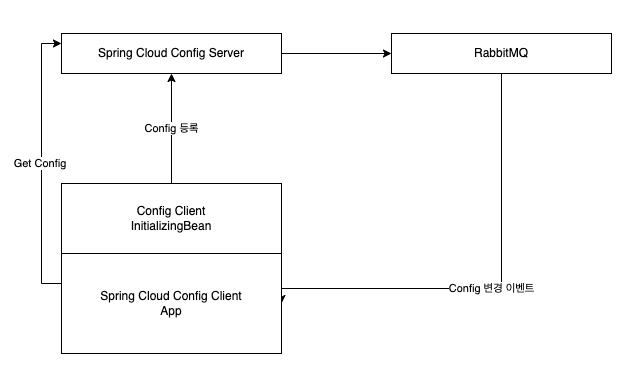
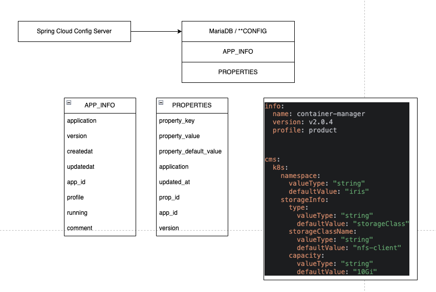

## Spring Cloud Config

현재 플랫폼팀에서는 Spring Cloud Config 기능을 커스터마이징하여 사용하고 있습니다.



### Spring Cloud Config Server  

* Config 서버의 기본 구조  
      
* Config 서버 기본 정책  
    a. App 등록과 `Configuration` 등록 필요  
    b. 등록 Config 의 Version을 이용해 추가 가능  
    c. 등록된 Config의 변경과 삭제는 불가능  
    d. 향 후 `Config Server`의 UI를 통해 등록된 Config의 변경(삭제) 가능하도록 할 예정  
* 디버깅을 위한 Config 등록 후 확인 방법  
    `GET http://{config-server}:8080/{app}/{profile}`

    `curl -s -X GET http://10.99.44.195:8080/data-importer/prod | jq "."`

    ```json
    {
    "name": "data-importer",
    "profiles": [
        "prod"
    ],
    "label": null,
    "version": null,
    "state": null,
    "propertySources": [
        {
        "name": "data-importer-prod",
        "source": {
            "dmm.host": "192.168.102.114",
            "dmm.port": "32251",
            "fm.url.url": "192.168.107.28:33016",
            "sentry.dsn": "https://4c08bfd4a9fd4db8b705d0808655f776@sentry.iris.tools/10",
            "processMeta": "{\"joinType\":[\"left\",\"inner\"],\"columnType\":[\"integer\",\"real\",\"text\",\"datetime\"]}",
            "sentry.debug": "false",
            "spark.2022-11-27 12:14:34": "local[2]",
            "fm.url.get-fid": "/iris-file-management/v1/create-file-id",
            "sentry.release": "idi-prod",
            "spark.app-name": "test",
            "fm.url.get-data": "/iris-file-management/v1/file/%s/download",
            "fm.url.save-data": "/iris-file-management/v1/file",
            "idi.max-pool-size": "30",
            "config-server.name": "data-importer",
            "idi.core-pool-size": "10",
            "idi.queue-capacity": "50",
            "idi.save-directory": "./idi-save-directory",
            "scheduler.expireDay": "3",
            "fm.url.get-file-data": "/iris-file-management/v1/file/%s",
            "idi.file-search-time": "30",
            "config-server.profile": "prod",
            "config-server.version": "v0.0.1",
            "scheduler.delete-cron": "0 0 2 * * *",
            "idi.sample-record-range": "1000",
            "sentry.traces-sample-rate": "1.0"
        }
        }
    ]
    }
    ```

### Config Client

Application의 기본 Config를 Config 서버에 등록하는 역할을 한다.

1. GitHub 저장소  
    `https://github.com/mobigen-platform/Framework-Config`
2. Nexus 저장소  
    `https://nexus.iris.tools/#browse/browse:iris-framework-release:com%2Fmobigen%2Fframework%2Fconfig`  

### Application 적용

*) 주의할 부분은 `spring.application.name`, `spring.application.profiles` 정보를 기반으로 Config를 가지고 오도록 되어 있으므로 이름과 활성화하는 프로파일정보의 일치가 필요하다.  

1. 의존성 설정  
    * maven

        ```xml
        <?xml version="1.0" encoding="UTF-8"?>
        <project>
            <!--   
            ...
            -->
        <properties>
            <spring-cloud.version>2021.0.4</spring-cloud.version>
            <config-framework.version>1.0.4-RC20221120</config-framework.version>
        </properties>
        <repositories>
            <repository>
                <id>iris-framework-release</id>
                <name>release</name>
                <url>https://nexus.iris.tools/repository/iris-framework-release/</url>
            </repository>
        </repositories>
        <dependencies>
            <!-- spring cloud config server 기본 설정 -->
            <dependency>
                <groupId>org.springframework.cloud</groupId>
                <artifactId>spring-cloud-starter-config</artifactId>
            </dependency>
            <dependency>
                <groupId>org.springframework.cloud</groupId>
                <artifactId>spring-cloud-config-client</artifactId>
            </dependency>
            <dependency>
                <groupId>org.springframework.cloud</groupId>
                <artifactId>spring-cloud-starter-bus-amqp</artifactId>
            </dependency>
            <!--- config framework 사용을 위한 라이브러리 -->
            <dependency>
                <groupId>com.mobigen.framework</groupId>
                <artifactId>config</artifactId>
                <version>${config-framework.version}</version>
            </dependency>
            <!--   
            ...
            ...
            ...
            -->
        </dependencies>
        <dependencyManagement>
            <dependencies>
                <dependency>
                    <groupId>org.springframework.cloud</groupId>
                    <artifactId>spring-cloud-dependencies</artifactId>
                    <version>${spring-cloud.version}</version>
                    <type>pom</type>
                    <scope>import</scope>
                </dependency>
            </dependencies>
        </dependencyManagement>
        </project>
        ```

2. application-product.yaml

    ```yaml
    ## CONFIG_SERVER_URL=http://192.168.105.81:30441;
    ## MQ_URL=192.168.105.81;
    ## MQ_PORT=32183;
    ## MQ_USER=mobigen
    ## MQ_PASSWORD=ahqlwps12#$;

    spring:
    application:
        name: mobigen-test
    config:
        import: "configserver:${CONFIG_SERVER_URL}"
    rabbitmq:
        host: ${MQ_URL}
        port: ${MQ_PORT}
        username: ${MQ_USER}
        password: ${MQ_PASSWORD}

    mobigen:
        framework:
            config:
                enable: true # framework-config 사용 여부 세팅 값, default: true
                resource-file: config-regi.yml
                config-manager-path: "/config-server-manager/v1/application/start" # config server mananger path 정보

    ```

3. 등록할 컨피그 작성방법  
    `https://github.com/mobigen-platform/framework-config`  
    `https://github.com/mobigen-platform/Container-Management-Service/blob/main/src/main/resources/config-regi.yml`  

4. `ConfigServer`의 Config 사용  
    `https://github.com/mobigen-platform/Container-Management-Service/blob/main/src/main/java/com/mobigen/ContainerManagement/configurations/CM/CMSConfig.java`
