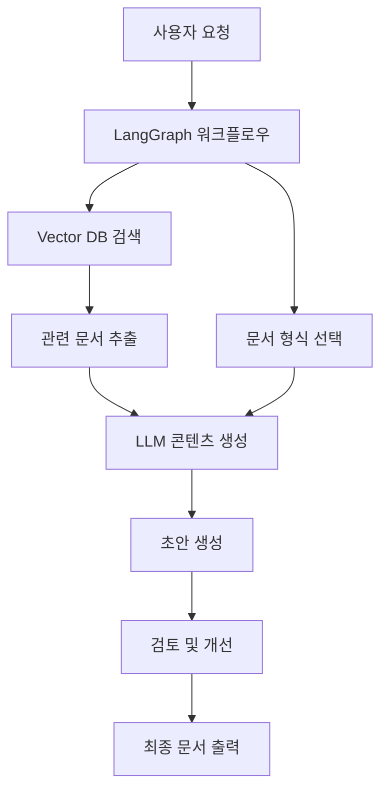

## LLM을 활용한 문서 초안 작성하기

### 개요

현대의 업무 환경에서 문서 작성은 필수적인 업무 중 하나입니다. 하지만 매번 백지 상태에서 시작하는 문서 작성은 시간이 많이 소요되고, 일관성을 유지하기 어려운 문제가 있습니다. 이러한 문제를 해결하기 위해 **LLM(Large Language Model)**, **LangGraph**, **Vector DB**, 그리고 **문서 형식 정보**를 활용한 자동화된 문서 초안 작성 프로그램을 구축할 수 있습니다.

### 시스템 구성 요소

#### 1. LLM (Large Language Model)
- **역할**: 문서의 실제 내용을 생성하는 핵심 엔진
- **주요 기능**:
  - 자연어 이해 및 생성
  - 컨텍스트 기반 내용 작성
  - 다양한 문서 스타일에 맞는 텍스트 생성
- **추천 모델**: GPT-4, Claude, LLaMA 등

#### 2. LangGraph
- **역할**: 복잡한 문서 작성 워크플로우 관리
- **주요 기능**:
  - 문서 작성 프로세스의 단계별 관리
  - 조건부 분기 및 반복 처리
  - 여러 LLM 호출 간의 상태 관리
  - 검증 및 피드백 루프 구현

#### 3. Vector DB (벡터 데이터베이스)
- **역할**: 기존 문서들의 지식 저장소
- **주요 기능**:
  - 문서 임베딩 저장 및 관리
  - 유사 문서 검색 (Semantic Search)
  - RAG (Retrieval-Augmented Generation) 구현
  - 문서 템플릿 및 예시 저장
- **추천 DB**: Chroma, Pinecone, Weaviate, Qdrant

#### 4. 문서 형식(포맷) 정보
- **역할**: 일관된 문서 구조 및 스타일 제공
- **포함 내용**:
  - 문서 템플릿 (헤더, 본문, 푸터 구조)
  - 스타일 가이드 (폰트, 색상, 레이아웃)
  - 문서 유형별 필수 섹션
  - 메타데이터 스키마

### 시스템 아키텍처



### 구현 단계별 가이드

#### Phase 1: 기초 인프라 구축
1. **Vector DB 설정**
   - 문서 임베딩 모델 선택 (OpenAI Embeddings, Sentence-BERT 등)
   - 벡터 데이터베이스 구축 및 인덱싱
   - 기존 문서 데이터 수집 및 전처리

2. **문서 형식 정의**
   - 문서 유형별 템플릿 작성
   - JSON/YAML 형태의 스키마 정의
   - 스타일 가이드 문서화

#### Phase 2: 핵심 기능 개발
1. **LangGraph 워크플로우 설계**
   ```python
   from langgraph.graph import Graph
   
   def create_document_workflow():
       workflow = Graph()
       
       # 노드 정의
       workflow.add_node("parse_request", parse_user_request)
       workflow.add_node("select_template", select_document_template)
       workflow.add_node("search_knowledge", search_vector_db)
       workflow.add_node("generate_content", generate_with_llm)
       workflow.add_node("validate_format", validate_document_format)
       workflow.add_node("refine_content", refine_content)
       
       # 엣지 정의
       workflow.add_edge("parse_request", "select_template")
       workflow.add_edge("select_template", "search_knowledge")
       workflow.add_edge("search_knowledge", "generate_content")
       workflow.add_edge("generate_content", "validate_format")
       
       return workflow
   ```

2. **RAG 시스템 구현**
   - 문서 청킹 전략 수립
   - 임베딩 생성 및 저장
   - 유사도 검색 알고리즘 구현

#### Phase 3: 고급 기능 추가
1. **적응형 템플릿 시스템**
   - 사용자 선호도 학습
   - 동적 템플릿 생성
   - A/B 테스트를 통한 최적화

2. **품질 보증 메커니즘**
   - 문서 일관성 검사
   - 팩트 체크 기능
   - 표절 검사

### 기술적 고려사항

#### 1. 성능 최적화
- **벡터 검색 최적화**: HNSW, IVF 등 근사 최근접 이웃 알고리즘 사용
- **캐싱 전략**: 자주 사용되는 템플릿과 검색 결과 캐싱
- **병렬 처리**: 여러 섹션 동시 생성

#### 2. 데이터 관리
- **버전 관리**: 문서 템플릿과 지식베이스의 버전 관리
- **데이터 품질**: 입력 데이터의 정제 및 품질 관리
- **프라이버시**: 민감한 문서 정보의 보안 처리

#### 3. 사용자 경험
- **인터랙티브 피드백**: 실시간 문서 미리보기
- **커스터마이제이션**: 사용자별 선호 설정
- **협업 기능**: 팀 내 문서 공유 및 공동 편집

### 예상 구현 결과

이 시스템을 통해 다음과 같은 결과를 기대할 수 있습니다:

1. **시간 효율성**: 문서 작성 시간 50-70% 단축
2. **일관성 향상**: 조직 내 문서 스타일 통일
3. **품질 개선**: 전문적이고 체계적인 문서 구조
4. **지식 활용**: 기존 문서 자산의 효과적 재활용

### 결론

LLM, LangGraph, Vector DB, 그리고 문서 형식 정보를 결합한 문서 초안 작성 시스템은 현대 조직의 문서 작성 업무를 혁신적으로 개선할 수 있는 강력한 도구입니다. 단계적 구현을 통해 안정적이고 확장 가능한 시스템을 구축할 수 있으며, 지속적인 개선을 통해 더욱 정교한 문서 생성이 가능해질 것입니다.

